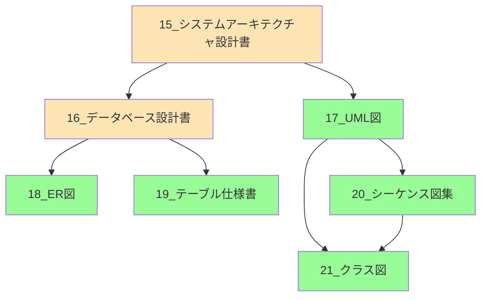

# 📚 ドキュメントインデックス

**更新日**: 2025年1月24日  
**プロジェクト**: 請求書処理自動化システム

## 📋 ドキュメント一覧

### **🎯 企画・要件定義**
- [01_要件定義書.md](01_要件定義書.md) - システム要件と機能仕様
- [02_仕様書.md](02_仕様書.md) - 詳細仕様書
- [02_統一ワークフロー設計書.md](02_統一ワークフロー設計書.md) - ワークフロー統一設計

### **🎨 設計書**
- [03_画面設計書.md](03_画面設計書.md) - UI/UX設計
- [04_外部インターフェース仕様書.md](04_外部インターフェース仕様書.md) - API連携仕様
- [05_プロンプト仕様書.md](05_プロンプト仕様書.md) - AI プロンプト設計
- **[15_システムアーキテクチャ設計書.md](15_システムアーキテクチャ設計書.md) - システム全体設計** ⭐ **統合版**
- **[16_データベース設計書.md](16_データベース設計書.md) - データベース設計・ER図** ⭐ **統合版**

### **🏗️ 詳細設計書（独立ファイル）** ⭐ **NEW**
- **[17_システムアーキテクチャUML図.md](17_システムアーキテクチャUML図.md) - システムアーキテクチャ図集**
- **[18_データベースER図.md](18_データベースER図.md) - データベースER図・関係性**
- **[19_テーブル設計詳細仕様書.md](19_テーブル設計詳細仕様書.md) - テーブル仕様・制約・インデックス**
- **[20_シーケンス図集.md](20_シーケンス図集.md) - 処理フロー・正常系・異常系**
- **[21_クラス図.md](21_クラス図.md) - クラス構造・コンポーネント関係**

### **📊 開発・実装**
- [09_開発計画書.md](09_開発計画書.md) - 開発スケジュール
- [10_エラーハンドリング統一仕様.md](10_エラーハンドリング統一仕様.md) - エラー処理標準
- [11_2段階照合ワークフロー実装仕様.md](11_2段階照合ワークフロー実装仕様.md) - 照合処理詳細
- [12_PowerShell開発・運用ガイドライン.md](12_PowerShell開発・運用ガイドライン.md) - PowerShell規約
- [13_Supabaseデータベース設定・運用ガイド.md](13_Supabaseデータベース設定・運用ガイド.md) - DB運用手順

### **🧪 テスト・品質保証**
- [20_テスト計画書.md](20_テスト計画書.md) - テスト戦略
- [21_テストケース設計書.md](21_テストケース設計書.md) - テストケース詳細
- [22_ag-grid技術検証書.md](22_ag-grid技術検証書.md) - ag-grid実装検証

### **🚀 運用・保守**
- [30_デプロイ設計書.md](30_デプロイ設計書.md) - デプロイ手順
- [31_運用保守マニュアル.md](31_運用保守マニュアル.md) - 運用手順書

### **🔍 課題・技術調査**
- [14_課題一覧表.md](14_課題一覧表.md) - 未解決課題管理
- [90_認証方式比較検討資料.md](90_認証方式比較検討資料.md) - 認証技術選定
- [91_PowerShellテンプレート_基本版.ps1](91_PowerShellテンプレート_基本版.ps1) - PS基本テンプレート
- [92_PowerShellテンプレート_Streamlit版.ps1](92_PowerShellテンプレート_Streamlit版.ps1) - PS Streamlit版

---

## 🎯 **重要な設計ドキュメント（最新版）**

### **📐 システムアーキテクチャ設計書（統合版）**
**ファイル**: [15_システムアーキテクチャ設計書.md](15_システムアーキテクチャ設計書.md)

- **システム全体構成**: レイヤードアーキテクチャ
- **コンポーネント設計**: 統一ワークフローエンジン
- **設計原則**: 単一責任原則、依存性逆転原則
- **アンチパターン排除**: 重複機能統一済み
- **パフォーマンス要件**: 処理時間・スケーラビリティ
- **セキュリティ要件**: OAuth 2.0、データ保護
- **今後の拡張計画**: Phase 3-4 ロードマップ

### **🗄️ データベース設計書（統合版）**  
**ファイル**: [16_データベース設計書.md](16_データベース設計書.md)

- **ER図**: 主要テーブル関係図
- **テーブル設計**: 12テーブルの詳細仕様
- **インデックス戦略**: パフォーマンス最適化
- **セキュリティ設計**: Row Level Security (RLS)
- **データ品質管理**: 検証システム・スコアリング
- **運用・保守**: バックアップ・監視戦略

---

## 🆕 **独立設計書シリーズ（専門化ドキュメント）**

### **🏗️ システムアーキテクチャUML図**
**ファイル**: [17_システムアーキテクチャUML図.md](17_システムアーキテクチャUML図.md)

- **📊 全体システム図**: レイヤードアーキテクチャの詳細構成
- **📦 コンポーネント図**: プレゼンテーション・ビジネス・インフラ層別
- **🔄 データフロー図**: 主要データフローパターン
- **🛡️ セキュリティ図**: 認証・認可・データ保護層
- **📈 スケーラビリティ図**: 水平スケーリング対応
- **🔧 技術スタック図**: 使用技術とバージョン管理
- **📊 パフォーマンス要件**: レスポンス時間・スループット目標
- **🚀 進化ロードマップ**: アーキテクチャ発展計画

### **🗂️ データベースER図**
**ファイル**: [18_データベースER図.md](18_データベースER図.md)

- **🗂️ 完全ER図**: 全12テーブルの関係性
- **📊 テーブルグループ別図**: 機能別ER図（4グループ）
- **🔄 データフロー図**: 請求書処理・OCRテスト
- **🔍 インデックス構成図**: パフォーマンス最適化
- **🔒 セキュリティ設計図**: RLS構成
- **📊 データ容量設計**: 年間成長予測
- **🚀 データベース進化計画**: Phase別拡張ロードマップ

### **📊 テーブル設計詳細仕様書**
**ファイル**: [19_テーブル設計詳細仕様書.md](19_テーブル設計詳細仕様書.md)

- **📋 全テーブル仕様**: 12テーブルの詳細定義
- **🔍 カラム仕様**: データ型・制約・デフォルト値
- **📏 業務ルール**: ビジネスロジック・検証ルール
- **🔗 インデックス仕様**: 基本・JSON・複合インデックス
- **🔒 制約・トリガー**: CHECK制約・外部キー・自動更新
- **📊 データ品質管理**: 完全性スコア・検証システム
- **📈 パフォーマンス監視**: 監視クエリ・最適化指針

### **🔄 シーケンス図集**
**ファイル**: [20_シーケンス図集.md](20_シーケンス図集.md)

- **🧪 統合ワークフローテスト**: 成功・エラーパターン
- **📤 請求書アップロード（バッチ）**: 複数ファイル処理
- **🔍 OCRテスト処理**: Google Drive連携
- **📊 ダッシュボード表示**: ag-Grid連携
- **🔐 認証・認可処理**: Google OAuth フロー
- **⚠️ エラーハンドリング**: 統一エラー処理・復旧フロー
- **📊 パフォーマンス監視**: レスポンス時間監視

### **📦 クラス図**
**ファイル**: [21_クラス図.md](21_クラス図.md)

- **🏗️ 全体クラス構成**: システム全体のクラス関係
- **📱 プレゼンテーション層**: Streamlitアプリ・ページ構成
- **🧠 ビジネスロジック層**: 統一ワークフローエンジン・サービス
- **🔧 インフラストラクチャ層**: DB・AI・ストレージ・UI拡張
- **📊 データモデル層**: エンティティ・ワークフローモデル
- **🔗 継承・実装関係**: インターフェース・例外階層
- **🎨 デザインパターン**: Factory・Observer・Strategy・Builder

---

## 📈 **設計書作成の経緯と成果**

### **背景・問題**
2025年1月24日に重複機能問題が発生：
- ❌ 重複ワークフローエンジン（UnifiedWorkflowEngine vs UnifiedProcessingWorkflow）
- ❌ file_idマッピングエラー
- ❌ 設計の不整合・コンポーネント関係不明

### **解決策・アプローチ**
包括的な設計書作成による問題予防と標準化：

#### **Phase 1: 統合設計書作成**
1. ✅ **システムアーキテクチャ設計書** - 全体構成の標準化
2. ✅ **データベース設計書** - データ構造の統一

#### **Phase 2: 専門化設計書作成（独立ファイル）** ⭐ **完了**
3. ✅ **システムアーキテクチャUML図** - 視覚的システム構成
4. ✅ **データベースER図** - データ関係性の可視化
5. ✅ **テーブル設計詳細仕様書** - 実装レベル仕様
6. ✅ **シーケンス図集** - 処理フロー・エラーハンドリング
7. ✅ **クラス図** - コンポーネント構造・関係性

### **実現した効果**
- 🔄 **重複開発の防止**: 設計レベルでの重複検出・回避
- 📊 **データフロー明確化**: マッピングエラーの事前防止
- 🏗️ **メンテナンス性向上**: 影響範囲の明確化・変更容易性
- ⚡ **新規開発効率化**: 設計指針の明確化・オンボーディング迅速化
- 👥 **チーム開発標準化**: 共通理解・コミュニケーション向上

### **設計書の使い分け**

| 用途 | 統合版 | 独立版 | 対象者 |
|------|-------|-------|-------|
| **概要把握** | 15_アーキテクチャ設計書 | 17_UML図 | PM・アーキテクト |
| **データ設計** | 16_データベース設計書 | 18_ER図 + 19_テーブル仕様 | DB設計者・開発者 |
| **処理フロー理解** | - | 20_シーケンス図集 | 開発者・テスター |
| **実装参考** | - | 21_クラス図 | 開発者 |
| **全体レビュー** | 15_＋16_ | 17_～21_全て | 全メンバー |

---

## 🔗 **ドキュメント間の関連性**

---

## 📝 **編集・メンテナンスルール**

### **新ドキュメント追加時**
1. ✅ このインデックスファイルを必ず更新
2. ✅ 関連ドキュメントのリンクを相互追加
3. ✅ バージョン番号の管理（v1.0, v1.1...）
4. ✅ 作成日・更新日の記録

### **設計変更時の影響範囲**
- **アーキテクチャ変更**: 17_UML図 → 20_シーケンス図 → 21_クラス図
- **データベース変更**: 18_ER図 → 19_テーブル仕様 → 20_シーケンス図
- **クラス構造変更**: 21_クラス図 → 20_シーケンス図
- **処理フロー変更**: 20_シーケンス図 → 21_クラス図

### **レビュー周期**
- **統合設計書（15_, 16_）**: 月次レビュー
- **独立設計書（17_～21_）**: 四半期レビュー
- **緊急時レビュー**: 重大な設計変更・問題発生時 