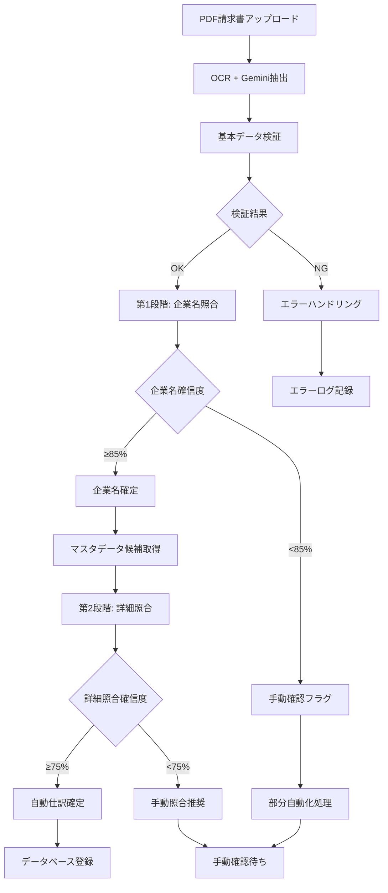

# 2段階照合ワークフロー実装仕様書

**バージョン**: 2.0  
**作成日**: 2025-01-XX  
**最終更新**: 2025-01-XX  
**更新内容**: GAS実データ分析結果を反映した実践的ワークフロー設計

## 1. 概要

### 1.1. 目的
請求書処理自動化システムにおいて、AIを活用した2段階照合プロセスにより、企業名の表記揺れと詳細な請求内容の照合を段階的に実行し、高精度な自動仕訳を実現する。

### 1.2. 設計原則（GAS実装からの学習）
- **段階的精度向上**: 第1段階で企業名を特定、第2段階で詳細照合
- **確信度ベース判定**: 各段階で明確な確信度閾値を設定
- **実データパターン対応**: GAS運用で判明した実際のパターンに対応
- **運用継続性**: エラー時も可能な範囲で処理を継続
- **透明性**: 各段階の判定理由を明確に記録

## 2. ワークフロー全体設計

### 2.1. フロー概要図



### 2.2. 実装技術スタック

```yaml
技術構成:
  フロントエンド: "Streamlit"
  バックエンド: "Python FastAPI"
  データベース: "Supabase (PostgreSQL)"
  AI処理: "Google Gemini API"
  ファイル管理: "Supabase Storage"
  プロンプト管理: "YAML設定ファイル"
  エラーハンドリング: "統一エラーハンドラークラス"
```

## 3. 第1段階：企業名照合ワークフロー

### 3.1. 入力データ準備

```python
class Stage1InputProcessor:
    """第1段階入力データ処理"""
    
    def prepare_input_data(self, extracted_invoice_data):
        """OCR抽出データから第1段階入力を準備"""
        
        # 実データパターンに基づく前処理
        issuer_name = self.normalize_company_name(
            extracted_invoice_data.get("請求元", "")
        )
        
        return {
            "issuer_name": issuer_name,
            "registration_number": extracted_invoice_data.get("登録番号"),
            "invoice_number": extracted_invoice_data.get("請求書番号"),
            "amount": extracted_invoice_data.get("税込金額"),
            "currency": extracted_invoice_data.get("通貨", "JPY"),
            "issue_date": extracted_invoice_data.get("発行日")
        }
    
    def normalize_company_name(self, raw_name):
        """企業名の基本正規化"""
        # 実データから判明した前処理パターン
        normalized = raw_name.strip()
        
        # 全角半角統一
        normalized = self.convert_fullwidth_to_halfwidth(normalized)
        
        # 特殊文字除去（実データで問題となったパターン）
        normalized = re.sub(r'[^\w\s\.\-\(\)株式会社有限合同LLC]', '', normalized)
        
        return normalized
```

### 3.2. マスタデータ取得

```python
class MasterDataManager:
    """支払マスタデータ管理"""
    
    def get_company_master_list(self):
        """企業名マスタリスト取得"""
        # Supabaseから企業マスタを取得
        companies = self.supabase.table("payment_master").select(
            "company_name", "company_aliases", "registration_number"
        ).execute()
        
        # GAS実データパターンを反映したエイリアス展開
        expanded_list = []
        for company in companies.data:
            # 基本名称
            expanded_list.append({
                "official_name": company["company_name"],
                "search_name": company["company_name"],
                "type": "official"
            })
            
            # 登録されたエイリアス
            if company.get("company_aliases"):
                for alias in company["company_aliases"]:
                    expanded_list.append({
                        "official_name": company["company_name"],
                        "search_name": alias,
                        "type": "alias"
                    })
        
        return expanded_list
```

### 3.3. 第1段階AI照合実行

```python
class Stage1Matcher:
    """第1段階企業名照合処理"""
    
    def __init__(self):
        self.prompt_loader = PromptLoader("master_matcher_prompt.yaml")
        self.error_handler = UnifiedErrorHandler()
    
    def execute_matching(self, input_data, master_list):
        """第1段階照合実行"""
        
        try:
            # プロンプト構築
            prompt = self.prompt_loader.build_prompt(
                issuer_name=input_data["issuer_name"],
                master_list=json.dumps(master_list, ensure_ascii=False)
            )
            
            # Gemini API呼び出し
            response = self.call_gemini_api(prompt)
            
            # レスポンス解析
            result = self.parse_ai_response(response)
            
            # 確信度チェック
            if result["confidence_score"] >= 0.85:
                return {
                    "success": True,
                    "matched_company": result["matched_company_name"],
                    "confidence": result["confidence_score"],
                    "reasoning": result["matching_reason"],
                    "stage": "1_completed"
                }
            else:
                # 確信度不足の場合のハンドリング
                return self.error_handler.handle_ai_processing_error(
                    result["confidence_score"], 
                    0.85, 
                    result.get("alternative_candidates", [])
                )
                
        except Exception as e:
            return self.error_handler.handle_system_error("AI_API_ERROR", str(e))
```

## 4. 第2段階：詳細照合ワークフロー

### 4.1. 候補データ絞り込み

```python
class Stage2DataPreparator:
    """第2段階データ準備"""
    
    def get_candidate_records(self, confirmed_company_name):
        """確定企業名に基づく候補レコード取得"""
        
        # GAS実データパターンに基づく絞り込み条件
        candidates = self.supabase.table("payment_master").select(
            "*"
        ).eq(
            "company_name", confirmed_company_name
        ).execute()
        
        # 期間や金額での追加絞り込み（実データ分析結果）
        filtered_candidates = []
        for candidate in candidates.data:
            # 金額帯での絞り込み（±20%範囲）
            if self.is_amount_in_range(candidate, input_amount):
                filtered_candidates.append(candidate)
        
        return filtered_candidates
    
    def prepare_invoice_detail_data(self, extracted_data):
        """請求書詳細データ準備"""
        
        # 実データ形式に対応
        line_items = self.parse_line_items_json(
            extracted_data.get("明細", "[]")
        )
        
        return {
            "issuer_name": extracted_data.get("請求元"),
            "invoice_number": extracted_data.get("請求書番号"),
            "registration_number": extracted_data.get("登録番号"),
            "currency": extracted_data.get("通貨", "JPY"),
            "total_amount": extracted_data.get("税込金額"),
            "tax_included_amount": extracted_data.get("税抜金額"),
            "issue_date": extracted_data.get("発行日"),
            "due_date": extracted_data.get("支払期日"),
            "key_info": self.extract_key_info(extracted_data),
            "line_items": line_items
        }
```

### 4.2. 第2段階AI照合実行

```python
class Stage2Matcher:
    """第2段階詳細照合処理"""
    
    def __init__(self):
        self.prompt_loader = PromptLoader("integrated_matcher_prompt.yaml")
        self.error_handler = UnifiedErrorHandler()
    
    def execute_detailed_matching(self, invoice_data, candidate_records):
        """第2段階詳細照合実行"""
        
        try:
            # プロンプト構築
            prompt = self.prompt_loader.build_prompt(
                invoice_data_json=json.dumps(invoice_data, ensure_ascii=False),
                master_records_json=json.dumps(candidate_records, ensure_ascii=False)
            )
            
            # Gemini API呼び出し
            response = self.call_gemini_api(prompt)
            
            # レスポンス解析
            result = self.parse_ai_response(response)
            
            # 確信度チェック（第2段階は75%閾値）
            if result["confidence_score"] >= 0.75:
                return {
                    "success": True,
                    "matched_entry_id": result["matched_entry_id"],
                    "confidence": result["confidence_score"],
                    "matching_details": result["matching_details"],
                    "validation_flags": result["validation_flags"],
                    "stage": "2_completed"
                }
            else:
                # 確信度不足の場合
                return self.error_handler.handle_detailed_matching_failure(
                    result["confidence_score"],
                    0.75,
                    result.get("alternative_candidates", [])
                )
                
        except Exception as e:
            return self.error_handler.handle_system_error("DETAILED_MATCHING_ERROR", str(e))
```

## 5. ワークフロー統合制御

### 5.1. メインワークフローコントローラー

```python
class TwoStageWorkflowController:
    """2段階照合ワークフロー統合制御"""
    
    def __init__(self):
        self.stage1_matcher = Stage1Matcher()
        self.stage2_matcher = Stage2Matcher()
        self.data_preparator = Stage2DataPreparator()
        self.error_handler = UnifiedErrorHandler()
        self.logger = WorkflowLogger()
    
    def execute_full_workflow(self, uploaded_file):
        """完全2段階ワークフロー実行"""
        
        correlation_id = self.generate_correlation_id()
        self.logger.start_workflow(correlation_id, uploaded_file.name)
        
        try:
            # Step 1: OCR + データ抽出
            extracted_data = self.extract_invoice_data(uploaded_file)
            if not extracted_data["success"]:
                return self.handle_extraction_failure(extracted_data, correlation_id)
            
            # Step 2: 第1段階企業名照合
            stage1_result = self.execute_stage1(
                extracted_data["data"], correlation_id
            )
            
            if stage1_result["success"]:
                # Step 3: 第2段階詳細照合
                stage2_result = self.execute_stage2(
                    extracted_data["data"],
                    stage1_result["matched_company"],
                    correlation_id
                )
                
                if stage2_result["success"]:
                    # Step 4: 自動仕訳確定
                    return self.finalize_automatic_booking(
                        stage2_result, correlation_id
                    )
                else:
                    # 第2段階失敗 → 手動確認
                    return self.prepare_manual_review(
                        stage1_result, stage2_result, correlation_id
                    )
            else:
                # 第1段階失敗 → 企業名手動確認
                return self.prepare_company_name_review(
                    extracted_data["data"], stage1_result, correlation_id
                )
                
        except Exception as e:
            return self.error_handler.handle_workflow_critical_error(
                str(e), correlation_id
            )
        finally:
            self.logger.end_workflow(correlation_id)
    
    def execute_stage1(self, extracted_data, correlation_id):
        """第1段階実行"""
        
        self.logger.start_stage(correlation_id, "stage1")
        
        # 入力データ準備
        input_processor = Stage1InputProcessor()
        stage1_input = input_processor.prepare_input_data(extracted_data)
        
        # マスタデータ取得
        master_manager = MasterDataManager()
        master_list = master_manager.get_company_master_list()
        
        # AI照合実行
        result = self.stage1_matcher.execute_matching(stage1_input, master_list)
        
        self.logger.log_stage_result(correlation_id, "stage1", result)
        return result
    
    def execute_stage2(self, extracted_data, confirmed_company, correlation_id):
        """第2段階実行"""
        
        self.logger.start_stage(correlation_id, "stage2")
        
        # 候補レコード絞り込み
        candidate_records = self.data_preparator.get_candidate_records(
            confirmed_company
        )
        
        # 請求書詳細データ準備
        invoice_detail = self.data_preparator.prepare_invoice_detail_data(
            extracted_data
        )
        
        # 詳細照合実行
        result = self.stage2_matcher.execute_detailed_matching(
            invoice_detail, candidate_records
        )
        
        self.logger.log_stage_result(correlation_id, "stage2", result)
        return result
```

### 5.2. 部分成功時の処理戦略

```python
class PartialSuccessHandler:
    """部分成功時の処理戦略"""
    
    def handle_stage1_only_success(self, stage1_result, extracted_data):
        """第1段階のみ成功時の処理"""
        
        # 企業名は確定したが詳細照合失敗
        partial_result = {
            "processing_status": "partial_success",
            "completed_stages": ["stage1"],
            "confirmed_data": {
                "company_name": stage1_result["matched_company"],
                "company_confidence": stage1_result["confidence"]
            },
            "extracted_data": extracted_data,
            "next_action": "manual_detail_matching",
            "suggested_actions": [
                "確定した企業名を元に手動で仕訳項目を選択してください",
                "新規取引先の場合はマスタデータ登録を検討してください"
            ]
        }
        
        return partial_result
    
    def prepare_manual_assistance_data(self, partial_result):
        """手動操作支援データ準備"""
        
        # 確定企業名に基づく候補提示
        company_name = partial_result["confirmed_data"]["company_name"]
        
        # 類似する過去取引の提示
        similar_transactions = self.get_similar_past_transactions(
            company_name, 
            partial_result["extracted_data"]
        )
        
        return {
            "manual_review_data": partial_result,
            "assistance_info": {
                "similar_past_transactions": similar_transactions,
                "suggested_account_items": self.suggest_account_items(company_name),
                "amount_validation": self.validate_amount_consistency(
                    partial_result["extracted_data"]
                )
            }
        }
```

## 6. 性能とモニタリング

### 6.1. 処理時間管理

```python
class PerformanceMonitor:
    """性能監視"""
    
    def __init__(self):
        self.timing_thresholds = {
            "stage1_processing": 10,  # 第1段階10秒以内
            "stage2_processing": 15,  # 第2段階15秒以内
            "total_workflow": 30      # 全体30秒以内
        }
    
    def monitor_stage_performance(self, stage_name, processing_time):
        """段階別性能監視"""
        
        threshold = self.timing_thresholds.get(stage_name, 60)
        
        if processing_time > threshold:
            self.logger.warning(
                f"Stage {stage_name} exceeded time threshold: "
                f"{processing_time}s > {threshold}s"
            )
            
            # 性能劣化アラート
            self.send_performance_alert(stage_name, processing_time, threshold)
```

### 6.2. 成功率監視

```python
class SuccessRateMonitor:
    """成功率監視"""
    
    def calculate_daily_success_rates(self):
        """日次成功率計算"""
        
        today = datetime.now().date()
        
        # 処理結果集計
        results = self.supabase.table("processing_logs").select(
            "stage1_success", "stage2_success", "final_status"
        ).gte("created_at", today).execute()
        
        total_count = len(results.data)
        if total_count == 0:
            return None
        
        stage1_success = sum(1 for r in results.data if r["stage1_success"])
        stage2_success = sum(1 for r in results.data if r["stage2_success"])
        full_auto_success = sum(
            1 for r in results.data if r["final_status"] == "auto_completed"
        )
        
        return {
            "total_processed": total_count,
            "stage1_success_rate": stage1_success / total_count,
            "stage2_success_rate": stage2_success / total_count,
            "full_automation_rate": full_auto_success / total_count,
            "date": today
        }
```

## 7. 実装優先順位とマイルストーン

### 7.1. フェーズ1（基本実装）
- [ ] 第1段階企業名照合の基本実装
- [ ] 統一エラーハンドリングの実装
- [ ] Streamlit基本UIの実装
- [ ] Supabaseデータベース設計・構築

### 7.2. フェーズ2（詳細照合実装）
- [ ] 第2段階詳細照合の実装
- [ ] 2段階統合ワークフローの実装
- [ ] 部分成功時の処理ロジック実装
- [ ] 手動確認UIの実装

### 7.3. フェーズ3（運用最適化）
- [ ] 性能監視・アラート機能の実装
- [ ] 自動復旧機能の実装
- [ ] 詳細分析・レポート機能の実装
- [ ] 本格運用開始

## 8. まとめ

本実装仕様により以下を実現：
- **段階的精度向上**: 各段階で適切な確信度閾値設定
- **実データ対応**: GAS運用で判明した実際のパターンに対応
- **運用継続性**: エラー時も可能な範囲で処理継続
- **透明性**: 各段階の判定理由を明確に記録・表示
- **拡張性**: 将来的な機能追加に対応可能な設計

GAS実装からの学習を活かし、より実用的で運用しやすいシステムを構築する。 