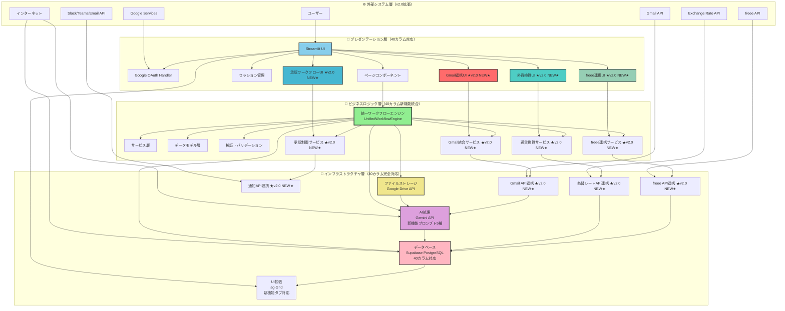
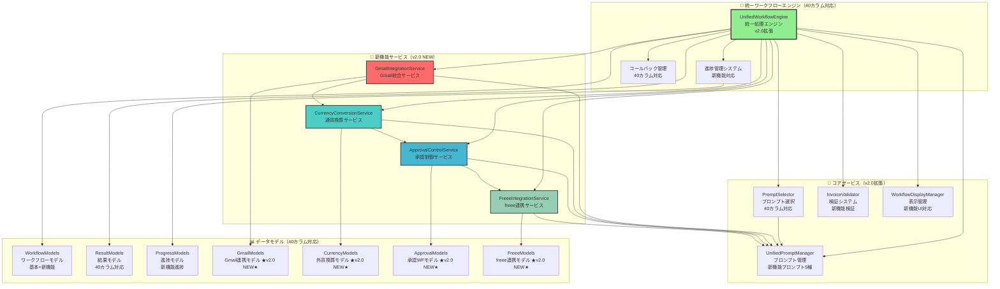
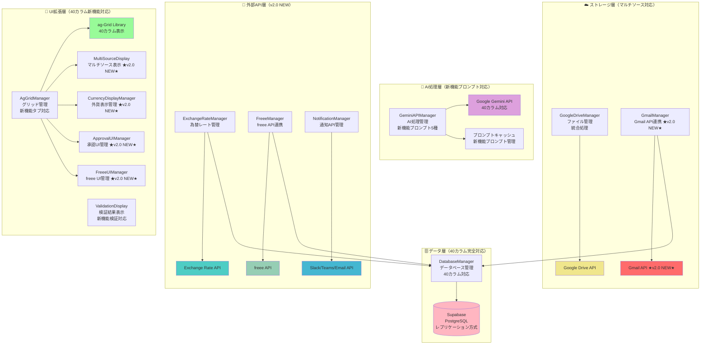
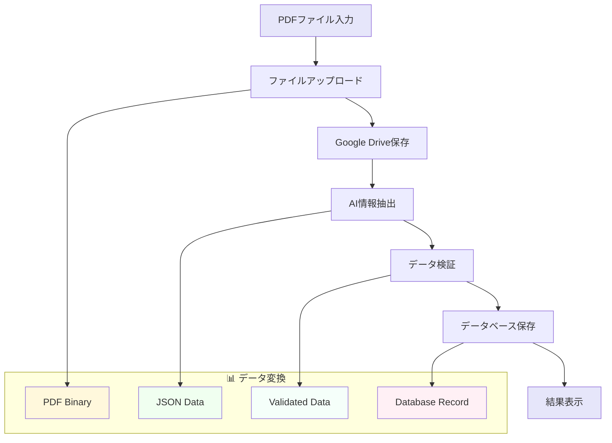
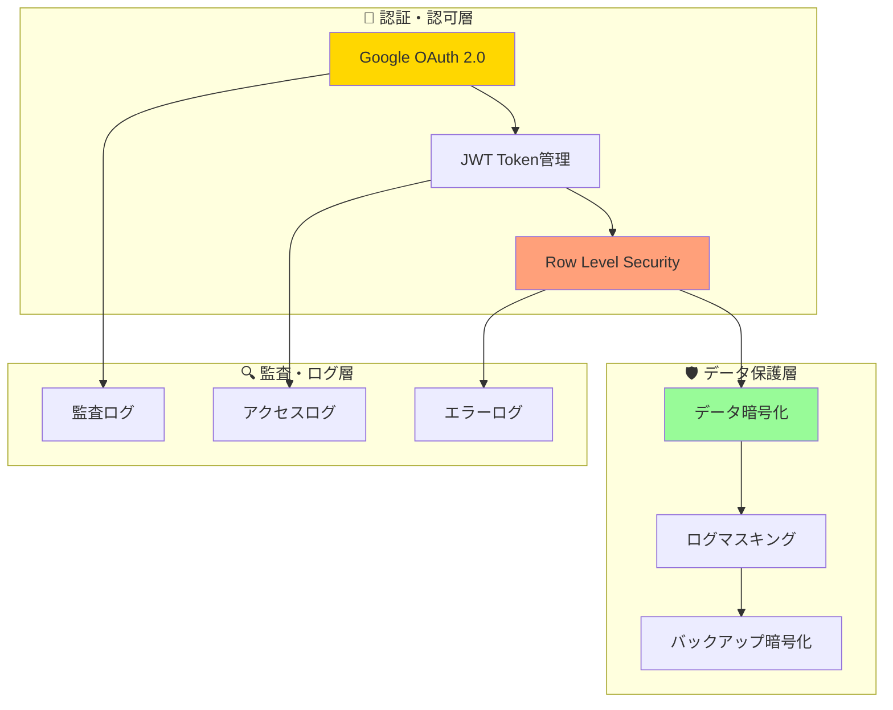
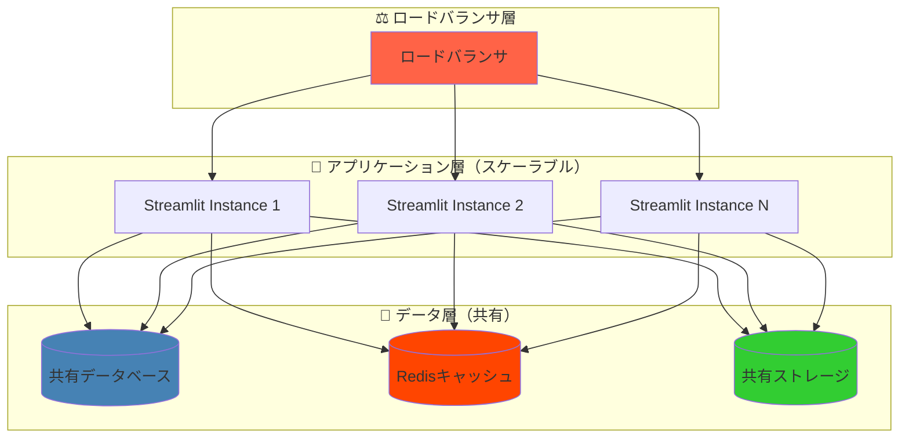
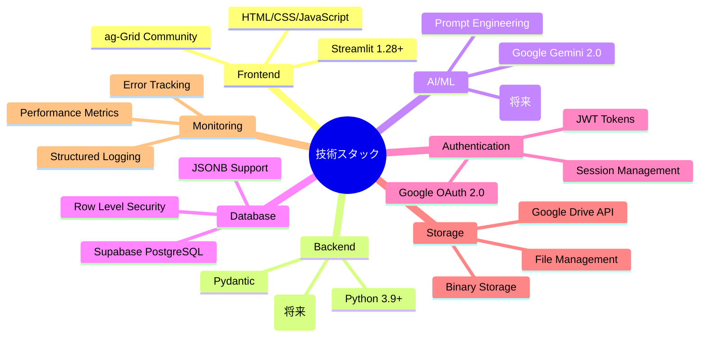
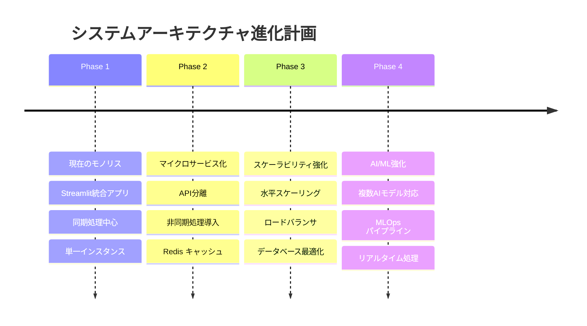

# 🏗️ システムアーキテクチャUML図

**作成日**: 2025年1月24日  
**最終更新**: 2025年7月28日  
**バージョン**: 2.0  
**対象システム**: 請求書処理自動化システム

**v2.0更新内容**: 40カラム新機能アーキテクチャ完全対応・Gmail連携・外貨換算・承認ワークフロー・freee連携コンポーネント追加  
**v1.2更新内容**: 統一スキーマ完全再構築対応・日付統一  
**v1.1更新内容**: 関連ドキュメントリンクを統一フォーマット化（3カテゴリ分類）

## 📊 概要

本ドキュメントは請求書処理自動化システムのシステムアーキテクチャをUML図で可視化し、各コンポーネントの関係性と責任範囲を明確に示します。

**🎉 2025年7月28日更新**: **40カラム新機能アーキテクチャ完全対応**により、Gmail連携・外貨換算・承認ワークフロー・freee連携の新機能コンポーネントが追加され、マルチソース処理・多通貨対応・承認制御・会計連携を統合したエンタープライズレベルのUMLアーキテクチャ図が完成しました。

## 🏗️ 全体システムアーキテクチャ図

### レイヤードアーキテクチャ構成（v2.0 40カラム新機能対応）

## 📦 コンポーネント構成図

### プレゼンテーション層の詳細構成（v2.0 40カラム新機能対応）

```mermaid
graph TD
    subgraph "📱 Streamlit アプリケーション（40カラム対応）"
        MAIN[app.py<br/>メインアプリ<br/>v2.0拡張]
        SIDEBAR[components/sidebar.py<br/>サイドバー<br/>新機能メニュー追加]
    end
    
    subgraph "📄 ページコンポーネント（v2.0拡張）"
        INVOICE[pages/invoice_processing.py<br/>請求書処理<br/>40カラム対応]
        TEST[pages/test_pages.py<br/>テストページ<br/>レプリケーション対応]
        SETTINGS[pages/settings.py<br/>設定・ダッシュボード<br/>新機能設定追加]
        GMAIL_PAGE[pages/gmail_integration.py<br/>Gmail連携ページ ★v2.0 NEW★]
        CURRENCY_PAGE[pages/currency_conversion.py<br/>外貨換算ページ ★v2.0 NEW★]
        APPROVAL_PAGE[pages/approval_workflow.py<br/>承認ワークフローページ ★v2.0 NEW★]
        FREEE_PAGE[pages/freee_integration.py<br/>freee連携ページ ★v2.0 NEW★]
    end
    
    subgraph "🔐 認証システム（v2.0強化）"
        OAUTH[auth/oauth_handler.py<br/>Google OAuth<br/>Gmail OAuth統合]
        SESSION_MGR[セッション管理<br/>40カラム対応]
        GMAIL_AUTH[auth/gmail_oauth.py<br/>Gmail認証 ★v2.0 NEW★]
        FREEE_AUTH[auth/freee_oauth.py<br/>freee認証 ★v2.0 NEW★]
    end
    
    subgraph "🎨 UI拡張コンポーネント（v2.0 NEW）"
        MULTI_SOURCE[components/multi_source_selector.py<br/>マルチソース選択]
        CURRENCY_DISPLAY[components/currency_display.py<br/>外貨表示]
        APPROVAL_ACTIONS[components/approval_actions.py<br/>承認アクション]
        FREEE_STATUS[components/freee_status.py<br/>freee連携状況]
    end
    
    %% 基本接続
    MAIN --> SIDEBAR
    MAIN --> INVOICE
    MAIN --> TEST
    MAIN --> SETTINGS
    MAIN --> OAUTH
    OAUTH --> SESSION_MGR
    
    %% v2.0新機能接続
    MAIN --> GMAIL_PAGE
    MAIN --> CURRENCY_PAGE
    MAIN --> APPROVAL_PAGE
    MAIN --> FREEE_PAGE
    
    OAUTH --> GMAIL_AUTH
    OAUTH --> FREEE_AUTH
    
    INVOICE --> MULTI_SOURCE
    INVOICE --> CURRENCY_DISPLAY
    INVOICE --> APPROVAL_ACTIONS
    INVOICE --> FREEE_STATUS
    
    %% 認証連携
    GMAIL_PAGE --> GMAIL_AUTH
    FREEE_PAGE --> FREEE_AUTH
    
    %% スタイリング
    style MAIN fill:#87CEEB
    style OAUTH fill:#FFD700
    style GMAIL_PAGE fill:#FF6B6B
    style CURRENCY_PAGE fill:#4ECDC4
    style APPROVAL_PAGE fill:#45B7D1
    style FREEE_PAGE fill:#96CEB4
```

### ビジネスロジック層の詳細構成（v2.0 40カラム新機能対応）

### インフラストラクチャ層の詳細構成（v2.0 40カラム新機能対応）

## 🔄 データフロー図

### 主要データフローパターン

## 🛡️ セキュリティアーキテクチャ

### セキュリティ層とアクセス制御

## 📈 スケーラビリティ設計

### 水平スケーリング対応

## 🔧 技術スタック構成

### 技術要素とバージョン管理

## 📊 パフォーマンス要件

### レスポンス時間とスループット目標

| コンポーネント | 目標レスポンス時間 | 最大スループット | 備考 |
|---------------|------------------|-----------------|------|
| UI表示 | < 200ms | 100 concurrent users | 初期表示 |
| 単一ファイル処理 | < 10秒 | 10 files/min | PDF→DB完了 |
| バッチ処理(5ファイル) | < 60秒 | 2 batches/min | 並列処理時 |
| ダッシュボード | < 3秒 | 50 requests/min | ag-Grid表示 |
| API応答 | < 500ms | 200 requests/min | データベースクエリ |

## 🚀 今後の発展計画

### アーキテクチャ進化ロードマップ

