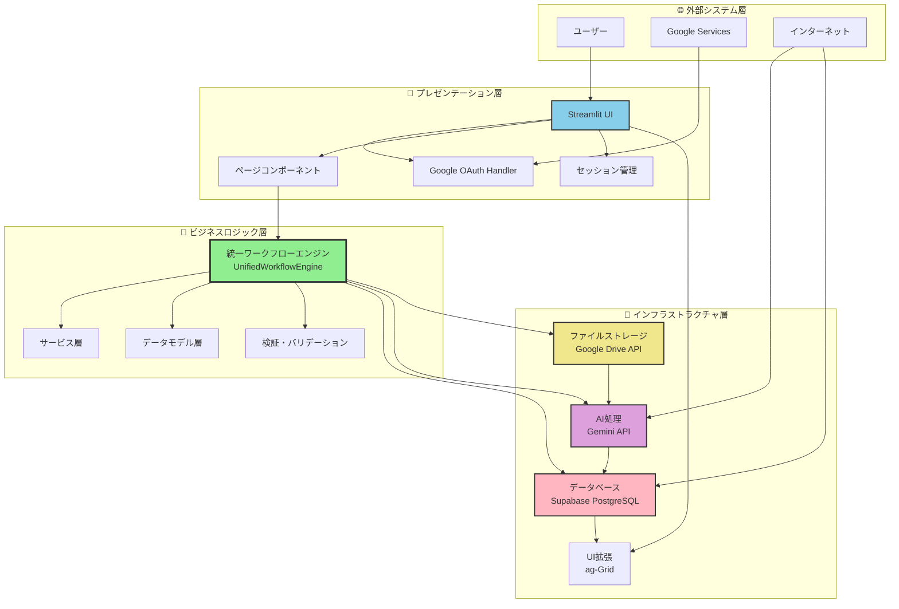
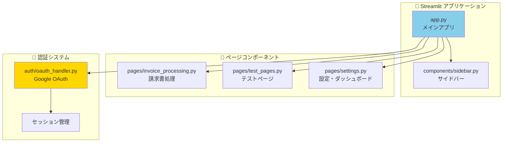
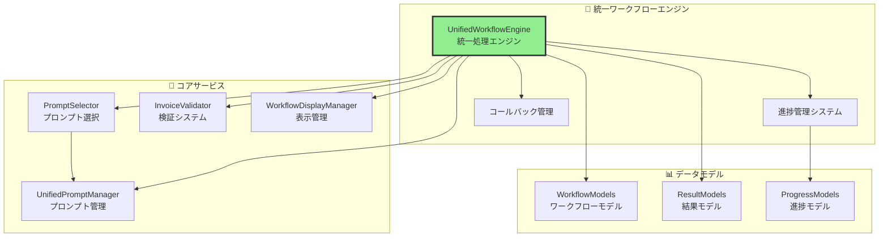
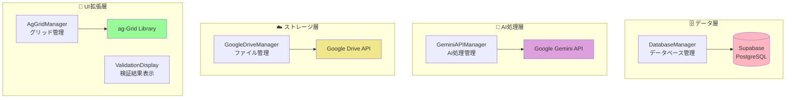
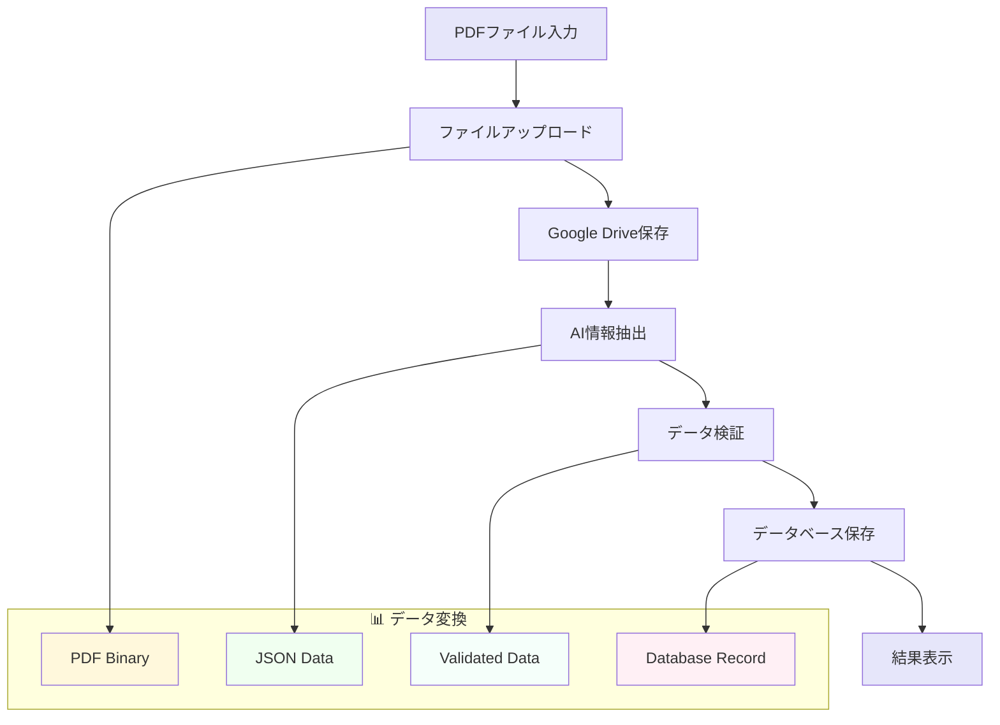
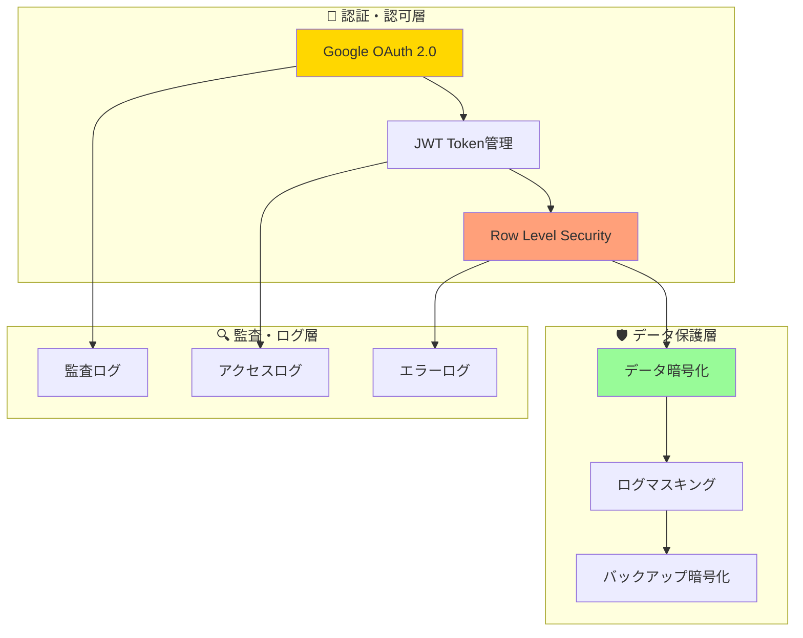
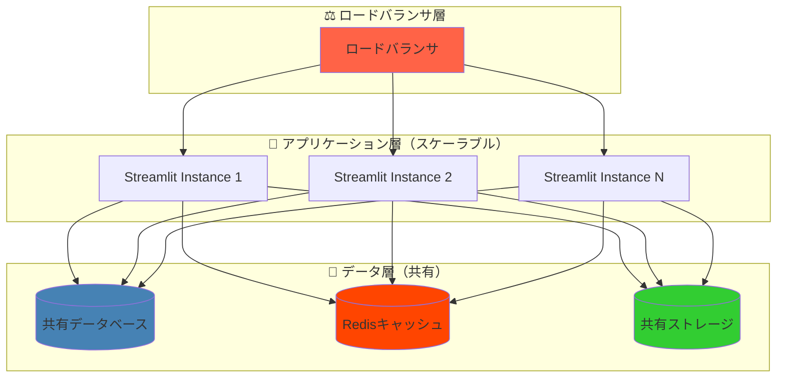
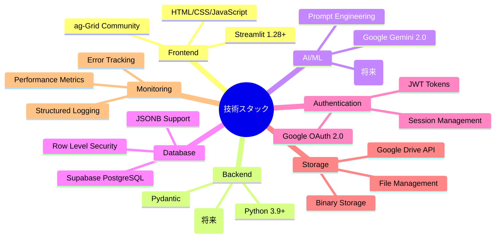
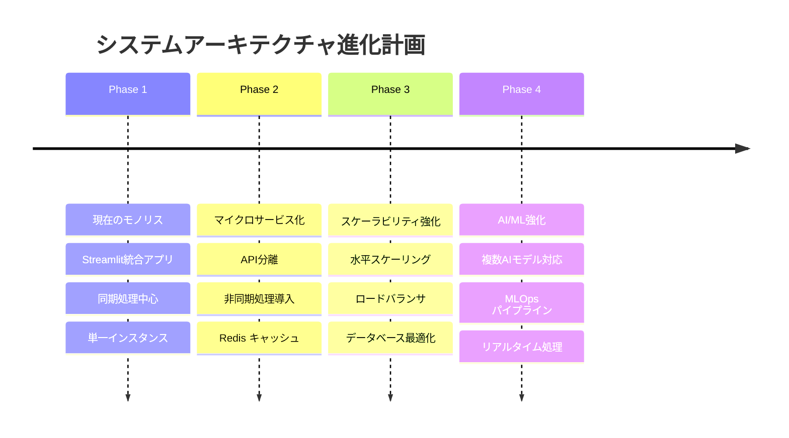

# 🏗️ システムアーキテクチャUML図

**作成日**: 2025年1月24日  
**バージョン**: 1.1  
**対象システム**: 請求書処理自動化システム

**v1.1更新内容**: 関連ドキュメントリンクを統一フォーマット化（3カテゴリ分類）

## 📊 概要

本ドキュメントは請求書処理自動化システムのシステムアーキテクチャをUML図で可視化し、各コンポーネントの関係性と責任範囲を明確に示します。

## 🏗️ 全体システムアーキテクチャ図

### レイヤードアーキテクチャ構成

## 📦 コンポーネント構成図

### プレゼンテーション層の詳細構成

### ビジネスロジック層の詳細構成

### インフラストラクチャ層の詳細構成

## 🔄 データフロー図

### 主要データフローパターン

## 🛡️ セキュリティアーキテクチャ

### セキュリティ層とアクセス制御

## 📈 スケーラビリティ設計

### 水平スケーリング対応

## 🔧 技術スタック構成

### 技術要素とバージョン管理

## 📊 パフォーマンス要件

### レスポンス時間とスループット目標

| コンポーネント | 目標レスポンス時間 | 最大スループット | 備考 |
|---------------|------------------|-----------------|------|
| UI表示 | < 200ms | 100 concurrent users | 初期表示 |
| 単一ファイル処理 | < 10秒 | 10 files/min | PDF→DB完了 |
| バッチ処理(5ファイル) | < 60秒 | 2 batches/min | 並列処理時 |
| ダッシュボード | < 3秒 | 50 requests/min | ag-Grid表示 |
| API応答 | < 500ms | 200 requests/min | データベースクエリ |

## 🚀 今後の発展計画

### アーキテクチャ進化ロードマップ

---

**最終更新**: 2025年1月24日  
**承認者**: システムアーキテクト  
**レビュー予定**: 2025年2月24日

**関連ドキュメント**:

### 📚 統合設計書
- [15_システムアーキテクチャ設計書.md](15_システムアーキテクチャ設計書.md) - システム全体設計（統合版）
- [16_データベース設計書.md](16_データベース設計書.md) - データベース設計（統合版）

### 🏗️ 詳細設計書（独立版）
- [18_データベースER図.md](18_データベースER図.md) - データベースER図・関係性
- [19_テーブル設計詳細仕様書.md](19_テーブル設計詳細仕様書.md) - テーブル仕様・制約・インデックス
- [20_シーケンス図集.md](20_シーケンス図集.md) - 処理フロー・正常系・異常系
- [21_クラス図.md](21_クラス図.md) - クラス構造・コンポーネント関係

### 📋 ドキュメント管理
- [00_DOCS_INDEX.md](00_DOCS_INDEX.md) - 全ドキュメント一覧・関連性 