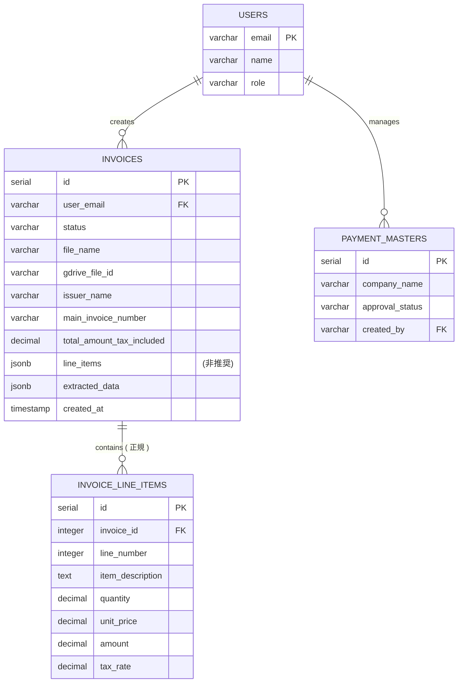
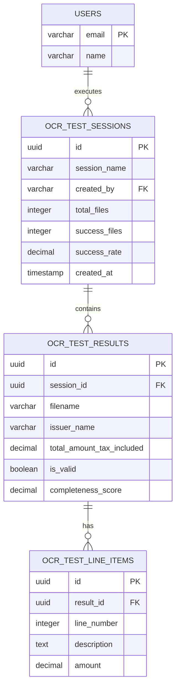
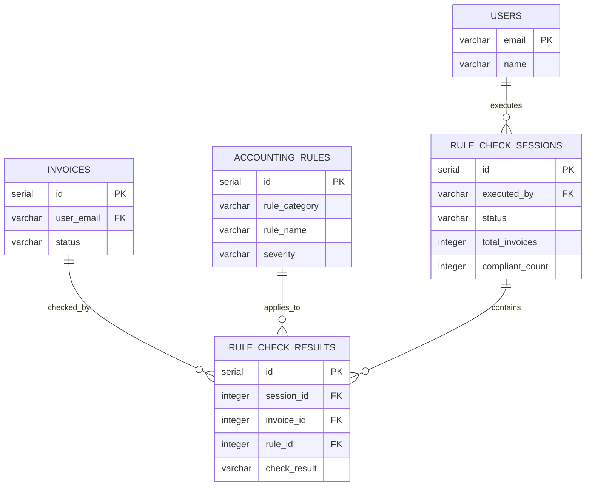
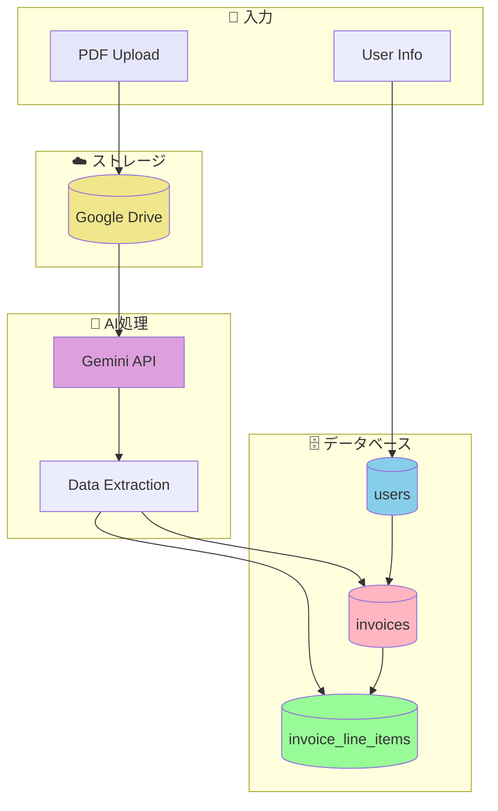
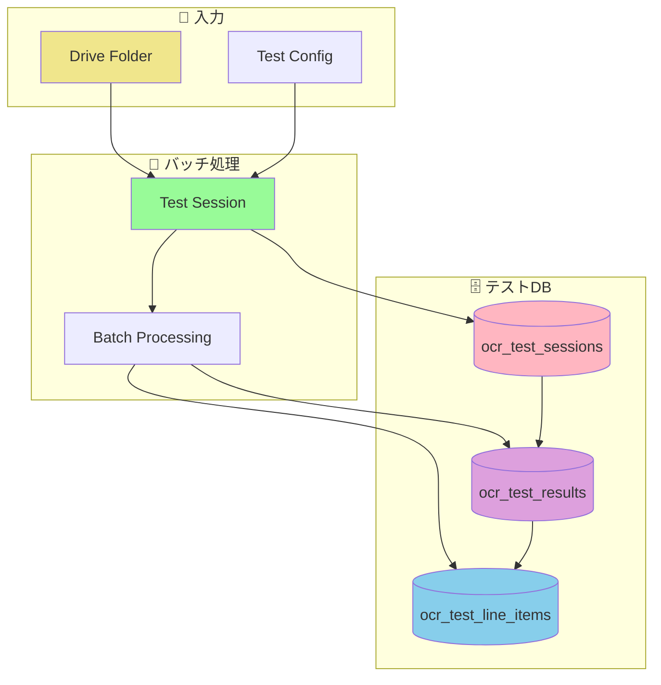
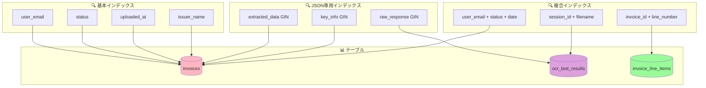
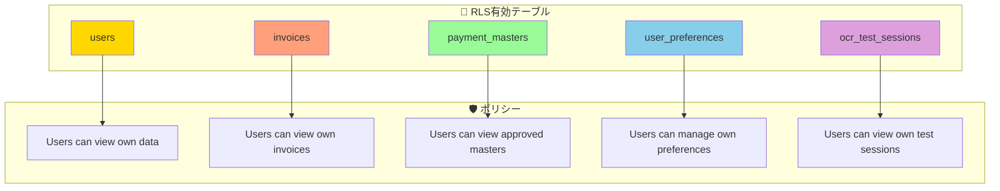
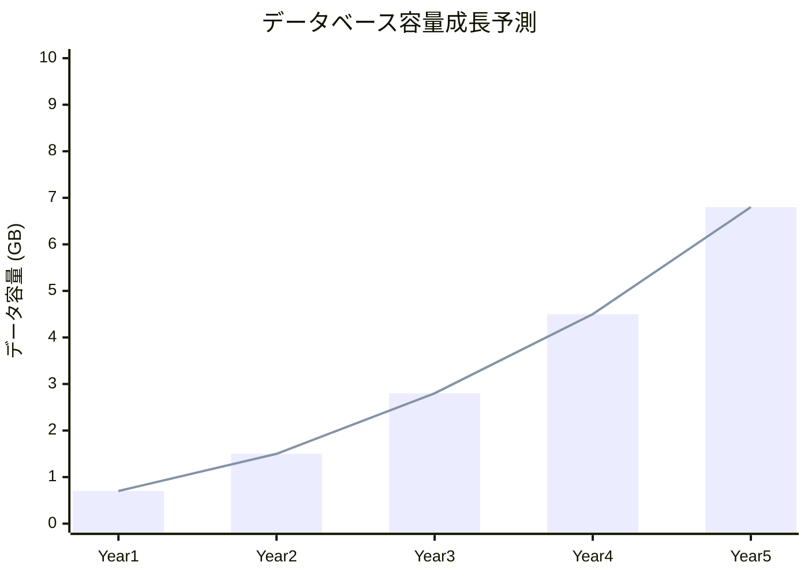
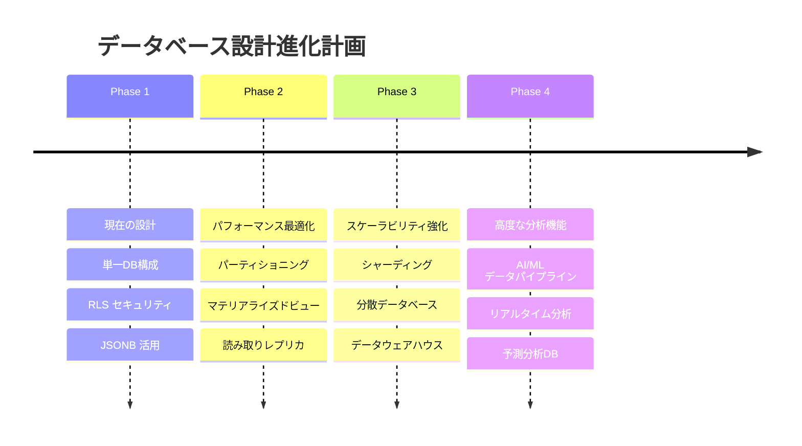

# 🗄️ データベースER図

**作成日**: 2025年1月24日  
**バージョン**: 1.1  
**対象システム**: 請求書処理自動化システム  
**データベース**: Supabase PostgreSQL

**v1.1更新内容**: 関連ドキュメントリンクを統一フォーマット化（3カテゴリ分類）

## 📊 概要

本ドキュメントは請求書処理自動化システムのデータベース構造をER図（Entity Relationship Diagram）で可視化し、テーブル間の関係性とデータフローを明確に示します。

## 🗂️ 完全ER図

### 全テーブル関係図

```mermaid
erDiagram
    %% ユーザー管理系
    USERS {
        varchar email PK "ユーザーメールアドレス"
        varchar name "ユーザー名"
        varchar role "権限(user/admin)"
    }
    
    USER_PREFERENCES {
        varchar user_email PK_FK "ユーザーメール"
        boolean notify_on_success "成功時通知"
        boolean notify_on_error "エラー時通知"
    }
    
    %% 請求書処理系
    INVOICES {
        serial id PK "請求書ID"
        varchar user_email FK "作成ユーザー"
        varchar status "処理状況"
        varchar file_name "ファイル名"
        varchar gdrive_file_id "GoogleDriveファイルID"
        timestamp uploaded_at "アップロード日時"
        varchar issuer_name "発行者名"
        varchar recipient_name "請求先名"
        varchar main_invoice_number "請求書番号"
        varchar receipt_number "受領書番号"
        varchar t_number "T番号"
        date issue_date "発行日"
        date due_date "支払期日"
        varchar currency "通貨コード"
        decimal total_amount_tax_included "税込合計金額"
        decimal total_amount_tax_excluded "税抜合計金額"
        jsonb key_info "キー情報JSON"
        jsonb line_items "(非推奨) 明細JSON"
        jsonb final_accounting_info "最終経理情報JSON"
        jsonb extracted_data "AI抽出データJSON"
        jsonb raw_response "生のAI応答JSON"
        boolean is_valid "検証状況"
        text[] validation_errors "検証エラー配列"
        text[] validation_warnings "検証警告配列"
        decimal completeness_score "完全性スコア"
        decimal processing_time "処理時間"
        varchar file_path "ファイルパス"
        timestamp created_at "作成日時"
        timestamp updated_at "更新日時"
    }
    
    INVOICE_LINE_ITEMS {
        serial id PK "明細ID"
        integer invoice_id FK "請求書ID"
        integer line_number "明細行番号"
        text item_description "商品・サービス名"
        decimal quantity "数量"
        decimal unit_price "単価"
        decimal amount "金額"
        decimal tax_rate "税率"
        timestamp created_at "作成日時"
        timestamp updated_at "更新日時"
    }
    
    PAYMENT_MASTERS {
        serial id PK "支払マスタID"
        varchar company_name "会社名"
        varchar content "内容"
        varchar additional_condition "追加条件"
        jsonb processing_rules "処理ルールJSON"
        varchar account_title "勘定科目"
        varchar item "項目"
        varchar payment_method "支払方法"
        varchar department "部門"
        varchar approval_status "承認状況"
        varchar created_by FK "作成者"
    }
    
    %% カード決済系
    CARD_STATEMENTS {
        serial id PK "カード明細ID"
        date transaction_date "取引日"
        varchar merchant_name "加盟店名"
        decimal jpy_amount "日本円金額"
        decimal foreign_currency_amount "外貨金額"
        varchar foreign_currency_code "外貨コード"
        decimal exchange_rate "為替レート"
    }
    
    %% OCRテスト系
    OCR_TEST_SESSIONS {
        uuid id PK "セッションID"
        varchar session_name "セッション名"
        varchar folder_id "フォルダID"
        integer total_files "総ファイル数"
        integer processed_files "処理済ファイル数"
        integer success_files "成功ファイル数"
        integer failed_files "失敗ファイル数"
        decimal average_completeness "平均完全性"
        decimal success_rate "成功率"
        decimal processing_duration "処理時間"
        varchar created_by FK "作成者"
        timestamp created_at "作成日時"
        timestamp updated_at "更新日時"
    }
    
    OCR_TEST_RESULTS {
        uuid id PK "結果ID"
        uuid session_id FK "セッションID"
        varchar file_id "ファイルID"
        varchar filename "ファイル名"
        bigint file_size "ファイルサイズ"
        varchar issuer_name "発行者名"
        varchar recipient_name "請求先名"
        varchar invoice_number "請求書番号"
        varchar registration_number "登録番号"
        varchar currency "通貨"
        decimal total_amount_tax_included "税込金額"
        decimal total_amount_tax_excluded "税抜金額"
        date issue_date "発行日"
        date due_date "支払期日"
        boolean is_valid "検証状況"
        decimal completeness_score "完全性スコア"
        text[] validation_errors "検証エラー"
        text[] validation_warnings "検証警告"
        decimal processing_time "処理時間"
        varchar gemini_model "Geminiモデル"
        jsonb raw_response "生の応答"
        timestamp created_at "作成日時"
        timestamp updated_at "更新日時"
    }
    
    OCR_TEST_LINE_ITEMS {
        uuid id PK "明細ID"
        uuid result_id FK "結果ID"
        integer line_number "行番号"
        text description "商品説明"
        decimal quantity "数量"
        decimal unit_price "単価"
        decimal amount "金額"
        varchar tax_rate "税率"
        timestamp created_at "作成日時"
    }
    
    %% ルール検証系
    ACCOUNTING_RULES {
        serial id PK "ルールID"
        varchar rule_category "ルールカテゴリ"
        varchar rule_name "ルール名"
        text rule_description "ルール説明"
        jsonb rule_conditions "ルール条件JSON"
        jsonb rule_values "ルール値JSON"
        varchar severity "重要度"
        varchar handbook_url "ハンドブックURL"
        integer slide_number "スライド番号"
        timestamp extracted_at "抽出日時"
        timestamp updated_at "更新日時"
    }
    
    RULE_CHECK_SESSIONS {
        serial id PK "チェックセッションID"
        varchar executed_by FK "実行者"
        timestamp started_at "開始日時"
        timestamp completed_at "完了日時"
        varchar status "状況"
        integer total_invoices "総請求書数"
        integer compliant_count "準拠数"
        integer warning_count "警告数"
        integer violation_count "違反数"
        varchar handbook_version "ハンドブックバージョン"
    }
    
    RULE_CHECK_RESULTS {
        serial id PK "チェック結果ID"
        integer session_id FK "セッションID"
        integer invoice_id FK "請求書ID"
        integer rule_id FK "ルールID"
        varchar check_result "チェック結果"
        text current_value "現在値"
        text expected_value "期待値"
        text violation_reason "違反理由"
        text suggestion "提案"
        timestamp checked_at "チェック日時"
    }
    
    %% リレーションシップ
    USERS ||--o{ USER_PREFERENCES : "1対1"
    USERS ||--o{ INVOICES : "1対多作成"
    USERS ||--o{ PAYMENT_MASTERS : "1対多作成"
    USERS ||--o{ OCR_TEST_SESSIONS : "1対多実行"
    USERS ||--o{ RULE_CHECK_SESSIONS : "1対多実行"
    
    INVOICES ||--o{ INVOICE_LINE_ITEMS : "1対多含有 (正規)"
    INVOICES ||--o{ RULE_CHECK_RESULTS : "1対多チェック"
    
    OCR_TEST_SESSIONS ||--o{ OCR_TEST_RESULTS : "1対多含有"
    OCR_TEST_RESULTS ||--o{ OCR_TEST_LINE_ITEMS : "1対多含有"
    
    ACCOUNTING_RULES ||--o{ RULE_CHECK_RESULTS : "1対多適用"
    RULE_CHECK_SESSIONS ||--o{ RULE_CHECK_RESULTS : "1対多含有"
```

## 📊 テーブルグループ別ER図

### 1. ユーザー管理系

```mermaid
erDiagram
    USERS {
        varchar email PK
        varchar name
        varchar role
    }
    
    USER_PREFERENCES {
        varchar user_email PK_FK
        boolean notify_on_success
        boolean notify_on_error
    }
    
    USERS ||--o| USER_PREFERENCES : "has"
```

### 2. 請求書処理系（コア）



### 3. OCRテスト系



### 4. ルール検証系



## 🔄 データフロー図

### 請求書処理データフロー



### OCRテストデータフロー



## 🔍 インデックス構成図

### パフォーマンス最適化インデックス



## 🔒 セキュリティ設計

### Row Level Security (RLS) 構成



## 📊 データ容量設計

### テーブル別データ容量予測

| テーブル名 | 年間レコード数 | 平均レコードサイズ | 年間データ容量 | 備考 |
|-----------|---------------|------------------|---------------|------|
| `invoices` | 120,000件 | 2KB | 240MB | JSONBデータ含む |
| `invoice_line_items` | 480,000件 | 200B | 96MB | 1請求書4明細平均 |
| `ocr_test_results` | 50,000件 | 1.5KB | 75MB | テスト用データ |
| `ocr_test_line_items` | 200,000件 | 150B | 30MB | テスト明細 |
| `rule_check_results` | 600,000件 | 500B | 300MB | チェック結果 |
| **総計** | **1,450,000件** | **平均520B** | **741MB/年** | **インデックス別途** |

### 成長予測グラフ



## 🚀 今後の拡張計画

### データベース進化ロードマップ



---

**最終更新**: 2025年1月24日  
**承認者**: データベース設計者  
**レビュー予定**: 2025年2月24日

**関連ドキュメント**:

### 📚 統合設計書
- [15_システムアーキテクチャ設計書.md](15_システムアーキテクチャ設計書.md) - システム全体設計（統合版）
- [16_データベース設計書.md](16_データベース設計書.md) - データベース設計（統合版）

### 🏗️ 詳細設計書（独立版）
- [17_システムアーキテクチャUML図.md](17_システムアーキテクチャUML図.md) - システムアーキテクチャ図集
- [19_テーブル設計詳細仕様書.md](19_テーブル設計詳細仕様書.md) - テーブル仕様・制約・インデックス
- [20_シーケンス図集.md](20_シーケンス図集.md) - 処理フロー・正常系・異常系
- [21_クラス図.md](21_クラス図.md) - クラス構造・コンポーネント関係

### 📋 ドキュメント管理
- [00_DOCS_INDEX.md](00_DOCS_INDEX.md) - 全ドキュメント一覧・関連性 