# 🔄 シーケンス図集

**作成日**: 2025年1月24日  
**バージョン**: 2.1  
**対象システム**: 請求書処理自動化システム

**v2.0更新内容**: 40カラム新機能対応・外貨換算・承認ワークフロー・freee連携シーケンス図追加  
**v2.1更新内容**: 実装状況反映・Gmail連携機能を実装予定に変更・外貨換算カード明細連携の実装状況修正
**v1.1更新内容**: 関連ドキュメントリンクを統一フォーマット化（3カテゴリ分類）

## 📊 概要

本ドキュメントは請求書処理自動化システムの主要な処理フローをシーケンス図で詳細に可視化し、正常系・異常系の両方のパターンを包括的に示します。

**🎉 2025年7月28日更新**: **40カラム新機能対応**により、外貨換算・承認ワークフロー・freee連携の3つの新機能処理フローが追加されました。Gmail連携機能は基盤準備完了・実装予定として計画されています。

**📋 2025年8月1日実装状況反映**: 各シーケンス図の実装状況を現在のコードと照合し、Gmail連携機能を「実装予定」、外貨換算のカード明細連携を「未実装（APIのみ）」として正確に反映しました。

## 📑 目次

1. [統合ワークフローテスト処理](#統合ワークフローテスト処理)
2. [請求書アップロード処理（バッチ）](#請求書アップロード処理バッチ)
3. [OCRテスト処理](#ocrテスト処理)
4. [ダッシュボード表示処理](#ダッシュボード表示処理)
5. [認証・認可処理](#認証認可処理)
6. [エラーハンドリング処理](#エラーハンドリング処理)
7. [💱 外貨換算処理](#外貨換算処理) ★v2.0 NEW★ ⚠️ **カード明細連携未実装**
8. [✅ 承認ワークフロー処理](#承認ワークフロー処理) ★v2.0 NEW★ ✅ **実装済み**
9. [📊 freee連携処理](#freee連携処理) ★v2.0 NEW★ ✅ **実装済み**
10. [📧 Gmail連携処理](#gmail連携処理) ★v2.0 PLANNED★ ⚠️ **実装予定**

---

## 🧪 統合ワークフローテスト処理

### 正常系：成功パターン

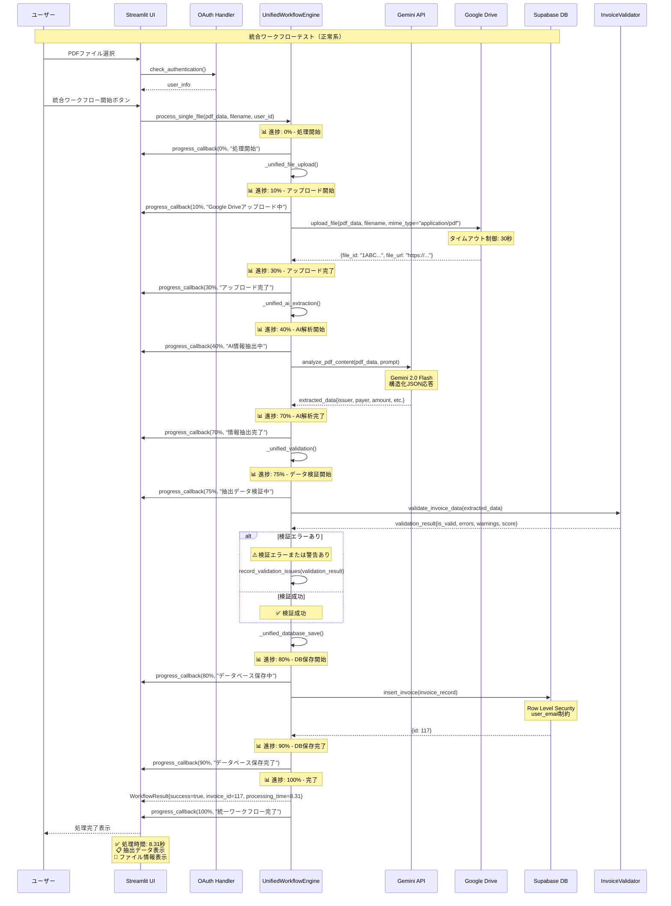
```mermaid
sequenceDiagram
    participant U as ユーザー
    participant UI as Streamlit UI
    participant AUTH as OAuth Handler
    participant UWE as UnifiedWorkflowEngine
    participant AI as Gemini API
    participant GD as Google Drive
    participant DB as Supabase DB
    
    Note over U, DB: 統合ワークフローテスト（正常系）
    
    %% 認証確認
    U->>UI: PDFファイル選択
    UI->>AUTH: check_authentication()
    AUTH-->>UI: user_info
    
    %% ワークフロー開始
    U->>UI: 統合ワークフロー開始ボタン
    UI->>UWE: process_single_file(pdf_data, filename, user_id)
    
    Note over UWE: 📊 進捗: 0% - 処理開始
    UWE->>UI: progress_callback(0%, "処理開始")
    
    %% ファイルアップロード段階
    UWE->>UWE: _unified_file_upload()
    Note over UWE: 📊 進捗: 10% - アップロード開始
    UWE->>UI: progress_callback(10%, "Google Driveアップロード中")
    
    UWE->>GD: upload_file(pdf_data, filename, mime_type="application/pdf")
    Note over GD: タイムアウト制御: 30秒
    GD-->>UWE: {file_id: "1ABC...", file_url: "https://..."}
    
    Note over UWE: 📊 進捗: 30% - アップロード完了
    UWE->>UI: progress_callback(30%, "アップロード完了")
    
    %% AI情報抽出段階
    UWE->>UWE: _unified_ai_extraction()
    Note over UWE: 📊 進捗: 40% - AI解析開始
    UWE->>UI: progress_callback(40%, "AI情報抽出中")
    
    UWE->>AI: analyze_pdf_content(pdf_data, prompt)
    Note over AI: Gemini 2.0 Flash<br/>構造化JSON応答
    AI-->>UWE: extracted_data{issuer, payer, amount, etc.}
    
    Note over UWE: 📊 進捗: 70% - AI解析完了
    UWE->>UI: progress_callback(70%, "情報抽出完了")
    
    %% データ検証段階
    UWE->>UWE: _unified_validation()
    Note over UWE: 📊 進捗: 75% - データ検証開始
    UWE->>UI: progress_callback(75%, "抽出データ検証中")

    participant VALIDATOR as InvoiceValidator
    UWE->>VALIDATOR: validate_invoice_data(extracted_data)
    VALIDATOR-->>UWE: validation_result{is_valid, errors, warnings, score}

    alt 検証エラーあり
        Note over UWE: ⚠️ 検証エラーまたは警告あり
        UWE->>UWE: record_validation_issues(validation_result)
    else 検証成功
        Note over UWE: ✅ 検証成功
    end

    %% データベース保存段階
    UWE->>UWE: _unified_database_save()
    Note over UWE: 📊 進捗: 80% - DB保存開始
    UWE->>UI: progress_callback(80%, "データベース保存中")
    
    UWE->>DB: insert_invoice(invoice_record)
    Note over DB: Row Level Security<br/>user_email制約
    DB-->>UWE: {id: 117}
    
    Note over UWE: 📊 進捗: 90% - DB保存完了
    UWE->>UI: progress_callback(90%, "データベース保存完了")
    
    %% 完了処理
    Note over UWE: 📊 進捗: 100% - 完了
    UWE-->>UI: WorkflowResult{success=true, invoice_id=117, processing_time=8.31}
    UWE->>UI: progress_callback(100%, "統一ワークフロー完了")
    
    %% 結果表示
    UI-->>U: 処理完了表示
    Note over UI: ✅ 処理時間: 8.31秒<br/>📋 抽出データ表示<br/>📄 ファイル情報表示
```

### 異常系：Google Driveアップロードエラー

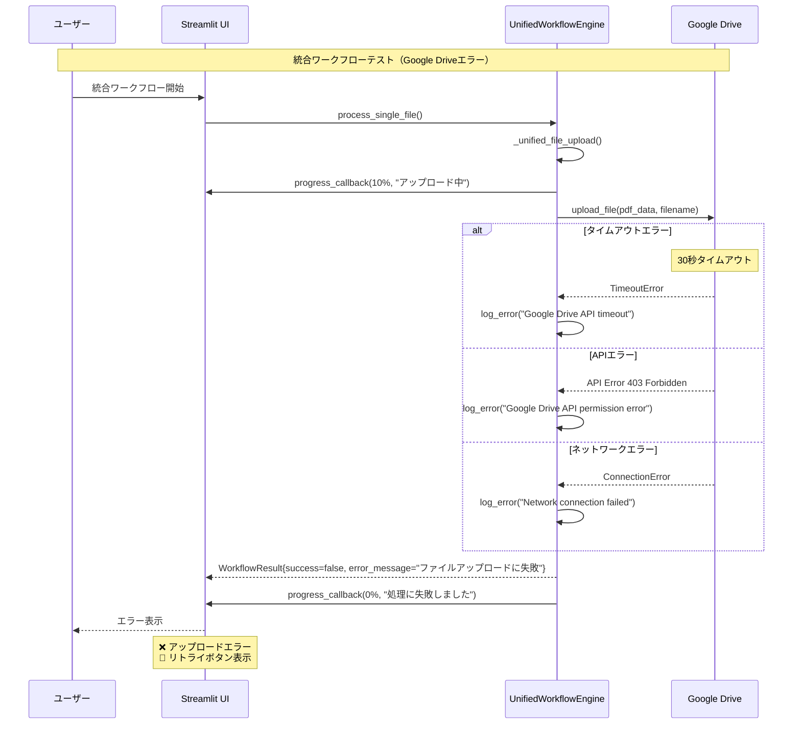
```mermaid
sequenceDiagram
    participant U as ユーザー
    participant UI as Streamlit UI
    participant UWE as UnifiedWorkflowEngine
    participant GD as Google Drive
    
    Note over U, GD: 統合ワークフローテスト（Google Driveエラー）
    
    U->>UI: 統合ワークフロー開始
    UI->>UWE: process_single_file()
    
    UWE->>UWE: _unified_file_upload()
    UWE->>UI: progress_callback(10%, "アップロード中")
    
    UWE->>GD: upload_file(pdf_data, filename)
    
    alt タイムアウトエラー
        Note over GD: 30秒タイムアウト
        GD-->>UWE: TimeoutError
        UWE->>UWE: log_error("Google Drive API timeout")
    else APIエラー  
        GD-->>UWE: API Error 403 Forbidden
        UWE->>UWE: log_error("Google Drive API permission error")
    else ネットワークエラー
        GD-->>UWE: ConnectionError
        UWE->>UWE: log_error("Network connection failed")
    end
    
    UWE-->>UI: WorkflowResult{success=false, error_message="ファイルアップロードに失敗"}
    UWE->>UI: progress_callback(0%, "処理に失敗しました")
    
    UI-->>U: エラー表示
    Note over UI: ❌ アップロードエラー<br/>🔄 リトライボタン表示
```

### 異常系：AI抽出エラー

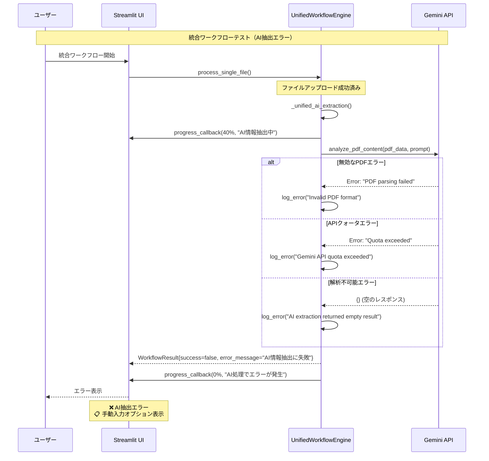
```mermaid
sequenceDiagram
    participant U as ユーザー
    participant UI as Streamlit UI
    participant UWE as UnifiedWorkflowEngine
    participant AI as Gemini API
    
    Note over U, AI: 統合ワークフローテスト（AI抽出エラー）
    
    U->>UI: 統合ワークフロー開始
    UI->>UWE: process_single_file()
    
    Note over UWE: ファイルアップロード成功済み
    
    UWE->>UWE: _unified_ai_extraction()
    UWE->>UI: progress_callback(40%, "AI情報抽出中")
    
    UWE->>AI: analyze_pdf_content(pdf_data, prompt)
    
    alt 無効なPDFエラー
        AI-->>UWE: Error: "PDF parsing failed"
        UWE->>UWE: log_error("Invalid PDF format")
    else APIクォータエラー
        AI-->>UWE: Error: "Quota exceeded"
        UWE->>UWE: log_error("Gemini API quota exceeded")
    else 解析不可能エラー
        AI-->>UWE: {}  (空のレスポンス)
        UWE->>UWE: log_error("AI extraction returned empty result")
    end
    
    UWE-->>UI: WorkflowResult{success=false, error_message="AI情報抽出に失敗"}
    UWE->>UI: progress_callback(0%, "AI処理でエラーが発生")
    
    UI-->>U: エラー表示
    Note over UI: ❌ AI抽出エラー<br/>📋 手動入力オプション表示
```

---

## 📤 請求書アップロード処理（バッチ）

### 正常系：複数ファイル一括処理

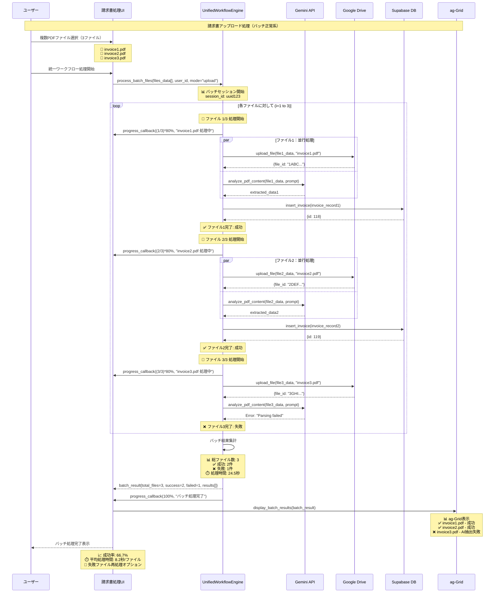
```mermaid
sequenceDiagram
    participant U as ユーザー
    participant UI as 請求書処理UI
    participant UWE as UnifiedWorkflowEngine
    participant AI as Gemini API
    participant GD as Google Drive
    participant DB as Supabase DB
    participant AGGRID as ag-Grid
    
    Note over U, AGGRID: 請求書アップロード処理（バッチ正常系）
    
    %% ファイル選択とバッチ開始
    U->>UI: 複数PDFファイル選択（3ファイル）
    Note over UI: 📄 invoice1.pdf<br/>📄 invoice2.pdf<br/>📄 invoice3.pdf
    
    U->>UI: 統一ワークフロー処理開始
    UI->>UWE: process_batch_files(files_data[], user_id, mode="upload")
    
    Note over UWE: 📊 バッチセッション開始<br/>session_id: uuid123
    
    %% ファイル1の処理
    loop 各ファイルに対して (i=1 to 3)
        Note over UWE: 📄 ファイル 1/3 処理開始
        UWE->>UI: progress_callback((1/3)*80%, "invoice1.pdf 処理中")
        
        par ファイル1：並行処理
            UWE->>GD: upload_file(file1_data, "invoice1.pdf")
            GD-->>UWE: {file_id: "1ABC..."}
        and
            UWE->>AI: analyze_pdf_content(file1_data, prompt)
            AI-->>UWE: extracted_data1
        end
        
        UWE->>DB: insert_invoice(invoice_record1)
        DB-->>UWE: {id: 118}
        
        Note over UWE: ✅ ファイル1完了: 成功
        
        %% ファイル2の処理
        Note over UWE: 📄 ファイル 2/3 処理開始
        UWE->>UI: progress_callback((2/3)*80%, "invoice2.pdf 処理中")
        
        par ファイル2：並行処理
            UWE->>GD: upload_file(file2_data, "invoice2.pdf")
            GD-->>UWE: {file_id: "2DEF..."}
        and
            UWE->>AI: analyze_pdf_content(file2_data, prompt)
            AI-->>UWE: extracted_data2
        end
        
        UWE->>DB: insert_invoice(invoice_record2)
        DB-->>UWE: {id: 119}
        
        Note over UWE: ✅ ファイル2完了: 成功
        
        %% ファイル3の処理（エラーケース）
        Note over UWE: 📄 ファイル 3/3 処理開始
        UWE->>UI: progress_callback((3/3)*80%, "invoice3.pdf 処理中")
        
        UWE->>GD: upload_file(file3_data, "invoice3.pdf")
        GD-->>UWE: {file_id: "3GHI..."}
        
        UWE->>AI: analyze_pdf_content(file3_data, prompt)
        AI-->>UWE: Error: "Parsing failed"
        
        Note over UWE: ❌ ファイル3完了: 失敗
        
    end
    
    %% バッチ結果集計
    UWE->>UWE: バッチ結果集計
    Note over UWE: 📊 総ファイル数: 3<br/>✅ 成功: 2件<br/>❌ 失敗: 1件<br/>⏱️ 処理時間: 24.5秒
    
    UWE-->>UI: batch_result{total_files=3, success=2, failed=1, results[]}
    UWE->>UI: progress_callback(100%, "バッチ処理完了")
    
    %% 結果表示
    UI->>AGGRID: display_batch_results(batch_result)
    Note over AGGRID: 📊 ag-Grid表示<br/>✅ invoice1.pdf - 成功<br/>✅ invoice2.pdf - 成功<br/>❌ invoice3.pdf - AI抽出失敗
    
    UI-->>U: バッチ処理完了表示
    Note over UI: 📈 成功率: 66.7%<br/>⏱️ 平均処理時間: 8.2秒/ファイル<br/>🔄 失敗ファイル再処理オプション
```

### 異常系：バッチ処理中断

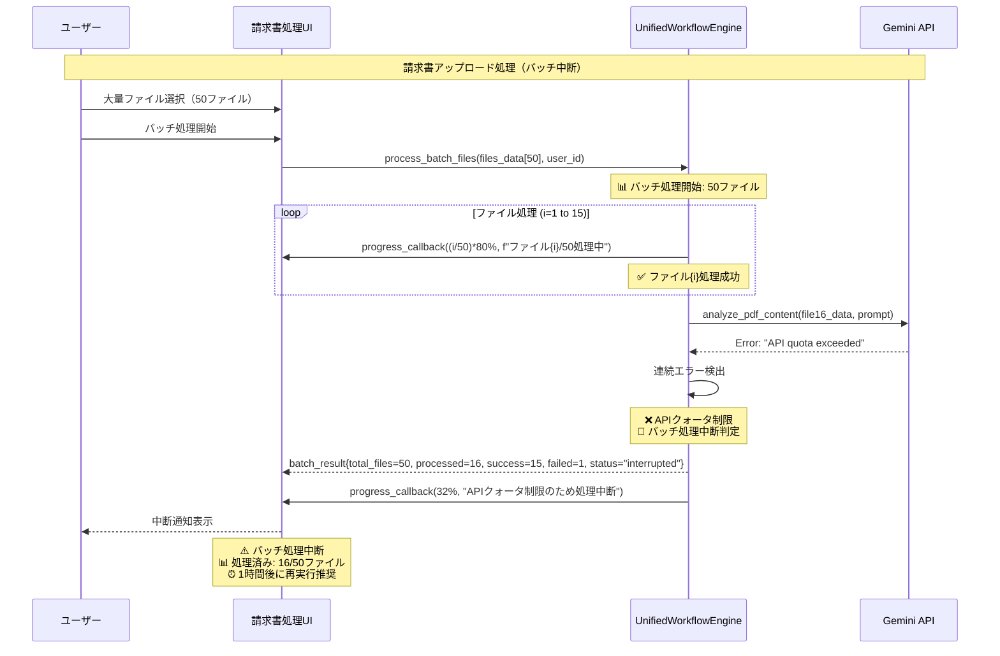
```mermaid
sequenceDiagram
    participant U as ユーザー
    participant UI as 請求書処理UI
    participant UWE as UnifiedWorkflowEngine
    participant AI as Gemini API
    
    Note over U, AI: 請求書アップロード処理（バッチ中断）
    
    U->>UI: 大量ファイル選択（50ファイル）
    U->>UI: バッチ処理開始
    UI->>UWE: process_batch_files(files_data[50], user_id)
    
    Note over UWE: 📊 バッチ処理開始: 50ファイル
    
    loop ファイル処理 (i=1 to 15)
        UWE->>UI: progress_callback((i/50)*80%, f"ファイル{i}/50処理中")
        Note over UWE: ✅ ファイル{i}処理成功
    end
    
    %% 16ファイル目でAPIクォータエラー
    UWE->>AI: analyze_pdf_content(file16_data, prompt)
    AI-->>UWE: Error: "API quota exceeded"
    
    UWE->>UWE: 連続エラー検出
    Note over UWE: ❌ APIクォータ制限<br/>🛑 バッチ処理中断判定
    
    UWE-->>UI: batch_result{total_files=50, processed=16, success=15, failed=1, status="interrupted"}
    UWE->>UI: progress_callback(32%, "APIクォータ制限のため処理中断")
    
    UI-->>U: 中断通知表示
    Note over UI: ⚠️ バッチ処理中断<br/>📊 処理済み: 16/50ファイル<br/>⏰ 1時間後に再実行推奨
```

---

## 🧪 OCRテスト処理

### 正常系：Google Drive連携テスト

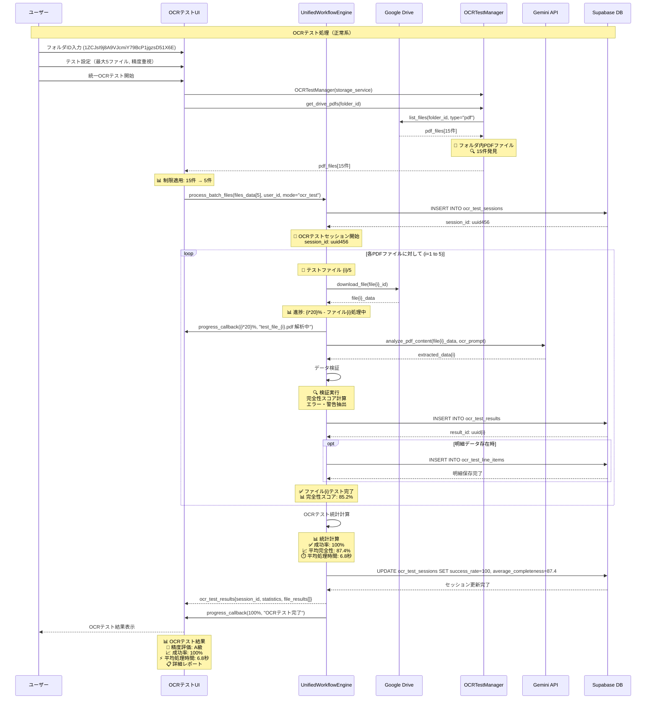
```mermaid
sequenceDiagram
    participant U as ユーザー
    participant UI as OCRテストUI
    participant UWE as UnifiedWorkflowEngine
    participant GD as Google Drive
    participant OCR as OCRTestManager
    participant AI as Gemini API
    participant DB as Supabase DB
    
    Note over U, DB: OCRテスト処理（正常系）
    
    %% テスト設定
    U->>UI: フォルダID入力 (1ZCJsI9j8A9VJcmiY79BcP1jgzsD51X6E)
    U->>UI: テスト設定（最大5ファイル, 精度重視）
    U->>UI: 統一OCRテスト開始
    
    %% Google Driveファイル一覧取得
    UI->>OCR: OCRTestManager(storage_service)
    UI->>OCR: get_drive_pdfs(folder_id)
    
    OCR->>GD: list_files(folder_id, type="pdf")
    GD-->>OCR: pdf_files[15件]
    
    Note over OCR: 📁 フォルダ内PDFファイル<br/>🔍 15件発見
    
    OCR-->>UI: pdf_files[15件]
    
    %% ファイル数制限適用
    Note over UI: 📊 制限適用: 15件 → 5件
    
    UI->>UWE: process_batch_files(files_data[5], user_id, mode="ocr_test")
    
    %% OCRテストセッション作成
    UWE->>DB: INSERT INTO ocr_test_sessions
    DB-->>UWE: session_id: uuid456
    
    Note over UWE: 🧪 OCRテストセッション開始<br/>session_id: uuid456
    
    %% 各ファイルのテスト処理
    loop 各PDFファイルに対して (i=1 to 5)
        Note over UWE: 📄 テストファイル {i}/5
        
        %% ファイルダウンロード
        UWE->>GD: download_file(file{i}_id)
        GD-->>UWE: file{i}_data
        
        Note over UWE: 📊 進捗: {i*20}% - ファイル{i}処理中
        UWE->>UI: progress_callback({i*20}%, "test_file_{i}.pdf 解析中")
        
        %% AI処理（OCR特化プロンプト）
        UWE->>AI: analyze_pdf_content(file{i}_data, ocr_prompt)
        AI-->>UWE: extracted_data{i}
        
        %% データ検証・スコアリング
        UWE->>UWE: データ検証
        Note over UWE: 🔍 検証実行<br/>完全性スコア計算<br/>エラー・警告抽出
        
        %% OCRテスト結果保存
        UWE->>DB: INSERT INTO ocr_test_results
        DB-->>UWE: result_id: uuid{i}
        
        %% 明細保存（存在する場合）
        opt 明細データ存在時
            UWE->>DB: INSERT INTO ocr_test_line_items
            DB-->>UWE: 明細保存完了
        end
        
        Note over UWE: ✅ ファイル{i}テスト完了<br/>📊 完全性スコア: 85.2%
        
    end
    
    %% OCRテスト統計計算
    UWE->>UWE: OCRテスト統計計算
    Note over UWE: 📊 統計計算<br/>✅ 成功率: 100%<br/>📈 平均完全性: 87.4%<br/>⏱️ 平均処理時間: 6.8秒
    
    %% セッション更新
    UWE->>DB: UPDATE ocr_test_sessions SET success_rate=100, average_completeness=87.4
    DB-->>UWE: セッション更新完了
    
    UWE-->>UI: ocr_test_results{session_id, statistics, file_results[]}
    UWE->>UI: progress_callback(100%, "OCRテスト完了")
    
    %% テスト結果表示
    UI-->>U: OCRテスト結果表示
    Note over UI: 📊 OCRテスト結果<br/>🎯 精度評価: A級<br/>📈 成功率: 100%<br/>⚡ 平均処理時間: 6.8秒<br/>📋 詳細レポート
```

### 異常系：フォルダアクセスエラー

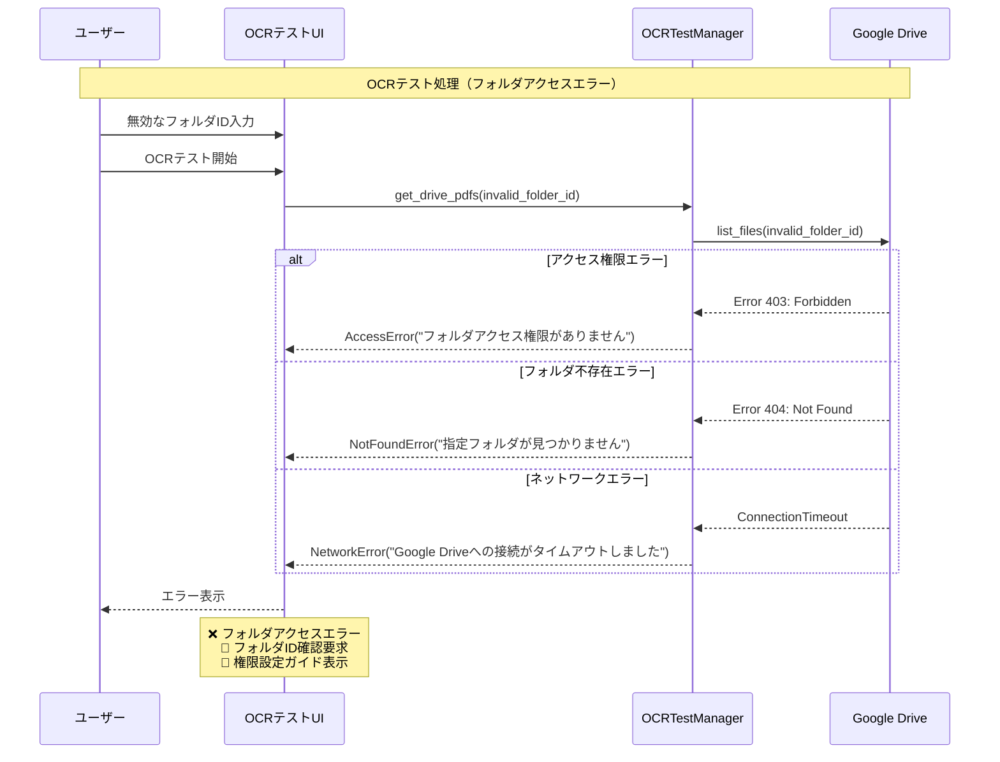
```mermaid
sequenceDiagram
    participant U as ユーザー
    participant UI as OCRテストUI
    participant OCR as OCRTestManager
    participant GD as Google Drive
    
    Note over U, GD: OCRテスト処理（フォルダアクセスエラー）
    
    U->>UI: 無効なフォルダID入力
    U->>UI: OCRテスト開始
    
    UI->>OCR: get_drive_pdfs(invalid_folder_id)
    OCR->>GD: list_files(invalid_folder_id)
    
    alt アクセス権限エラー
        GD-->>OCR: Error 403: Forbidden
        OCR-->>UI: AccessError("フォルダアクセス権限がありません")
    else フォルダ不存在エラー
        GD-->>OCR: Error 404: Not Found  
        OCR-->>UI: NotFoundError("指定フォルダが見つかりません")
    else ネットワークエラー
        GD-->>OCR: ConnectionTimeout
        OCR-->>UI: NetworkError("Google Driveへの接続がタイムアウトしました")
    end
    
    UI-->>U: エラー表示
    Note over UI: ❌ フォルダアクセスエラー<br/>🔧 フォルダID確認要求<br/>📖 権限設定ガイド表示
```

---

## 📊 ダッシュボード表示処理

### 正常系：ag-Grid請求書一覧表示

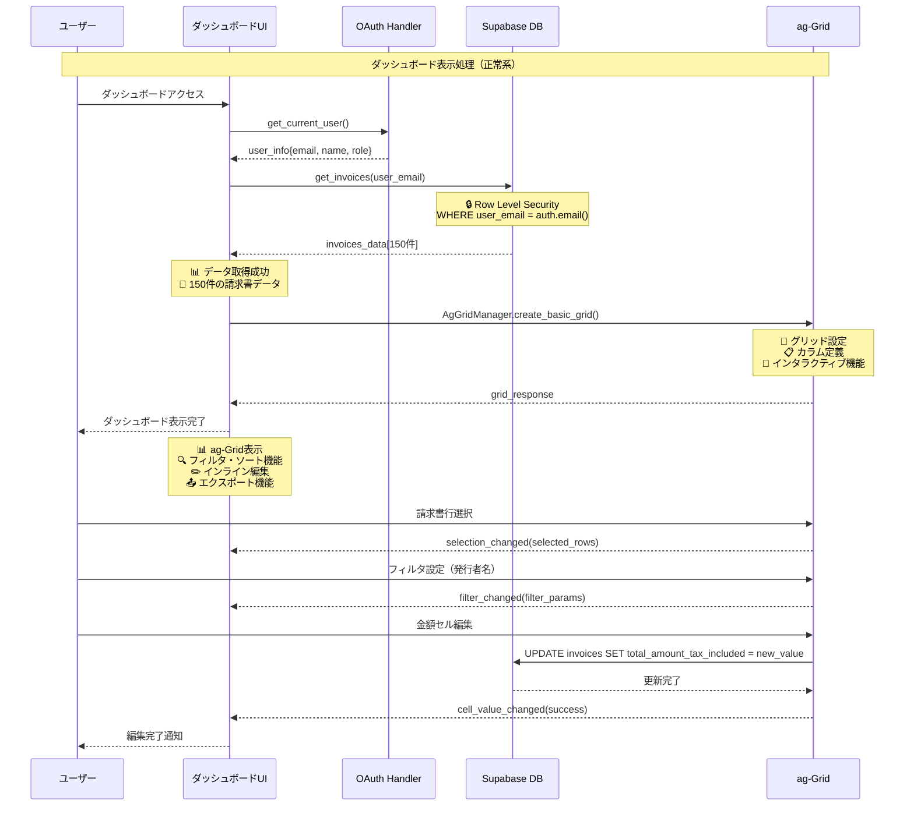
```mermaid
sequenceDiagram
    participant U as ユーザー
    participant UI as ダッシュボードUI
    participant AUTH as OAuth Handler
    participant DB as Supabase DB
    participant AGGRID as ag-Grid
    
    Note over U, AGGRID: ダッシュボード表示処理（正常系）
    
    %% 認証確認
    U->>UI: ダッシュボードアクセス
    UI->>AUTH: get_current_user()
    AUTH-->>UI: user_info{email, name, role}
    
    %% データ取得
    UI->>DB: get_invoices(user_email)
    Note over DB: 🔒 Row Level Security<br/>WHERE user_email = auth.email()
    
    DB-->>UI: invoices_data[150件]
    Note over UI: 📊 データ取得成功<br/>📄 150件の請求書データ
    
    %% ag-Grid設定
    UI->>AGGRID: AgGridManager.create_basic_grid()
    Note over AGGRID: 🎨 グリッド設定<br/>📋 カラム定義<br/>🔧 インタラクティブ機能
    
    AGGRID-->>UI: grid_response
    
    %% ユーザーへの表示
    UI-->>U: ダッシュボード表示完了
    Note over UI: 📊 ag-Grid表示<br/>🔍 フィルタ・ソート機能<br/>✏️ インライン編集<br/>📤 エクスポート機能
    
    %% ユーザーインタラクション
    U->>AGGRID: 請求書行選択
    AGGRID-->>UI: selection_changed(selected_rows)
    
    U->>AGGRID: フィルタ設定（発行者名）
    AGGRID-->>UI: filter_changed(filter_params)
    
    U->>AGGRID: 金額セル編集
    AGGRID->>DB: UPDATE invoices SET total_amount_tax_included = new_value
    DB-->>AGGRID: 更新完了
    AGGRID-->>UI: cell_value_changed(success)
    
    UI-->>U: 編集完了通知
```

### 異常系：大量データ表示

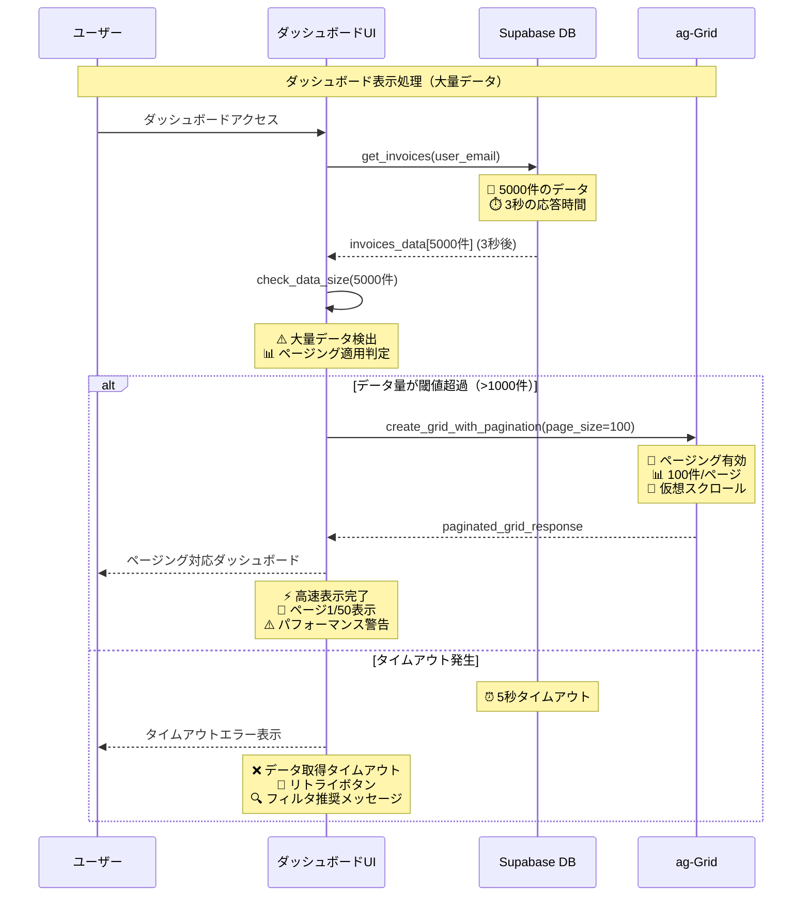
```mermaid
sequenceDiagram
    participant U as ユーザー
    participant UI as ダッシュボードUI
    participant DB as Supabase DB
    participant AGGRID as ag-Grid
    
    Note over U, AGGRID: ダッシュボード表示処理（大量データ）
    
    U->>UI: ダッシュボードアクセス
    UI->>DB: get_invoices(user_email)
    
    %% 大量データのレスポンス遅延
    Note over DB: 🐌 5000件のデータ<br/>⏱️ 3秒の応答時間
    
    DB-->>UI: invoices_data[5000件] (3秒後)
    
    %% パフォーマンス問題対応
    UI->>UI: check_data_size(5000件)
    Note over UI: ⚠️ 大量データ検出<br/>📊 ページング適用判定
    
    alt データ量が閾値超過（>1000件）
        UI->>AGGRID: create_grid_with_pagination(page_size=100)
        Note over AGGRID: 📄 ページング有効<br/>📊 100件/ページ<br/>🚀 仮想スクロール
        AGGRID-->>UI: paginated_grid_response
        
        UI-->>U: ページング対応ダッシュボード
        Note over UI: ⚡ 高速表示完了<br/>📄 ページ1/50表示<br/>⚠️ パフォーマンス警告
        
    else タイムアウト発生
        Note over DB: ⏰ 5秒タイムアウト
        UI-->>U: タイムアウトエラー表示
        Note over UI: ❌ データ取得タイムアウト<br/>🔄 リトライボタン<br/>🔍 フィルタ推奨メッセージ
    end
```

---

## 🔐 認証・認可処理

### 正常系：Google OAuth認証フロー

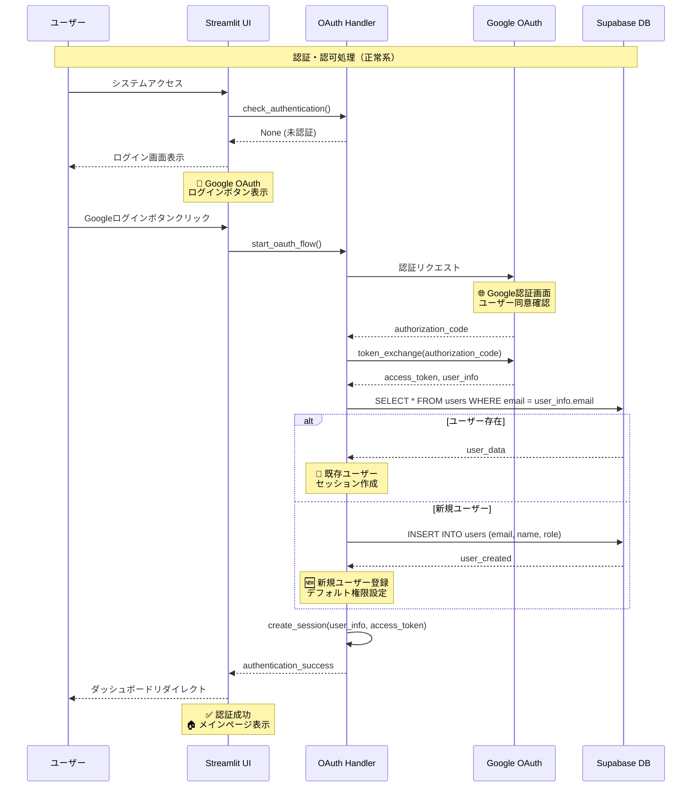
```mermaid
sequenceDiagram
    participant U as ユーザー
    participant UI as Streamlit UI
    participant AUTH as OAuth Handler
    participant GOOGLE as Google OAuth
    participant DB as Supabase DB
    
    Note over U, DB: 認証・認可処理（正常系）
    
    %% 未認証状態でのアクセス
    U->>UI: システムアクセス
    UI->>AUTH: check_authentication()
    AUTH-->>UI: None (未認証)
    
    UI-->>U: ログイン画面表示
    Note over UI: 🔐 Google OAuth<br/>ログインボタン表示
    
    %% OAuth認証開始
    U->>UI: Googleログインボタンクリック
    UI->>AUTH: start_oauth_flow()
    AUTH->>GOOGLE: 認証リクエスト
    
    Note over GOOGLE: 🌐 Google認証画面<br/>ユーザー同意確認
    
    GOOGLE-->>AUTH: authorization_code
    AUTH->>GOOGLE: token_exchange(authorization_code)
    GOOGLE-->>AUTH: access_token, user_info
    
    %% ユーザー情報処理
    AUTH->>DB: SELECT * FROM users WHERE email = user_info.email
    
    alt ユーザー存在
        DB-->>AUTH: user_data
        Note over AUTH: 📝 既存ユーザー<br/>セッション作成
    else 新規ユーザー
        AUTH->>DB: INSERT INTO users (email, name, role)
        DB-->>AUTH: user_created
        Note over AUTH: 🆕 新規ユーザー登録<br/>デフォルト権限設定
    end
    
    %% セッション確立
    AUTH->>AUTH: create_session(user_info, access_token)
    AUTH-->>UI: authentication_success
    
    UI-->>U: ダッシュボードリダイレクト
    Note over UI: ✅ 認証成功<br/>🏠 メインページ表示
```

### 異常系：認証エラー・権限不足

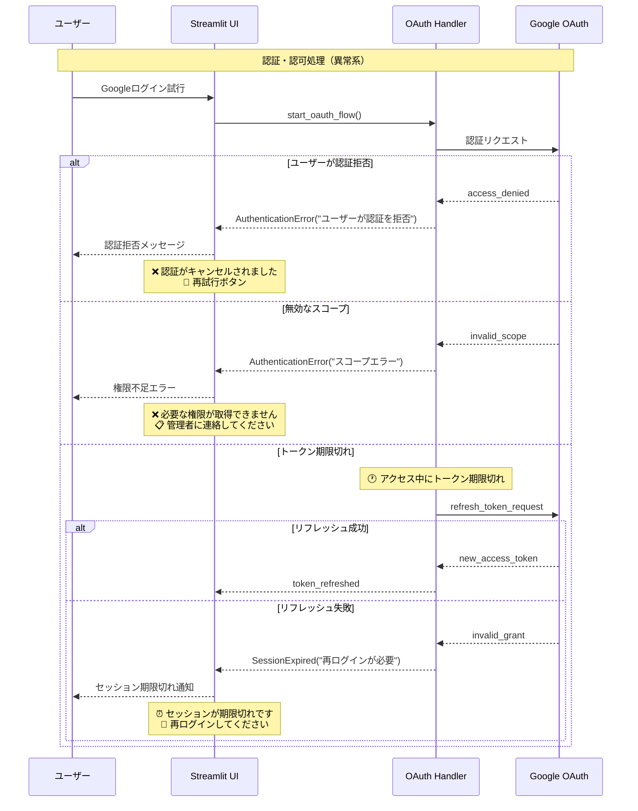
```mermaid
sequenceDiagram
    participant U as ユーザー
    participant UI as Streamlit UI
    participant AUTH as OAuth Handler
    participant GOOGLE as Google OAuth
    
    Note over U, GOOGLE: 認証・認可処理（異常系）
    
    U->>UI: Googleログイン試行
    UI->>AUTH: start_oauth_flow()
    AUTH->>GOOGLE: 認証リクエスト
    
    alt ユーザーが認証拒否
        GOOGLE-->>AUTH: access_denied
        AUTH-->>UI: AuthenticationError("ユーザーが認証を拒否")
        UI-->>U: 認証拒否メッセージ
        Note over UI: ❌ 認証がキャンセルされました<br/>🔄 再試行ボタン
        
    else 無効なスコープ
        GOOGLE-->>AUTH: invalid_scope
        AUTH-->>UI: AuthenticationError("スコープエラー")
        UI-->>U: 権限不足エラー
        Note over UI: ❌ 必要な権限が取得できません<br/>📋 管理者に連絡してください
        
    else トークン期限切れ
        Note over AUTH: 🕐 アクセス中にトークン期限切れ
        AUTH->>GOOGLE: refresh_token_request
        
        alt リフレッシュ成功
            GOOGLE-->>AUTH: new_access_token
            AUTH-->>UI: token_refreshed
        else リフレッシュ失敗
            GOOGLE-->>AUTH: invalid_grant
            AUTH-->>UI: SessionExpired("再ログインが必要")
            UI-->>U: セッション期限切れ通知
            Note over UI: ⏰ セッションが期限切れです<br/>🔐 再ログインしてください
        end
    end
```

---

## ⚠️ エラーハンドリング処理

### 統一エラーハンドリングフロー

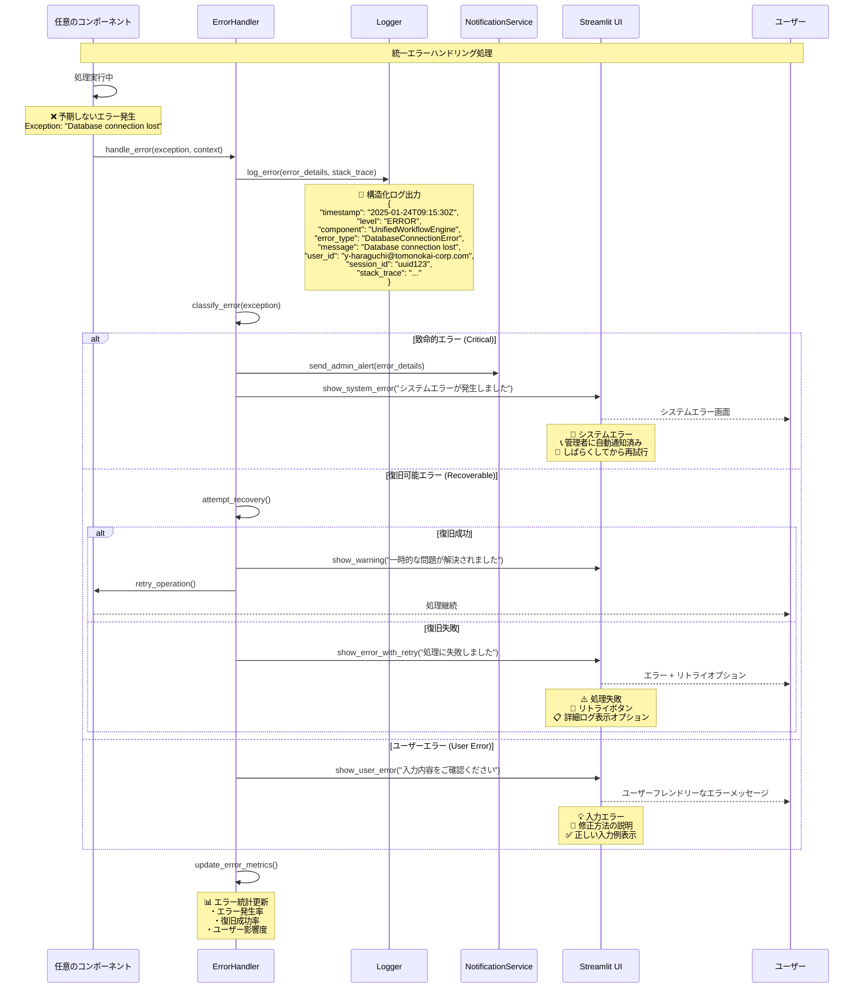
```mermaid
sequenceDiagram
    participant COMPONENT as 任意のコンポーネント
    participant ERROR_HANDLER as ErrorHandler
    participant LOGGER as Logger
    participant NOTIFIER as NotificationService
    participant UI as Streamlit UI
    participant USER as ユーザー
    
    Note over COMPONENT, USER: 統一エラーハンドリング処理
    
    %% エラー発生
    COMPONENT->>COMPONENT: 処理実行中
    Note over COMPONENT: ❌ 予期しないエラー発生<br/>Exception: "Database connection lost"
    
    %% エラーキャッチとログ
    COMPONENT->>ERROR_HANDLER: handle_error(exception, context)
    ERROR_HANDLER->>LOGGER: log_error(error_details, stack_trace)
    
    Note over LOGGER: 📝 構造化ログ出力<br/>{<br/>  "timestamp": "2025-01-24T09:15:30Z",<br/>  "level": "ERROR",<br/>  "component": "UnifiedWorkflowEngine",<br/>  "error_type": "DatabaseConnectionError",<br/>  "message": "Database connection lost",<br/>  "user_id": "y-haraguchi@tomonokai-corp.com",<br/>  "session_id": "uuid123",<br/>  "stack_trace": "..."<br/>}
    
    %% エラー分類と対応決定
    ERROR_HANDLER->>ERROR_HANDLER: classify_error(exception)
    
    alt 致命的エラー (Critical)
        ERROR_HANDLER->>NOTIFIER: send_admin_alert(error_details)
        ERROR_HANDLER->>UI: show_system_error("システムエラーが発生しました")
        UI-->>USER: システムエラー画面
        Note over UI: 🚨 システムエラー<br/>📞 管理者に自動通知済み<br/>🔄 しばらくしてから再試行
        
    else 復旧可能エラー (Recoverable)
        ERROR_HANDLER->>ERROR_HANDLER: attempt_recovery()
        
        alt 復旧成功
            ERROR_HANDLER->>UI: show_warning("一時的な問題が解決されました")
            ERROR_HANDLER->>COMPONENT: retry_operation()
            COMPONENT-->>USER: 処理継続
        else 復旧失敗
            ERROR_HANDLER->>UI: show_error_with_retry("処理に失敗しました")
            UI-->>USER: エラー + リトライオプション
            Note over UI: ⚠️ 処理失敗<br/>🔄 リトライボタン<br/>📋 詳細ログ表示オプション
        end
        
    else ユーザーエラー (User Error)
        ERROR_HANDLER->>UI: show_user_error("入力内容をご確認ください")
        UI-->>USER: ユーザーフレンドリーなエラーメッセージ
        Note over UI: 💡 入力エラー<br/>📝 修正方法の説明<br/>✅ 正しい入力例表示
    end
    
    %% エラー統計更新
    ERROR_HANDLER->>ERROR_HANDLER: update_error_metrics()
    Note over ERROR_HANDLER: 📊 エラー統計更新<br/>・エラー発生率<br/>・復旧成功率<br/>・ユーザー影響度
```

### ネットワークエラー回復フロー

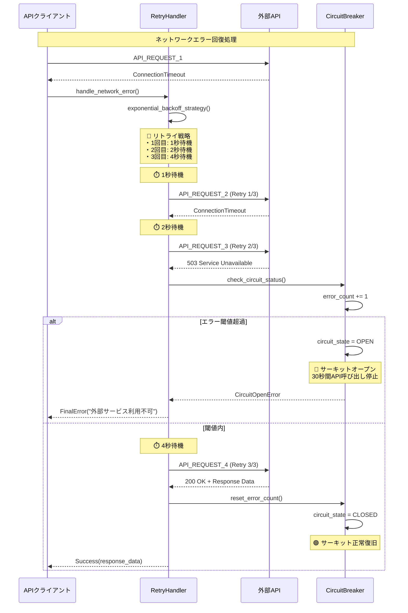
```mermaid
sequenceDiagram
    participant COMPONENT as APIクライアント
    participant RETRY as RetryHandler
    participant EXTERNAL as 外部API
    participant CIRCUIT as CircuitBreaker
    
    Note over COMPONENT, CIRCUIT: ネットワークエラー回復処理
    
    %% 初回リクエスト失敗
    COMPONENT->>EXTERNAL: API_REQUEST_1
    EXTERNAL-->>COMPONENT: ConnectionTimeout
    
    %% リトライハンドラ起動
    COMPONENT->>RETRY: handle_network_error()
    RETRY->>RETRY: exponential_backoff_strategy()
    
    Note over RETRY: 🔄 リトライ戦略<br/>・1回目: 1秒待機<br/>・2回目: 2秒待機<br/>・3回目: 4秒待機
    
    %% 1回目リトライ
    Note over RETRY: ⏱️ 1秒待機
    RETRY->>EXTERNAL: API_REQUEST_2 (Retry 1/3)
    EXTERNAL-->>RETRY: ConnectionTimeout
    
    %% 2回目リトライ  
    Note over RETRY: ⏱️ 2秒待機
    RETRY->>EXTERNAL: API_REQUEST_3 (Retry 2/3)
    EXTERNAL-->>RETRY: 503 Service Unavailable
    
    %% サーキットブレーカー判定
    RETRY->>CIRCUIT: check_circuit_status()
    CIRCUIT->>CIRCUIT: error_count += 1
    
    alt エラー閾値超過
        CIRCUIT->>CIRCUIT: circuit_state = OPEN
        Note over CIRCUIT: 🔴 サーキットオープン<br/>30秒間API呼び出し停止
        
        CIRCUIT-->>RETRY: CircuitOpenError
        RETRY-->>COMPONENT: FinalError("外部サービス利用不可")
        
    else 閾値内
        %% 3回目リトライ
        Note over RETRY: ⏱️ 4秒待機
        RETRY->>EXTERNAL: API_REQUEST_4 (Retry 3/3)
        EXTERNAL-->>RETRY: 200 OK + Response Data
        
        %% 成功時の回復処理
        RETRY->>CIRCUIT: reset_error_count()
        CIRCUIT->>CIRCUIT: circuit_state = CLOSED
        Note over CIRCUIT: 🟢 サーキット正常復旧
        
        RETRY-->>COMPONENT: Success(response_data)
    end
```

---

## 💱 データ検証・通貨正規化フロー ★NEW★

### 統一データ検証・正規化処理フロー

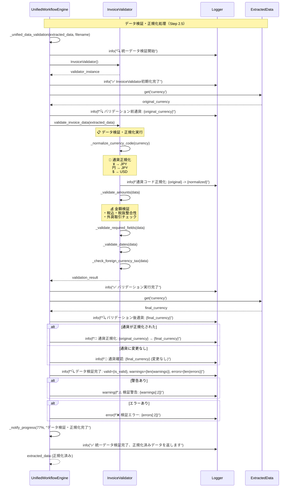
```mermaid
sequenceDiagram
    participant WE as UnifiedWorkflowEngine
    participant IV as InvoiceValidator
    participant LOG as Logger
    participant DATA as ExtractedData
    
    Note over WE, DATA: データ検証・正規化処理（Step 2.5）
    
    %% データ検証開始
    WE->>WE: _unified_data_validation(extracted_data, filename)
    WE->>LOG: info("🔍 統一データ検証開始")
    
    %% InvoiceValidator初期化
    WE->>IV: InvoiceValidator()
    IV-->>WE: validator_instance
    WE->>LOG: info("✅ InvoiceValidator初期化完了")
    
    %% 検証前状態記録
    WE->>DATA: get('currency')
    DATA-->>WE: original_currency
    WE->>LOG: info(f"🔍 バリデーション前通貨: {original_currency}")
    
    %% バリデーション実行
    WE->>IV: validate_invoice_data(extracted_data)
    
    Note over IV: 📋 データ検証・正規化実行
    
    %% 通貨正規化
    IV->>IV: _normalize_currency_code(currency)
    Note over IV: 💱 通貨正規化<br/>¥ → JPY<br/>円 → JPY<br/>$ → USD
    IV->>LOG: info(f"通貨コード正規化: {original} -> {normalized}")
    
    %% 金額検証
    IV->>IV: _validate_amounts(data)
    Note over IV: 💰 金額検証<br/>・税込・税抜整合性<br/>・外貨取引チェック
    
    %% その他検証
    IV->>IV: _validate_required_fields(data)
    IV->>IV: _validate_dates(data)
    IV->>IV: _check_foreign_currency_tax(data)
    
    %% 検証結果生成
    IV-->>WE: validation_result
    WE->>LOG: info("✅ バリデーション実行完了")
    
    %% 検証後状態確認
    WE->>DATA: get('currency')
    DATA-->>WE: final_currency
    WE->>LOG: info(f"🔍 バリデーション後通貨: {final_currency}")
    
    %% 通貨正規化結果確認
    alt 通貨が正規化された
        WE->>LOG: info(f"💱 通貨正規化: {original_currency} → {final_currency}")
    else 通貨に変更なし
        WE->>LOG: info(f"💱 通貨確認: {final_currency} (変更なし)")
    end
    
    %% 検証結果ログ出力
    WE->>LOG: info(f"🔍 データ検証完了: valid={is_valid}, warnings={len(warnings)}, errors={len(errors)}")
    
    alt 警告あり
        WE->>LOG: warning(f"⚠️ 検証警告: {warnings[:2]}")
    end
    
    alt エラーあり
        WE->>LOG: error(f"❌ 検証エラー: {errors[:2]}")
    end
    
    %% 進捗通知
    WE->>WE: _notify_progress(77%, "データ検証・正規化完了")
    
    %% 正規化済みデータ返却
    WE->>LOG: info("✅ 統一データ検証完了、正規化済みデータを返します")
    WE-->>WE: extracted_data (正規化済み)
```

### 通貨正規化対応表

| **入力** | **出力** | **備考** |
|:---|:---|:---|
| `¥` | `JPY` | 日本円記号 |
| `円` | `JPY` | 日本円漢字 |
| `$` | `USD` | 米ドル記号 |
| `USD` | `USD` | 既に正規化済み |
| `JPY` | `JPY` | 既に正規化済み |
| `EUR` | `EUR` | ユーロ（既に正規化済み） |

### 外貨取引対応フロー

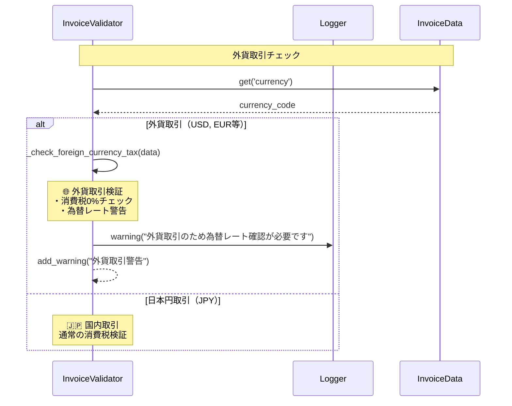
```mermaid
sequenceDiagram
    participant IV as InvoiceValidator
    participant LOG as Logger
    participant DATA as InvoiceData
    
    Note over IV, DATA: 外貨取引チェック
    
    IV->>DATA: get('currency')
    DATA-->>IV: currency_code
    
    alt 外貨取引（USD, EUR等）
        IV->>IV: _check_foreign_currency_tax(data)
        Note over IV: 🌐 外貨取引検証<br/>・消費税0%チェック<br/>・為替レート警告
        IV->>LOG: warning("外貨取引のため為替レート確認が必要です")
        IV-->>IV: add_warning("外貨取引警告")
        
    else 日本円取引（JPY）
        Note over IV: 🇯🇵 国内取引<br/>通常の消費税検証
    end
```

---

## 📊 パフォーマンス監視

### レスポンス時間監視フロー

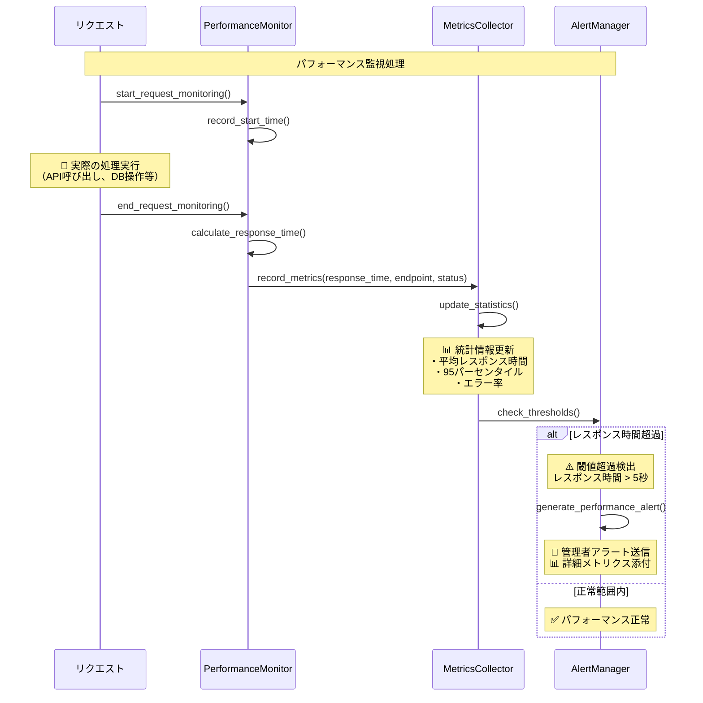
```mermaid
sequenceDiagram
    participant REQUEST as リクエスト
    participant MONITOR as PerformanceMonitor
    participant METRICS as MetricsCollector
    participant ALERT as AlertManager
    
    Note over REQUEST, ALERT: パフォーマンス監視処理
    
    %% リクエスト開始
    REQUEST->>MONITOR: start_request_monitoring()
    MONITOR->>MONITOR: record_start_time()
    
    %% 処理実行
    Note over REQUEST: 🔄 実際の処理実行<br/>（API呼び出し、DB操作等）
    
    %% リクエスト完了
    REQUEST->>MONITOR: end_request_monitoring()
    MONITOR->>MONITOR: calculate_response_time()
    
    %% メトリクス収集
    MONITOR->>METRICS: record_metrics(response_time, endpoint, status)
    METRICS->>METRICS: update_statistics()
    
    Note over METRICS: 📊 統計情報更新<br/>・平均レスポンス時間<br/>・95パーセンタイル<br/>・エラー率
    
    %% 閾値チェック
    METRICS->>ALERT: check_thresholds()
    
    alt レスポンス時間超過
        Note over ALERT: ⚠️ 閾値超過検出<br/>レスポンス時間 > 5秒
        ALERT->>ALERT: generate_performance_alert()
        Note over ALERT: 🚨 管理者アラート送信<br/>📊 詳細メトリクス添付
        
    else 正常範囲内
        Note over ALERT: ✅ パフォーマンス正常
    end
```

---

## 💱 外貨換算処理

### ⚠️ **実装状況**: **Exchange Rate API実装済み・カード明細連携未実装**

外貨換算機能は以下の実装状況です：

| **コンポーネント** | **実装状況** | **詳細** |
|------------------|-------------|---------|
| **CurrencyConversionService** | ✅ **実装済み** | Exchange Rate API連携完了 |
| **exchange_rate・jpy_amount** | ✅ **実装済み** | 40カラム対応完了 |
| **カード明細連携** | ❌ **未実装** | `card_statement_id` 常にNull |
| **実際の決済レート照合** | ❌ **未実装** | 外部APIのみ（既知課題ISS-009） |

### 正常系：外貨請求書自動換算フロー

```mermaid
sequenceDiagram
    participant U as ユーザー
    participant UI as Streamlit UI
    participant UWE as UnifiedWorkflowEngine
    participant AI as Gemini API
    participant CURRENCY as CurrencyConversionService
    participant EXCHANGE as Exchange Rate API
    participant DB as Supabase DB
    
    Note over U, DB: 外貨換算処理（正常系）⚠️ カード明細連携未実装
    
    %% 外貨請求書アップロード
    U->>UI: 外貨請求書アップロード（USD建て）
    UI->>UWE: process_single_file(usd_invoice.pdf, filename, user_id)
    
    %% AI解析・通貨検出
    UWE->>AI: analyze_pdf_content(pdf_data, currency_prompt)
    AI-->>UWE: extracted_data{currency: "USD", amount: 1000.00}
    
    Note over UWE: 💱 外貨検出: USD
    UWE->>UWE: detect_foreign_currency(extracted_data)
    
    %% 通貨換算サービス起動
    UWE->>CURRENCY: CurrencyConversionService()
    UWE->>CURRENCY: convert_to_jpy(amount=1000.00, from_currency="USD")
    
    %% 為替レート取得
    CURRENCY->>EXCHANGE: get_current_rate(from="USD", to="JPY")
    EXCHANGE-->>CURRENCY: {rate: 149.50, timestamp: "2025-01-24T10:00:00Z"}
    
    Note over CURRENCY: 💰 為替レート: 1 USD = 149.50 JPY
    
    %% JPY換算計算
    CURRENCY->>CURRENCY: calculate_jpy_amount(1000.00 * 149.50)
    CURRENCY-->>UWE: conversion_result{
        exchange_rate: 149.50,
        jpy_amount: 149500.00,
        conversion_timestamp: "2025-01-24T10:00:00Z"
    }
    
    %% 外貨データ拡張
    UWE->>UWE: enhance_invoice_data_with_currency()
    Note over UWE: 📊 請求書データ拡張<br/>- exchange_rate: 149.50<br/>- jpy_amount: 149500.00<br/>- currency: "USD"<br/>⚠️ card_statement_id: None（未実装）
    
    %% データベース保存
    UWE->>DB: insert_invoice(enhanced_invoice_data)
    Note over DB: 💾 外貨対応保存<br/>40カラム完全対応
    DB-->>UWE: {id: 120}
    
    %% 外貨換算結果表示
    UWE-->>UI: WorkflowResult{success=true, currency_conversion=true}
    UI-->>U: 外貨換算完了表示
    Note over UI: ✅ 外貨換算成功<br/>💱 USD 1,000.00 → JPY 149,500<br/>📊 レート: 1 USD = 149.50 JPY
```

### 異常系：為替レート取得エラー

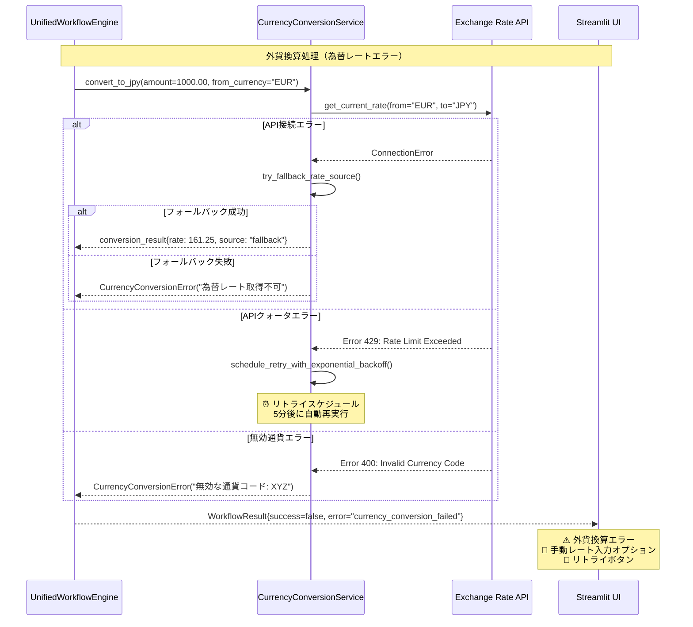
```mermaid
sequenceDiagram
    participant UWE as UnifiedWorkflowEngine
    participant CURRENCY as CurrencyConversionService
    participant EXCHANGE as Exchange Rate API
    participant UI as Streamlit UI
    
    Note over UWE, UI: 外貨換算処理（為替レートエラー）
    
    UWE->>CURRENCY: convert_to_jpy(amount=1000.00, from_currency="EUR")
    CURRENCY->>EXCHANGE: get_current_rate(from="EUR", to="JPY")
    
    alt API接続エラー
        EXCHANGE-->>CURRENCY: ConnectionError
        CURRENCY->>CURRENCY: try_fallback_rate_source()
        
        alt フォールバック成功
            CURRENCY-->>UWE: conversion_result{rate: 161.25, source: "fallback"}
        else フォールバック失敗
            CURRENCY-->>UWE: CurrencyConversionError("為替レート取得不可")
        end
        
    else APIクォータエラー
        EXCHANGE-->>CURRENCY: Error 429: Rate Limit Exceeded
        CURRENCY->>CURRENCY: schedule_retry_with_exponential_backoff()
        Note over CURRENCY: ⏰ リトライスケジュール<br/>5分後に自動再実行
        
    else 無効通貨エラー
        EXCHANGE-->>CURRENCY: Error 400: Invalid Currency Code
        CURRENCY-->>UWE: CurrencyConversionError("無効な通貨コード: XYZ")
    end
    
    UWE-->>UI: WorkflowResult{success=false, error="currency_conversion_failed"}
    Note over UI: ⚠️ 外貨換算エラー<br/>💱 手動レート入力オプション<br/>🔄 リトライボタン
```

---

## ✅ 承認ワークフロー処理

### 正常系：自動承認判定・通知フロー

```mermaid
sequenceDiagram
    participant U as ユーザー
    participant UI as Streamlit UI
    participant UWE as UnifiedWorkflowEngine
    participant APPROVAL as ApprovalControlService
    participant RULES as ApprovalRulesEngine
    participant NOTIFICATION as NotificationAPI
    participant APPROVER as 承認者
    participant DB as Supabase DB
    
    Note over U, DB: 承認ワークフロー処理（正常系）✅ 実装済み
    
    %% 請求書処理完了後の承認判定
    UWE->>APPROVAL: ApprovalControlService()
    UWE->>APPROVAL: evaluate_approval_requirement(invoice_data)
    
    %% 承認ルール評価
    APPROVAL->>RULES: check_approval_rules(invoice_data)
    Note over RULES: 📋 承認ルール評価<br/>- 金額: 50万円（閾値: 30万円）<br/>- 取引先: 新規取引先<br/>- 内容: コンサルティング費用
    
    RULES-->>APPROVAL: approval_decision{
        requires_approval: true,
        approval_level: "manager",
        reason: "金額が閾値を超過"
    }
    
    %% 承認者割り当て
    APPROVAL->>APPROVAL: assign_approver(approval_level="manager")
    Note over APPROVAL: 👤 承認者割り当て<br/>承認者: 部長 田中様
    
    %% 承認ステータス更新
    APPROVAL->>DB: UPDATE invoices SET approval_status='pending', approved_by=NULL
    DB-->>APPROVAL: 更新完了
    
    %% 承認通知送信
    APPROVAL->>NOTIFICATION: send_approval_notification(approver_info, invoice_summary)
    Note over NOTIFICATION: 📧 承認通知送信<br/>- Slack: #approval-channel<br/>- Email: tanaka@company.com<br/>- Teams: 承認チーム
    
    NOTIFICATION-->>APPROVAL: notification_sent{channels: ["slack", "email", "teams"]}
    
    %% 承認者による承認アクション
    APPROVER->>UI: 承認システムアクセス
    UI->>DB: get_pending_approvals(approver_email)
    DB-->>UI: pending_invoices[1件]
    
    UI-->>APPROVER: 承認待ち一覧表示
    Note over UI: 📋 承認待ち請求書<br/>💰 金額: ¥500,000<br/>🏢 取引先: ABC商事<br/>📄 内容: コンサルティング費用
    
    %% 承認実行
    APPROVER->>UI: 承認ボタンクリック
    UI->>APPROVAL: approve_invoice(invoice_id, approver_email, comment)
    
    APPROVAL->>DB: UPDATE invoices SET 
        approval_status='approved',
        approved_by='tanaka@company.com',
        approved_at=NOW()
    DB-->>APPROVAL: 承認完了
    
    %% 承認完了通知
    APPROVAL->>NOTIFICATION: send_approval_completion_notification()
    NOTIFICATION-->>U: 承認完了通知
    
    UI-->>APPROVER: 承認完了表示
    Note over UI: ✅ 承認完了<br/>📋 請求書ID: 120<br/>⏰ 承認日時: 2025-01-24 10:15:00
```

### 異常系：承認拒否・差し戻しフロー

```mermaid
sequenceDiagram
    participant APPROVER as 承認者
    participant UI as Streamlit UI
    participant APPROVAL as ApprovalControlService
    participant NOTIFICATION as NotificationAPI
    participant U as 申請者
    participant DB as Supabase DB
    
    Note over APPROVER, DB: 承認ワークフロー処理（承認拒否）
    
    %% 承認者による承認拒否
    APPROVER->>UI: 承認画面で拒否ボタンクリック
    UI->>APPROVAL: reject_invoice(invoice_id, reject_reason, approver_email)
    
    %% 拒否理由チェック
    APPROVAL->>APPROVAL: validate_reject_reason(reject_reason)
    Note over APPROVAL: 📝 拒否理由確認<br/>"請求書の詳細が不明確<br/>追加資料が必要"
    
    %% 承認ステータス更新
    APPROVAL->>DB: UPDATE invoices SET 
        approval_status='rejected',
        approved_by='tanaka@company.com',
        approved_at=NOW(),
        rejection_reason='請求書の詳細が不明確'
    DB-->>APPROVAL: 拒否完了
    
    %% 拒否通知送信
    APPROVAL->>NOTIFICATION: send_rejection_notification(applicant, reject_reason)
    NOTIFICATION-->>U: 拒否通知
    
    Note over U: 📧 承認拒否通知<br/>❌ 請求書が拒否されました<br/>📝 理由: 詳細が不明確<br/>📎 追加資料をアップロードしてください
    
    %% 再申請フロー
    U->>UI: 追加資料アップロード
    UI->>APPROVAL: resubmit_invoice(invoice_id, additional_documents)
    
    APPROVAL->>DB: UPDATE invoices SET 
        approval_status='pending',
        approved_by=NULL,
        resubmission_count=resubmission_count+1
    DB-->>APPROVAL: 再申請登録完了
    
    %% 再承認通知
    APPROVAL->>NOTIFICATION: send_resubmission_notification(approver)
    NOTIFICATION-->>APPROVER: 再申請通知
    
    Note over APPROVER: 🔄 再申請通知<br/>📋 請求書ID: 120<br/>📎 追加資料あり<br/>⏰ 再申請日時: 2025-01-24 14:30:00
```

---

## 📊 freee連携処理

### 正常系：自動仕訳作成・連携フロー

```mermaid
sequenceDiagram
    participant U as ユーザー
    participant UI as Streamlit UI
    participant UWE as UnifiedWorkflowEngine
    participant FREEE_SVC as FreeeIntegrationService
    participant FREEE_API as freee API
    participant ACCOUNT_MAP as 勘定科目マッピング
    participant DB as Supabase DB
    
    Note over U, DB: freee連携処理（正常系）✅ 実装済み
    
    %% 承認済み請求書のfreee連携開始
    U->>UI: freee連携実行ボタン
    UI->>UWE: execute_freee_integration(invoice_id)
    
    %% FreeeIntegrationService初期化
    UWE->>FREEE_SVC: FreeeIntegrationService()
    UWE->>FREEE_SVC: process_approved_invoice(invoice_data)
    
    %% freee API認証確認
    FREEE_SVC->>FREEE_API: validate_api_connection()
    FREEE_API-->>FREEE_SVC: connection_status{valid: true, scope: "read_write"}
    
    %% 勘定科目マッピング
    FREEE_SVC->>ACCOUNT_MAP: map_expense_category(invoice_data)
    Note over ACCOUNT_MAP: 📊 勘定科目マッピング<br/>内容: "コンサルティング費用"<br/>→ 勘定科目: "支払手数料"<br/>→ 補助科目: "コンサルティング料"
    
    ACCOUNT_MAP-->>FREEE_SVC: mapping_result{
        account_code: "5201",
        account_name: "支払手数料",
        sub_account: "コンサルティング料"
    }
    
    %% 仕訳データ準備
    FREEE_SVC->>FREEE_SVC: prepare_journal_entry(invoice_data, mapping_result)
    Note over FREEE_SVC: 📋 仕訳データ準備<br/>借方: 支払手数料 500,000円<br/>貸方: 未払金 500,000円<br/>摘要: "ABC商事 コンサルティング費用"
    
    %% freee API仕訳作成
    FREEE_SVC->>FREEE_API: create_journal_entry(journal_data)
    Note over FREEE_API: 💾 freee仕訳作成<br/>日付: 2025-01-24<br/>伝票番号: 自動採番
    
    FREEE_API-->>FREEE_SVC: journal_created{
        id: "freee_txn_123456",
        journal_number: "JE-20250124-001",
        status: "draft"
    }
    
    %% バッチ処理ID生成
    FREEE_SVC->>FREEE_SVC: generate_batch_id()
    Note over FREEE_SVC: 🏷️ バッチID生成<br/>freee_batch_202501241015
    
    %% データベース連携状況更新
    FREEE_SVC->>DB: UPDATE invoices SET 
        exported_to_freee=true,
        export_date=NOW(),
        freee_batch_id='freee_batch_202501241015'
    DB-->>FREEE_SVC: 連携状況更新完了
    
    %% 連携結果返却
    FREEE_SVC-->>UWE: integration_result{
        success: true,
        freee_transaction_id: "freee_txn_123456",
        journal_number: "JE-20250124-001"
    }
    
    UWE-->>UI: freee連携完了
    UI-->>U: freee連携成功表示
    Note over UI: ✅ freee連携完了<br/>📊 仕訳番号: JE-20250124-001<br/>💼 freee取引ID: freee_txn_123456<br/>📅 連携日時: 2025-01-24 10:15:00
```

### 異常系：API制限・勘定科目エラー

```mermaid
sequenceDiagram
    participant FREEE_SVC as FreeeIntegrationService
    participant FREEE_API as freee API
    participant ACCOUNT_MAP as 勘定科目マッピング
    participant UI as Streamlit UI
    participant U as ユーザー
    
    Note over FREEE_SVC, U: freee連携処理（異常系）
    
    %% freee連携開始
    FREEE_SVC->>FREEE_API: create_journal_entry(journal_data)
    
    alt APIレート制限エラー
        FREEE_API-->>FREEE_SVC: Error 429: Rate Limit Exceeded
        FREEE_SVC->>FREEE_SVC: schedule_retry_with_exponential_backoff()
        Note over FREEE_SVC: ⏰ リトライスケジュール<br/>5分後に自動再実行
        
    else 勘定科目マッピングエラー
        FREEE_SVC->>ACCOUNT_MAP: map_expense_category("不明な経費項目")
        ACCOUNT_MAP-->>FREEE_SVC: MappingError("対応する勘定科目が見つかりません")
        
        FREEE_SVC->>UI: show_manual_mapping_dialog(unmapped_category)
        UI-->>U: 手動勘定科目選択画面
        Note over UI: 📋 勘定科目選択<br/>❓ "不明な経費項目"<br/>🏷️ 手動で勘定科目を選択してください
        
    else freee API認証エラー
        FREEE_API-->>FREEE_SVC: Error 401: Unauthorized
        FREEE_SVC->>FREEE_SVC: refresh_oauth_token()
        
        alt トークン更新成功
            FREEE_SVC->>FREEE_API: create_journal_entry(journal_data) (リトライ)
        else トークン更新失敗
            FREEE_SVC-->>UI: AuthenticationError("freee再認証が必要")
            UI-->>U: freee再認証画面
            Note over UI: 🔐 freee再認証<br/>OAuth認証をやり直してください
        end
        
    else データ形式エラー
        FREEE_API-->>FREEE_SVC: Error 400: Invalid Data Format
        FREEE_SVC->>FREEE_SVC: validate_and_fix_data_format()
        Note over FREEE_SVC: 🔧 データ形式修正<br/>必須フィールド補完・形式調整
        
        alt データ修正成功
            FREEE_SVC->>FREEE_API: create_journal_entry(corrected_data)
        else データ修正失敗
            FREEE_SVC-->>UI: DataValidationError("請求書データの修正が必要")
        end
    end
    
    UI-->>U: freee連携エラー表示
    Note over UI: ❌ freee連携エラー<br/>🔄 自動リトライ設定<br/>📞 サポートに連絡オプション
```

---

## 📧 Gmail連携処理

### ⚠️ **実装状況**: **基盤準備完了・実装予定**

Gmail連携機能は以下の実装状況です：

| **コンポーネント** | **実装状況** | **詳細** |
|------------------|-------------|---------|
| **データベースフィールド** | ✅ **準備完了** | `gmail_message_id`, `attachment_id`, `sender_email` カラム実装済み |
| **GmailIntegrationService** | ❌ **未実装** | サービスクラス未作成 |
| **Gmail OAuth認証** | ❌ **未実装** | 認証機能未実装 |
| **添付ファイル自動取得** | ❌ **未実装** | Gmail API連携未実装 |

### 実装予定シーケンス図（将来実装時）

```mermaid
sequenceDiagram
    participant U as ユーザー
    participant UI as Streamlit UI
    participant GMAIL_SVC as GmailIntegrationService
    participant GMAIL_API as Gmail API
    participant UWE as UnifiedWorkflowEngine
    participant DB as Supabase DB
    
    Note over U, DB: Gmail連携処理（実装予定）
    
    %% Gmail OAuth認証（実装予定）
    U->>UI: Gmail連携開始
    UI->>GMAIL_SVC: authenticate_gmail()
    GMAIL_SVC->>GMAIL_API: OAuth認証リクエスト
    GMAIL_API-->>GMAIL_SVC: access_token
    
    %% メール一覧取得（実装予定）
    GMAIL_SVC->>GMAIL_API: list_messages(query="has:attachment filename:pdf")
    GMAIL_API-->>GMAIL_SVC: messages[10件]
    
    %% 添付ファイル処理（実装予定）
    loop 各メールに対して
        GMAIL_SVC->>GMAIL_API: get_attachment(message_id, attachment_id)
        GMAIL_API-->>GMAIL_SVC: pdf_data
        
        GMAIL_SVC->>UWE: process_gmail_file(pdf_data, gmail_metadata)
        Note over UWE: 📧 Gmail メタデータ設定<br/>- gmail_message_id: "msg123"<br/>- sender_email: "billing@company.com"<br/>- attachment_id: "att456"
        
        UWE->>DB: insert_invoice(gmail_enhanced_data)
        DB-->>UWE: {id: 121}
    end
    
    UI-->>U: Gmail連携完了
    Note over UI: ✅ Gmail連携成功<br/>📧 10件のメール処理完了<br/>📎 添付ファイル自動取得
```

**実装計画**:
1. **Phase 1**: GmailIntegrationService クラス実装
2. **Phase 2**: Gmail OAuth認証機能実装  
3. **Phase 3**: 添付ファイル自動取得機能実装
4. **Phase 4**: UI統合・テスト完了

---

**最終更新**: 2025年8月1日 - 実装状況反映完了  
**承認者**: システム設計者・開発チーム  
**レビュー予定**: 2025年8月28日

**関連ドキュメント**:

### 📚 統合設計書
- [15_システムアーキテクチャ設計書.md](15_システムアーキテクチャ設計書.md) - システム全体設計（統合版）
- [16_データベース設計書.md](16_データベース設計書.md) - データベース設計（統合版）

### 🏗️ 詳細設計書（独立版）
- [17_システムアーキテクチャUML図.md](17_システムアーキテクチャUML図.md) - システムアーキテクチャ図集
- [18_データベースER図.md](18_データベースER図.md) - データベースER図・関係性
- [19_テーブル設計詳細仕様書.md](19_テーブル設計詳細仕様書.md) - テーブル仕様・制約・インデックス
- [21_クラス図.md](21_クラス図.md) - クラス構造・コンポーネント関係

### 📋 ドキュメント管理
- [00_DOCS_INDEX.md](00_DOCS_INDEX.md) - 全ドキュメント一覧・関連性 