# 📦 クラス図

**作成日**: 2025年1月24日  
**バージョン**: 2.0  
**対象システム**: 請求書処理自動化システム  
**最終更新**: 2025年7月24日

**v2.0更新内容**: 重複削除・モジュール統合・通貨正規化機能対応
- PromptSelector削除（UnifiedPromptManagerに統合）
- UnifiedWorkflowEngineにデータ検証ステップ追加
- InvoiceValidatorに通貨正規化機能追加
- シングルトンパターンの適用

## 📊 概要

本ドキュメントは請求書処理自動化システムの全クラス構造をUMLクラス図で可視化し、各クラスの属性、メソッド、関係性を詳細に定義します。

## 📑 目次

1. [全体クラス構成](#全体クラス構成)
2. [プレゼンテーション層](#プレゼンテーション層)
3. [ビジネスロジック層](#ビジネスロジック層)
4. [インフラストラクチャ層](#インフラストラクチャ層)
5. [データモデル層](#データモデル層)
6. [継承・実装関係](#継承実装関係)
7. [デザインパターン](#デザインパターン)

---

## 🏗️ 全体クラス構成

### システム全体のクラス関係図

```mermaid
classDiagram
    %% プレゼンテーション層
    class StreamlitApp {
        +main()
        +initialize_session_state()
        +render_sidebar()
        +handle_navigation()
    }
    
    class InvoiceProcessingPage {
        +render_unified_invoice_processing_page()
        +render_production_upload_content()
        +render_ocr_test_content()
        +execute_unified_upload_processing()
        +execute_unified_ocr_test()
    }
    
    class TestPages {
        +render_integrated_workflow_test_page()
        +execute_integrated_workflow()
        +render_workflow_progress()
        +render_workflow_result()
    }
    
    class SettingsPage {
        +render_dashboard_page()
        +render_invoice_aggrid()
    }
    
    %% ビジネスロジック層
    class UnifiedWorkflowEngine {
        -ai_service: GeminiAPIManager
        -storage_service: GoogleDriveManager
        -database_service: DatabaseManager
        -progress_callback: Callable
        -progress_history: List[WorkflowProgress]
        -prompt_manager: UnifiedPromptManager
        -prompt_selector: PromptSelector
        +__init__(ai_service, storage_service, database_service, progress_callback)
        +process_single_file(pdf_file_data, filename, user_id, mode) WorkflowResult
        +process_uploaded_files(uploaded_files, user_id, mode) Dict
        +process_batch_files(files_data, user_id, mode) Dict
        +process_ocr_test_from_drive(folder_id, user_id, max_files) Dict
        +_unified_file_upload(pdf_file_data, filename) Dict
        +_unified_ai_extraction(pdf_file_data, filename) Dict
        +_unified_data_validation(extracted_data, filename) Dict ★NEW★
        +_unified_database_save(file_info, validated_data, filename, user_id, mode) str
        +_notify_progress(status, step, progress_percent, message, details)
        +get_progress_history() List[WorkflowProgress]
        +reset_progress()
    }
    
    class UnifiedPromptManager {
        -prompts_dir: str
        -prompts_cache: Dict
        -default_prompts: Dict
        +__init__(prompts_dir)
        +get_prompt_by_key(key) Dict
        +format_prompt_for_gemini(prompt_key, variables) Tuple[str, str]
        +validate_prompt_compatibility(prompt_key, operation_type) Tuple[bool, List]
        +get_recommended_prompt(mode) str ★統合★
        +get_prompt_compatibility_score(prompt_key, mode) float ★統合★
        +_load_prompts()
        +_cache_prompt(key, content)
        +_evaluate_prompt_suitability(prompt_data, mode) float ★統合★
    }
    
    class PromptSelector {
        -prompt_manager: UnifiedPromptManager
        +__init__(prompt_manager)
        +get_recommended_prompt(mode) str
        +get_prompt_compatibility_score(prompt_key, mode) float
        +_evaluate_prompt_suitability(prompt_data, mode) float
        %% NOTE: UnifiedPromptManagerに統合済み（後方互換性のため保持）
    }
    
    %% PromptSelector統合済み - UnifiedPromptManagerに統合
    
    class InvoiceValidator {
        +validate_invoice_data(invoice_data, strict_mode) Dict
        +calculate_completeness_score(invoice_data) float
        +_validate_required_fields(data) List[str]
        +_validate_amounts(data) List[str]
        +_normalize_currency_code(currency) str ★NEW★
        +_validate_dates(data) List[str]
        +_check_foreign_currency_tax(data) List[str] ★NEW★
        +_validate_data_types(data) List[str]
        +_validate_business_rules(data) List[str]
    }
    
    %% インフラストラクチャ層
    class DatabaseManager {
        -client: SupabaseClient
        -connection_config: Dict
        +__init__(url, key)
        +insert_invoice(invoice_data) Dict
        +get_invoices(user_email) List[Dict]
        +check_tables_exist() Dict
        +get_sample_data() Dict
        +_execute_query(query, params) Any
        +_handle_rls_policy(user_email) bool
    }
    
    class GeminiAPIManager {
        -api_key: str
        -model_name: str
        -client: GenerativeAI
        +__init__(api_key, model_name)
        +analyze_pdf_content(pdf_data, prompt) Dict
        +generate_text(prompt) str
        +validate_api_connection() bool
        +_prepare_pdf_for_analysis(pdf_data) Any
        +_parse_json_response(response) Dict
    }
    
    class GoogleDriveManager {
        -service_account_info: Dict
        -default_folder_id: str
        -credentials: Credentials
        +__init__(service_account_info, default_folder_id)
        +upload_file(file_content, filename, folder_id, mime_type) Dict
        +download_file(file_id) bytes
        +list_files(folder_id, file_type) List[Dict]
        +get_file_info(file_id) Dict
        +_authenticate() Credentials
        +_handle_timeout(timeout_seconds) Any
    }
    
    class AgGridManager {
        +create_basic_grid(data, columns) Any
        +get_selected_rows(grid_response) List[Dict]
        +display_invoice_data(invoice_data) Any
        +_configure_grid_options() Dict
        +_setup_column_definitions(columns) List[Dict]
    }
    
    %% データモデル層
    class WorkflowResult {
        +success: bool
        +invoice_id: Optional[str]
        +extracted_data: Optional[Dict]
        +file_info: Optional[Dict]
        +error_message: Optional[str]
        +processing_time: float
        +progress_history: List[WorkflowProgress]
        +__init__(**kwargs)
        +to_dict() Dict
        +is_successful() bool
    }
    
    class WorkflowProgress {
        +status: WorkflowStatus
        +step: str
        +progress_percent: int
        +message: str
        +timestamp: datetime
        +details: Optional[Dict]
        +__init__(status, step, progress_percent, message, timestamp, details)
        +to_dict() Dict
        +format_timestamp() str
    }
    
    class WorkflowStatus {
        <<enumeration>>
        UPLOADING
        PROCESSING
        SAVING
        COMPLETED
        FAILED
    }
    
    %% 関係性
    StreamlitApp --> InvoiceProcessingPage
    StreamlitApp --> TestPages
    StreamlitApp --> SettingsPage
    
    InvoiceProcessingPage --> UnifiedWorkflowEngine
    TestPages --> UnifiedWorkflowEngine
    
    UnifiedWorkflowEngine --> DatabaseManager
    UnifiedWorkflowEngine --> GeminiAPIManager
    UnifiedWorkflowEngine --> GoogleDriveManager
    UnifiedWorkflowEngine --> UnifiedPromptManager
    UnifiedWorkflowEngine --> InvoiceValidator
    
    UnifiedWorkflowEngine ..> WorkflowResult : creates
    UnifiedWorkflowEngine ..> WorkflowProgress : emits
    
    %% PromptSelector --> UnifiedPromptManager（統合により削除）
    SettingsPage --> AgGridManager
    SettingsPage --> DatabaseManager
    
    WorkflowProgress --> WorkflowStatus
```

---

## 📱 プレゼンテーション層

### Streamlitアプリケーション構成

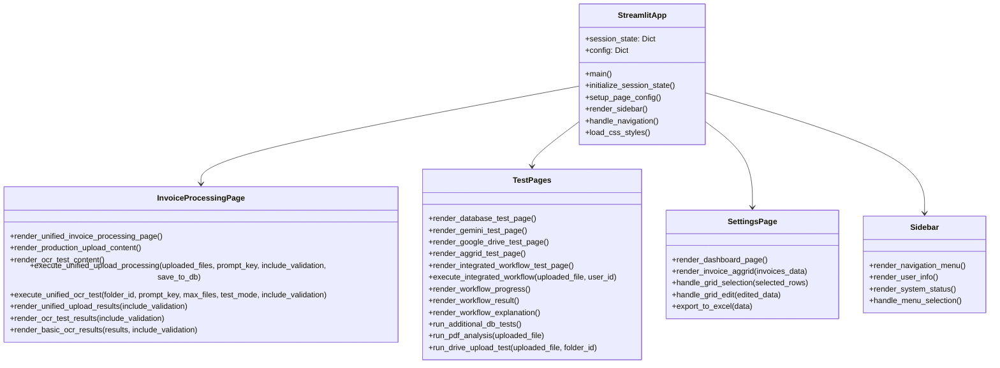

### ページコンポーネント詳細

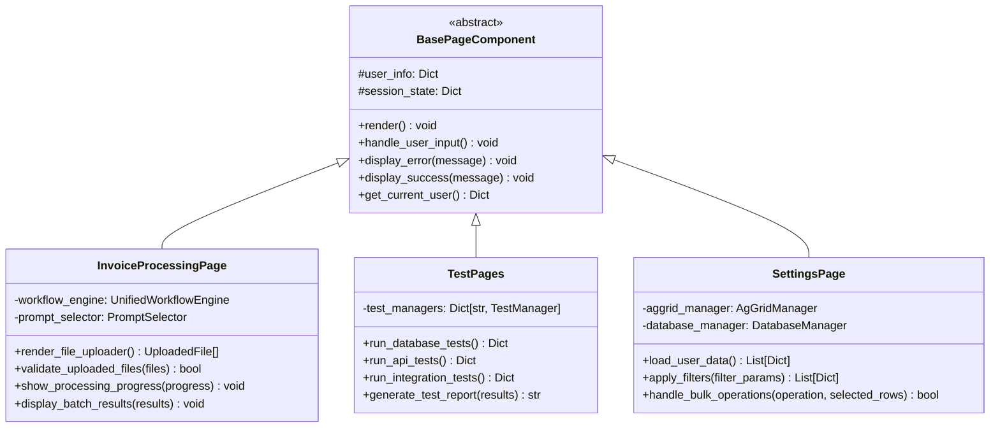

---

## 🧠 ビジネスロジック層

### 統一ワークフローエンジン詳細

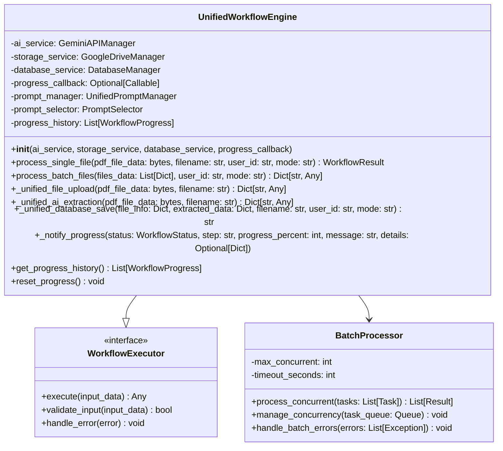

### サービス層クラス群

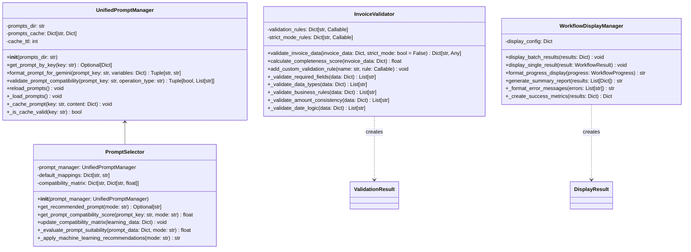

---

## 🔧 インフラストラクチャ層

### データベース層

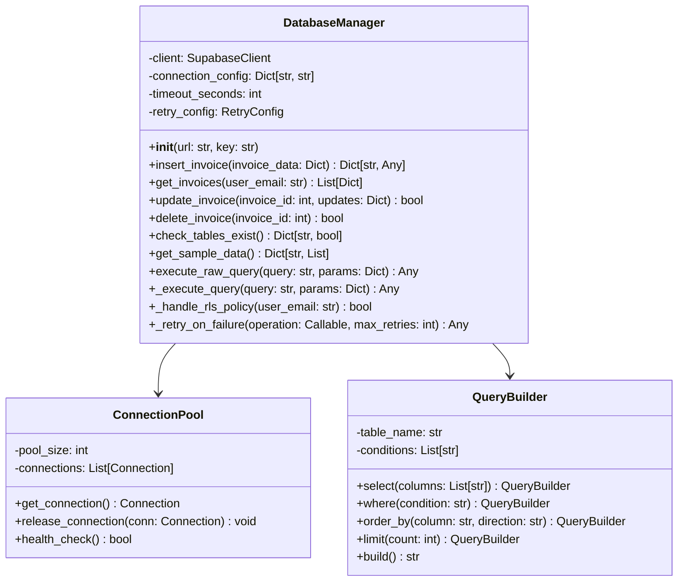

### AI処理層

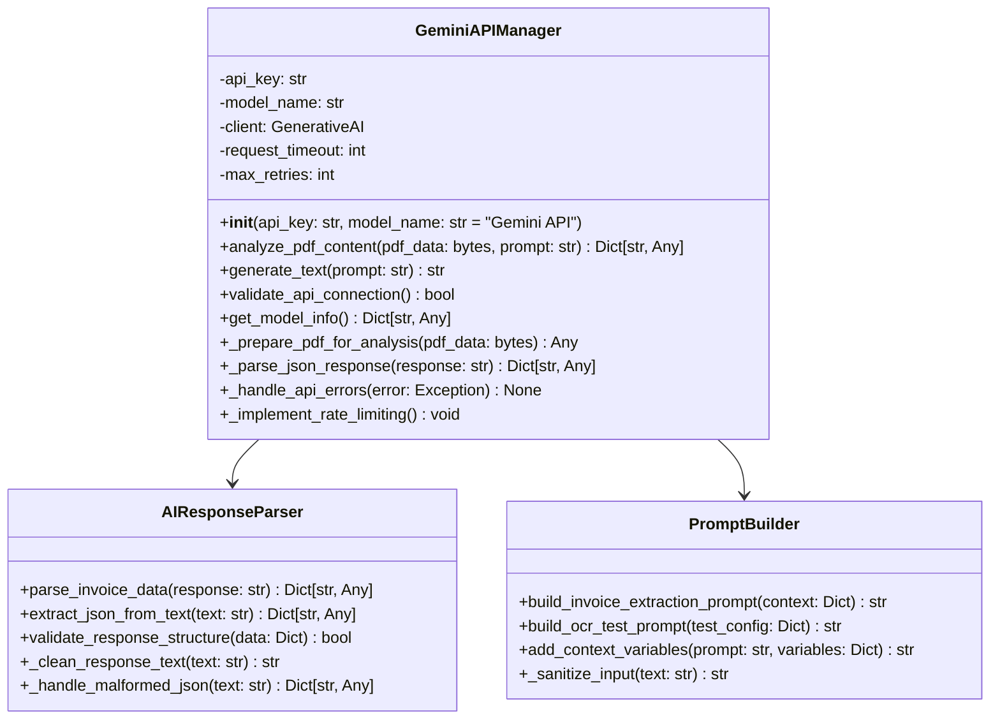

### ストレージ層

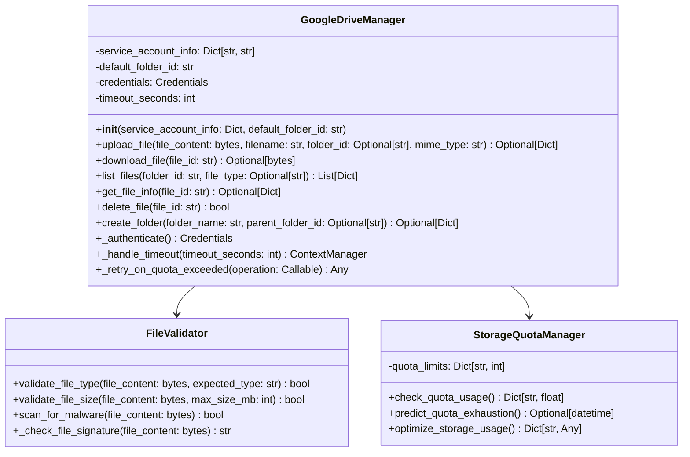

### UI拡張層

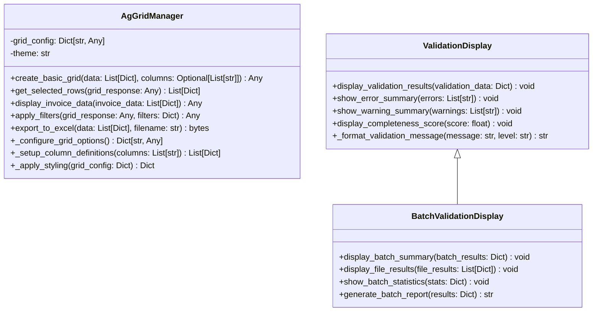

---

## 📊 データモデル層

### ワークフローモデル

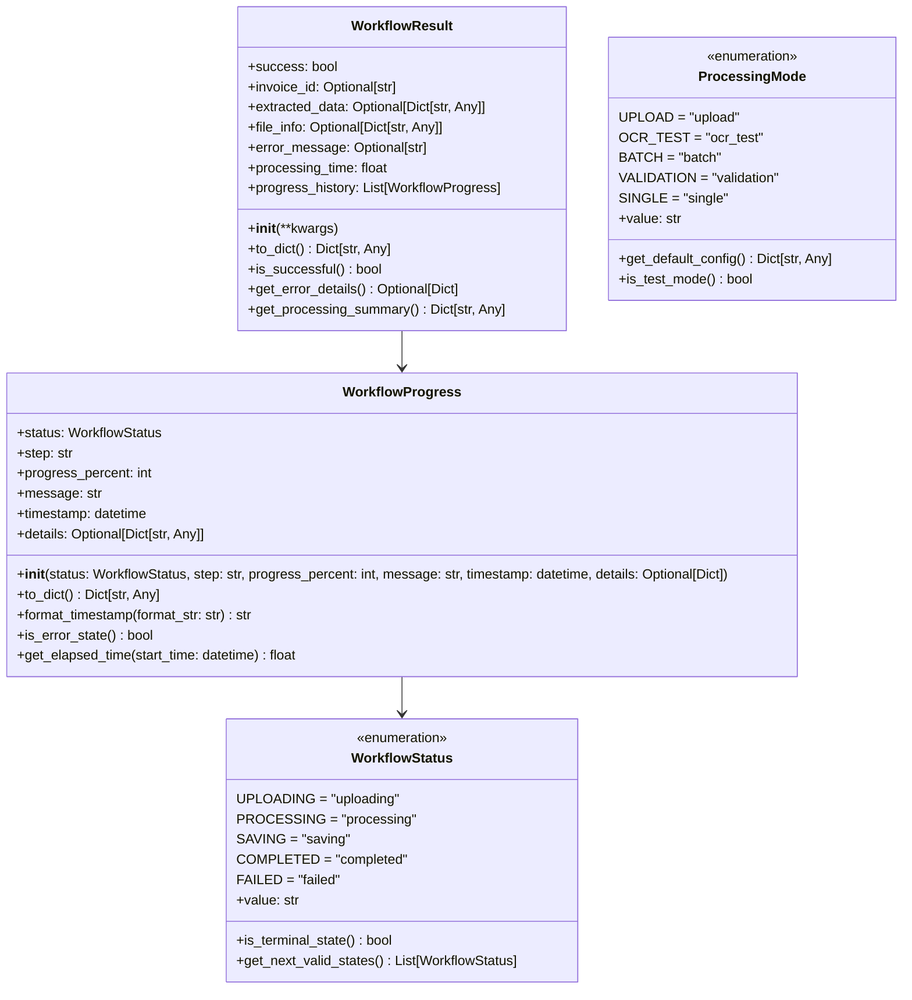

### ビジネスエンティティ

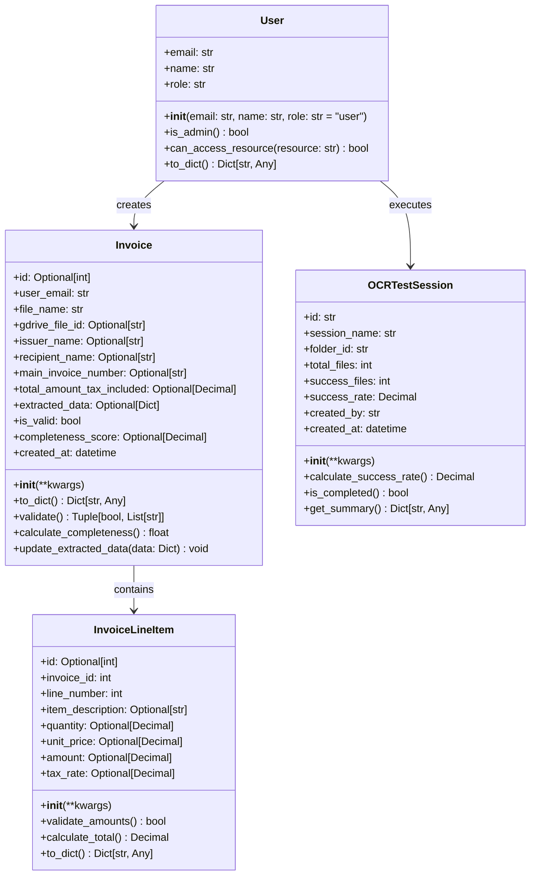

---

## 🔗 継承・実装関係

### サービスインターフェース

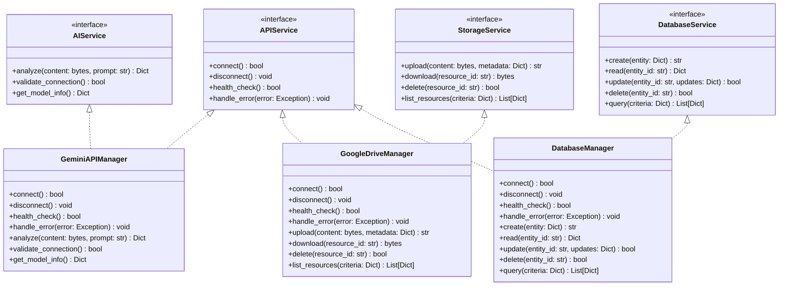

### 例外階層

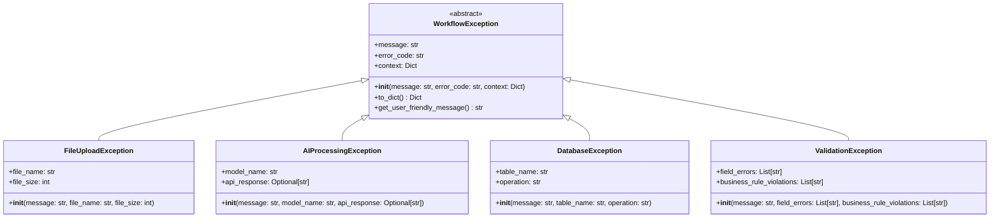

---

## 🎨 デザインパターン

### Factoryパターン

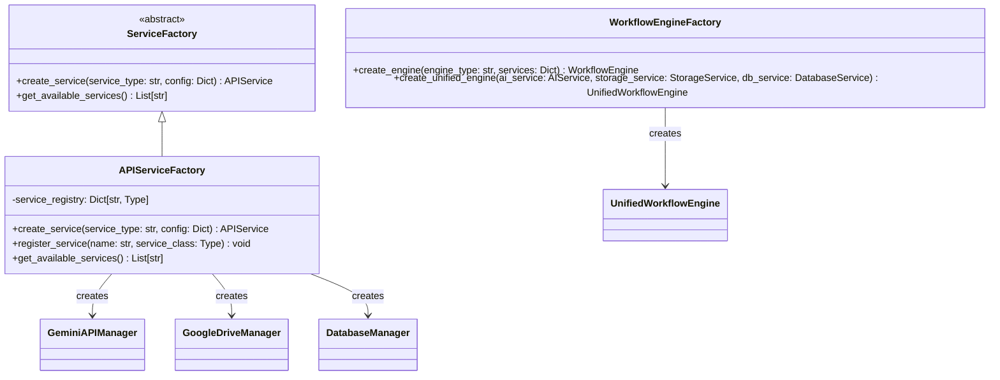

### Observerパターン

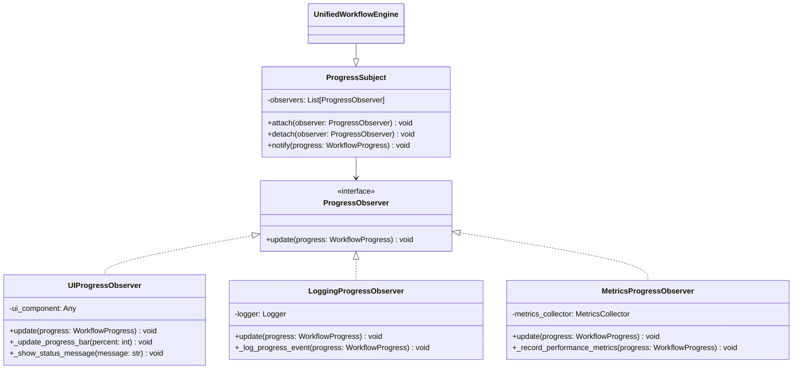

### Strategyパターン

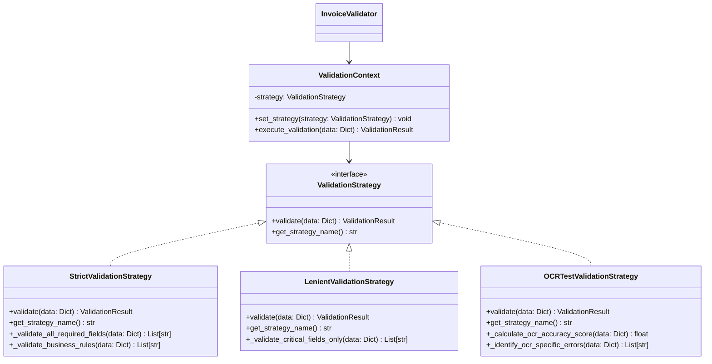

### Builderパターン

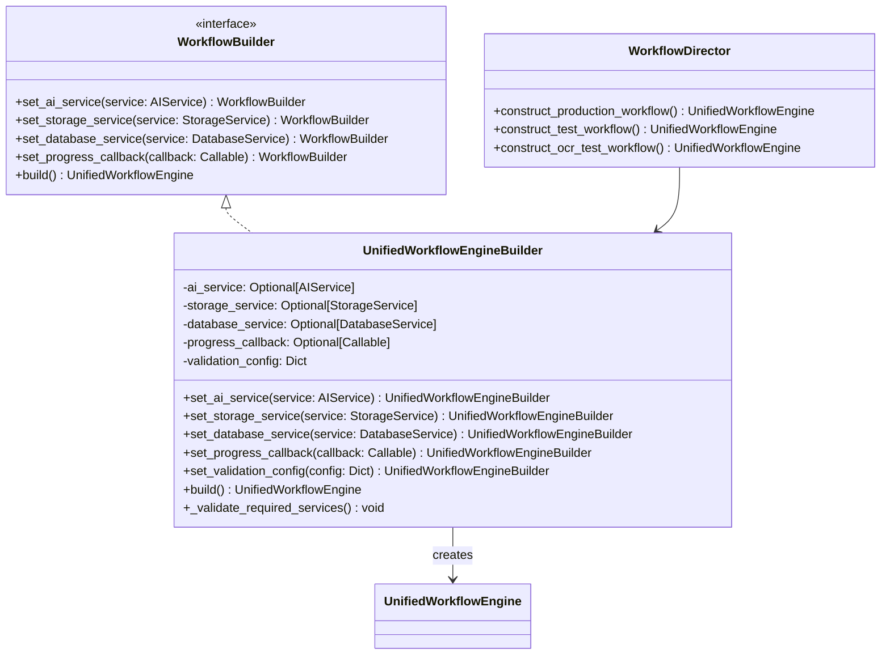

---

## 🔧 依存性注入

### DIコンテナ構成

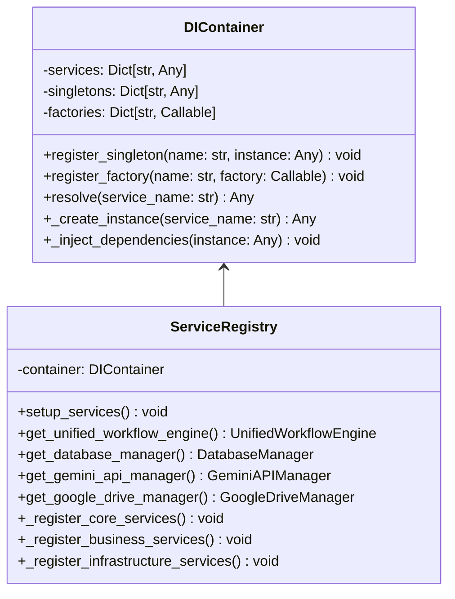

---

**最終更新**: 2025年1月24日  
**承認者**: システム設計者・開発チーム  
**レビュー予定**: 2025年2月24日

**関連ドキュメント**:

### 📚 統合設計書
- [15_システムアーキテクチャ設計書.md](15_システムアーキテクチャ設計書.md) - システム全体設計（統合版）
- [16_データベース設計書.md](16_データベース設計書.md) - データベース設計（統合版）

### 🏗️ 詳細設計書（独立版）
- [17_システムアーキテクチャUML図.md](17_システムアーキテクチャUML図.md) - システムアーキテクチャ図集
- [18_データベースER図.md](18_データベースER図.md) - データベースER図・関係性
- [19_テーブル設計詳細仕様書.md](19_テーブル設計詳細仕様書.md) - テーブル仕様・制約・インデックス
- [20_シーケンス図集.md](20_シーケンス図集.md) - 処理フロー・正常系・異常系

### 📋 ドキュメント管理
- [00_DOCS_INDEX.md](00_DOCS_INDEX.md) - 全ドキュメント一覧・関連性 