# 📦 クラス図

**作成日**: 2025年1月24日  
**バージョン**: 3.1  
**対象システム**: 請求書処理自動化システム  
**最終更新**: 2025年8月1日 - 実装状況反映・Gmail連携機能状況修正

**v3.1更新内容**: 実装状況正確反映・Gmail連携機能を実装予定に変更・外貨換算カード明細連携未実装状況反映・アダプターパターン基底クラス未実装状況反映  
**v3.0更新内容**: 40カラム新機能対応・外貨換算・承認ワークフロー・freee連携クラス追加
**v2.0更新内容**: 重複削除・モジュール統合・通貨正規化機能対応
- PromptSelector削除（UnifiedPromptManagerに統合）
- UnifiedWorkflowEngineにデータ検証ステップ追加
- InvoiceValidatorに通貨正規化機能追加
- シングルトンパターンの適用

## 📊 概要

本ドキュメントは請求書処理自動化システムの全クラス構造をUMLクラス図で可視化し、各クラスの属性、メソッド、関係性を詳細に定義します。

**🎉 2025年7月28日更新**: **40カラム新機能対応**により、外貨換算・承認ワークフロー・freee連携の3つの新機能クラスが追加されました。  

**📋 2025年8月1日実装状況反映**: 各クラスの実装状況を現在のコードと照合し、Gmail連携機能を「実装予定」、外貨換算のカード明細連携を「未実装（APIのみ）」、アダプターパターン基底クラスを「未実装」として正確に反映しました。

### 🚨 **重要な実装状況**
| **機能** | **設計書記載** | **実際の実装** | **状況** |
|---------|-------------|-------------|----------|
| **Gmail連携機能** | 完全実装 | ❌ **GmailIntegrationService未実装** | **実装予定** |
| **BaseInputAdapter** | 完全実装 | ❌ **基底クラス未実装** | **設計のみ** |
| **外貨換算カード明細** | カード明細連携 | ⚠️ **Exchange Rate APIのみ** | **部分実装** |
| **その他40カラム機能** | 完全実装 | ✅ **実装済み** | **実装済み** |

## 📑 目次

1. [全体クラス構成](#全体クラス構成)
2. [プレゼンテーション層](#プレゼンテーション層)
3. [ビジネスロジック層](#ビジネスロジック層)
4. [インフラストラクチャ層](#インフラストラクチャ層)
5. [データモデル層](#データモデル層)
6. [継承・実装関係](#継承実装関係)
7. [デザインパターン](#デザインパターン)

---

## 🏗️ 全体クラス構成

### システム全体のクラス関係図

```mermaid
classDiagram
    %% プレゼンテーション層
    class StreamlitApp {
        +main()
        +initialize_session_state()
        +render_sidebar()
        +handle_navigation()
    }
    
    class InvoiceProcessingPage {
        +render_unified_invoice_processing_page()
        +render_production_upload_content()
        +render_ocr_test_content()
        +execute_unified_upload_processing()
        +execute_unified_ocr_test()
        %% ★v3.1 リファクタリング - Helper関数追加★
        +_get_current_user_id() str
        +_create_progress_callback() callable
        +_initialize_processing_session() void
        +_get_unified_engine() UnifiedWorkflowEngine
        +_display_processing_info() void
        +_display_processing_success() void
    }
    
    class TestPages {
        +render_integrated_workflow_test_page()
        +execute_integrated_workflow()
        +render_workflow_progress()
        +render_workflow_result()
    }
    
    class SettingsPage {
        +render_dashboard_page()
        +render_invoice_aggrid()
    }
    
    %% ビジネスロジック層
    class UnifiedWorkflowEngine {
        -ai_service: GeminiAPIManager
        -storage_service: GoogleDriveManager
        -database_service: DatabaseManager
        -progress_callback: Callable
        -progress_history: List[WorkflowProgress]
        -prompt_manager: UnifiedPromptManager
        -prompt_selector: PromptSelector
        +__init__(ai_service, storage_service, database_service, progress_callback)
        +process_single_file(pdf_file_data, filename, user_id, mode) WorkflowResult
        +process_uploaded_files(uploaded_files, user_id, mode) Dict
        +process_batch_files(files_data, user_id, mode) Dict
        +process_ocr_test_from_drive(folder_id, user_id, max_files) Dict
        +_unified_file_upload(pdf_file_data, filename) Dict
        +_unified_ai_extraction(pdf_file_data, filename) Dict
        +_unified_data_validation(extracted_data, filename) Dict ★NEW★
        +_unified_database_save(file_info, validated_data, filename, user_id, mode) str
        +_notify_progress(status, step, progress_percent, message, details)
        +get_progress_history() List[WorkflowProgress]
        +reset_progress()
    }
    
    class UnifiedPromptManager {
        -prompts_dir: str
        -prompts_cache: Dict
        -default_prompts: Dict
        +__init__(prompts_dir)
        +get_prompt_by_key(key) Dict
        +format_prompt_for_gemini(prompt_key, variables) Tuple[str, str]
        +validate_prompt_compatibility(prompt_key, operation_type) Tuple[bool, List]
        +get_recommended_prompt(mode) str ★統合★
        +get_prompt_compatibility_score(prompt_key, mode) float ★統合★
        +_load_prompts()
        +_cache_prompt(key, content)
        +_evaluate_prompt_suitability(prompt_data, mode) float ★統合★
    }
    
    class PromptSelector {
        -prompt_manager: UnifiedPromptManager
        +__init__(prompt_manager)
        +get_recommended_prompt(mode) str
        +get_prompt_compatibility_score(prompt_key, mode) float
        +_evaluate_prompt_suitability(prompt_data, mode) float
        %% NOTE: UnifiedPromptManagerに統合済み（後方互換性のため保持）
    }
    
    %% PromptSelector統合済み - UnifiedPromptManagerに統合
    
    class InvoiceValidator {
        +validate_invoice_data(invoice_data, strict_mode) Dict
        +calculate_completeness_score(invoice_data) float
        +_validate_required_fields(data) List[str]
        +_validate_amounts(data) List[str]
        +_normalize_currency_code(currency) str ★NEW★
        +_validate_dates(data) List[str]
        +_check_foreign_currency_tax(data) List[str] ★NEW★
        +_validate_data_types(data) List[str]
        +_validate_business_rules(data) List[str]
    }
    
    %% 40カラム新機能サービス層 ★v3.0 NEW★
    class CurrencyConversionService {
        -exchange_api: ExchangeRateAPI
        -cache_ttl: int
        -rate_cache: Dict[str, Dict]
        +__init__(api_key, cache_ttl)
        +convert_to_jpy(amount, from_currency) Dict ★v3.0 NEW★
        +get_current_rate(from_currency, to_currency) float ★v3.0 NEW★
        +get_cached_rate(currency_pair) Optional[float] ★v3.0 NEW★
        +validate_currency_code(currency) bool ★v3.0 NEW★
        +_fetch_rate_from_api(from_currency, to_currency) float
        +_cache_rate(currency_pair, rate, timestamp) void
        +_is_cache_valid(currency_pair) bool
        %% ⚠️ カード明細連携未実装（Exchange Rate APIのみ）
    }
    
    class ApprovalControlService {
        -approval_rules: Dict[str, ApprovalRule]
        -notification_service: NotificationAPI
        -approver_config: Dict
        +__init__(rules_config, notification_service)
        +evaluate_approval_requirement(invoice_data) Dict ★v3.0 NEW★
        +assign_approver(approval_level) str ★v3.0 NEW★
        +approve_invoice(invoice_id, approver_email, comment) bool ★v3.0 NEW★
        +reject_invoice(invoice_id, reject_reason, approver_email) bool ★v3.0 NEW★
        +send_approval_notification(approver_info, invoice_summary) bool ★v3.0 NEW★
        +_check_approval_rules(invoice_data) Dict
        +_determine_approval_level(amount, vendor, category) str
        +_update_approval_status(invoice_id, status, approver) bool
    }
    
    class FreeeIntegrationService {
        -freee_api: FreeeAPI
        -oauth_config: Dict
        -account_mapping: Dict[str, str]
        +__init__(oauth_config, account_mapping)
        +process_approved_invoice(invoice_data) Dict ★v3.0 NEW★
        +create_journal_entry(invoice_data) str ★v3.0 NEW★
        +map_expense_category(category) str ★v3.0 NEW★
        +generate_batch_id() str ★v3.0 NEW★
        +validate_freee_connection() bool ★v3.0 NEW★
        +_prepare_journal_data(invoice_data, account_mapping) Dict
        +_authenticate_freee_api() bool
        +_handle_freee_errors(error) None
    }
    
    %% インフラストラクチャ層
    class DatabaseManager {
        -client: SupabaseClient
        -connection_config: Dict
        +__init__(url, key)
        +insert_invoice(invoice_data) Dict
        +get_invoices(user_email) List[Dict]
        +check_tables_exist() Dict
        +get_sample_data() Dict
        +_execute_query(query, params) Any
        +_handle_rls_policy(user_email) bool
    }
    
    class GeminiAPIManager {
        -api_key: str
        -model_name: str
        -client: GenerativeAI
        +__init__(api_key, model_name)
        +analyze_pdf_content(pdf_data, prompt) Dict
        +generate_text(prompt) str
        +validate_api_connection() bool
        +_prepare_pdf_for_analysis(pdf_data) Any
        +_parse_json_response(response) Dict
    }
    
    class GoogleDriveManager {
        -service_account_info: Dict
        -default_folder_id: str
        -credentials: Credentials
        +__init__(service_account_info, default_folder_id)
        +upload_file(file_content, filename, folder_id, mime_type) Dict
        +download_file(file_id) bytes
        +list_files(folder_id, file_type) List[Dict]
        +get_file_info(file_id) Dict
        +_authenticate() Credentials
        +_handle_timeout(timeout_seconds) Any
    }
    
    class AgGridManager {
        +create_basic_grid(data, columns) Any
        +get_selected_rows(grid_response) List[Dict]
        +display_invoice_data(invoice_data) Any
        +_configure_grid_options() Dict
        +_setup_column_definitions(columns) List[Dict]
    }
    
    %% データモデル層
    class WorkflowResult {
        +success: bool
        +invoice_id: Optional[str]
        +extracted_data: Optional[Dict]
        +file_info: Optional[Dict]
        +error_message: Optional[str]
        +processing_time: float
        +progress_history: List[WorkflowProgress]
        +__init__(**kwargs)
        +to_dict() Dict
        +is_successful() bool
    }
    
    class WorkflowProgress {
        +status: WorkflowStatus
        +step: str
        +progress_percent: int
        +message: str
        +timestamp: datetime
        +details: Optional[Dict]
        +__init__(status, step, progress_percent, message, timestamp, details)
        +to_dict() Dict
        +format_timestamp() str
    }
    
    class WorkflowStatus {
        <<enumeration>>
        UPLOADING
        PROCESSING
        SAVING
        COMPLETED
        FAILED
    }
    
    %% 関係性
    StreamlitApp --> InvoiceProcessingPage
    StreamlitApp --> TestPages
    StreamlitApp --> SettingsPage
    
    InvoiceProcessingPage --> UnifiedWorkflowEngine
    TestPages --> UnifiedWorkflowEngine
    
    UnifiedWorkflowEngine --> DatabaseManager
    UnifiedWorkflowEngine --> GeminiAPIManager
    UnifiedWorkflowEngine --> GoogleDriveManager
    UnifiedWorkflowEngine --> UnifiedPromptManager
    UnifiedWorkflowEngine --> InvoiceValidator
    
    %% 40カラム新機能サービス関係 ★v3.0 NEW★
    UnifiedWorkflowEngine --> CurrencyConversionService
    UnifiedWorkflowEngine --> ApprovalControlService
    UnifiedWorkflowEngine --> FreeeIntegrationService
    
    %% Gmail連携機能 ⚠️ 実装予定（未実装）
    %% UnifiedWorkflowEngine -.-> GmailIntegrationService : 実装予定
    
    UnifiedWorkflowEngine ..> WorkflowResult : creates
    UnifiedWorkflowEngine ..> WorkflowProgress : emits
    
    %% 新機能サービス間の関係 ★v3.0 NEW★
    CurrencyConversionService --> ExchangeRateAPI : uses
    ApprovalControlService --> NotificationAPI : uses
    FreeeIntegrationService --> FreeeAPI : uses
    
    %% ★v3.1 NEW★ 実装予定クラス（Gmail連携機能）
    class GmailIntegrationService {
        <<実装予定>>
        -gmail_api: GmailAPI
        -oauth_config: Dict
        -attachment_cache: Dict
        +__init__(oauth_config) ⚠️ 実装予定
        +authenticate_gmail() bool ⚠️ 実装予定
        +fetch_attachments(message_id) List ⚠️ 実装予定
        +process_gmail_invoice(attachment_data) Dict ⚠️ 実装予定
        +sync_gmail_attachments() List ⚠️ 実装予定
        %% データベースフィールドのみ実装済み
    }
    
    %% ★v3.1 NEW★ 実装予定クラス（アダプターパターン）
    class BaseInputAdapter {
        <<実装予定>>
        <<abstract>>
        +get_files(config) List[FileData] ⚠️ 実装予定
        +validate_input(config) bool ⚠️ 実装予定
        +get_metadata(file_data) Dict ⚠️ 実装予定
    }
    
    class LocalFileAdapter {
        <<実装予定>>
        +get_files(config) List[FileData] ⚠️ 実装予定
        +validate_input(config) bool ⚠️ 実装予定
        +get_metadata(file_data) Dict ⚠️ 実装予定
    }
    
    class GoogleDriveAdapter {
        <<実装予定>>
        +get_files(config) List[FileData] ⚠️ 実装予定
        +validate_input(config) bool ⚠️ 実装予定
        +get_metadata(file_data) Dict ⚠️ 実装予定
    }
    
    %% 実装予定関係
    BaseInputAdapter <|.. LocalFileAdapter
    BaseInputAdapter <|.. GoogleDriveAdapter
    
    %% PromptSelector --> UnifiedPromptManager（統合により削除）
    SettingsPage --> AgGridManager
    SettingsPage --> DatabaseManager
    
    WorkflowProgress --> WorkflowStatus
```



---

## 📱 プレゼンテーション層

### Streamlitアプリケーション構成


### ページコンポーネント詳細


---

## 🧠 ビジネスロジック層

### 統一ワークフローエンジン詳細


### サービス層クラス群


---

## 🔧 インフラストラクチャ層

### データベース層


### AI処理層


### ストレージ層


### UI拡張層


### 外部API層（40カラム新機能対応） ★v3.0 NEW★

```mermaid
classDiagram
    class ExchangeRateAPI {
        -api_key: str
        -base_url: str
        -request_timeout: int
        
        +__init__(api_key: str, base_url: str)
        +get_current_rate(from_currency: str, to_currency: str) Dict ★v3.0 NEW★
        +get_historical_rates(date: str, currencies: List[str]) Dict ★v3.0 NEW★
        +get_supported_currencies() List[str] ★v3.0 NEW★
        +validate_currency_code(currency: str) bool ★v3.0 NEW★
        +_make_api_request(endpoint: str, params: Dict) Dict
        +_handle_rate_api_errors(error: Exception) None
        +_parse_rate_response(response: Dict) Dict
    }
    
    class NotificationAPI {
        -slack_webhook: str
        -teams_webhook: str
        -email_config: Dict
        
        +__init__(slack_webhook: str, teams_webhook: str, email_config: Dict)
        +send_slack_notification(message: str, channel: str) bool ★v3.0 NEW★
        +send_teams_notification(message: str, channel: str) bool ★v3.0 NEW★
        +send_email_notification(to: str, subject: str, body: str) bool ★v3.0 NEW★
        +send_approval_notification(approver_info: Dict, invoice_summary: Dict) bool ★v3.0 NEW★
        +send_rejection_notification(applicant_info: Dict, rejection_reason: str) bool ★v3.0 NEW★
        +_format_approval_message(invoice_summary: Dict) str
        +_format_rejection_message(rejection_reason: str) str
        +_handle_notification_errors(error: Exception) None
    }
    
    class FreeeAPI {
        -client_id: str
        -client_secret: str
        -oauth_token: str
        -base_url: str
        
        +__init__(client_id: str, client_secret: str)
        +authenticate_oauth() bool ★v3.0 NEW★
        +create_journal_entry(journal_data: Dict) Dict ★v3.0 NEW★
        +get_account_items() List[Dict] ★v3.0 NEW★
        +get_company_info() Dict ★v3.0 NEW★
        +validate_journal_data(journal_data: Dict) bool ★v3.0 NEW★
        +refresh_oauth_token() bool ★v3.0 NEW★
        +_make_authenticated_request(endpoint: str, method: str, data: Dict) Dict
        +_handle_freee_api_errors(error: Exception) None
        +_format_journal_entry(invoice_data: Dict, account_mapping: Dict) Dict
    }
    
    %% ★v3.1 NEW★ 実装予定クラス（Gmail API）
    class GmailAPI {
        <<実装予定>>
        -access_token: str
        -refresh_token: str
        -client_config: Dict
        
        +__init__(client_config) ⚠️ 実装予定
        +authenticate_oauth() bool ⚠️ 実装予定
        +list_messages(query) List[Dict] ⚠️ 実装予定
        +get_message(message_id) Dict ⚠️ 実装予定
        +get_attachments(message_id) List[Dict] ⚠️ 実装予定
        +download_attachment(attachment_id) bytes ⚠️ 実装予定
        +_make_authenticated_request(endpoint, method, data) Dict
        +_handle_gmail_api_errors(error) None
    }
    
    %% 外部API間の関係
    CurrencyConversionService --> ExchangeRateAPI : uses
    ApprovalControlService --> NotificationAPI : uses
    FreeeIntegrationService --> FreeeAPI : uses
    GmailIntegrationService -.-> GmailAPI : 実装予定
```

---

## 📊 データモデル層

### ワークフローモデル


### ビジネスエンティティ

```mermaid
classDiagram
    class Invoice {
        +id: Optional[int]
        +user_email: str
        +file_name: str
        +gdrive_file_id: Optional[str]
        +issuer_name: Optional[str]
        +recipient_name: Optional[str]
        +main_invoice_number: Optional[str]
        +total_amount_tax_included: Optional[Decimal]
        +extracted_data: Optional[Dict]
        +is_valid: bool
        +completeness_score: Optional[Decimal]
        +created_at: datetime
        
        +__init__(**kwargs)
        +to_dict() Dict[str, Any]
        +validate() Tuple[bool, List[str]]
        +calculate_completeness() float
        +update_extracted_data(data: Dict) void
    }
    
    class InvoiceLineItem {
        +id: Optional[int]
        +invoice_id: int
        +line_number: int
        +item_description: Optional[str]
        +quantity: Optional[Decimal]
        +unit_price: Optional[Decimal]
        +amount: Optional[Decimal]
        +tax_rate: Optional[Decimal]
        
        +__init__(**kwargs)
        +validate_amounts() bool
        +calculate_total() Decimal
        +to_dict() Dict[str, Any]
    }
    
    class User {
        +email: str
        +name: str
        +role: str
        
        +__init__(email: str, name: str, role: str = "user")
        +is_admin() bool
        +can_access_resource(resource: str) bool
        +to_dict() Dict[str, Any]
    }
    
    class OCRTestSession {
        +id: str
        +session_name: str
        +folder_id: str
        +total_files: int
        +success_files: int
        +success_rate: Decimal
        +created_by: str
        +created_at: datetime
        
        +__init__(**kwargs)
        +calculate_success_rate() Decimal
        +is_completed() bool
        +get_summary() Dict[str, Any]
    }
    
    %% 40カラム新機能モデル ★v3.0 NEW★
    class CurrencyConversion {
        +id: Optional[int]
        +invoice_id: int
        +from_currency: str
        +to_currency: str
        +exchange_rate: Decimal
        +original_amount: Decimal
        +converted_amount: Decimal
        +conversion_date: datetime
        +rate_source: str
        +card_statement_id: Optional[int] %% ⚠️ 常にNull（カード明細連携未実装）
        
        +__init__(**kwargs) ★v3.0 NEW★
        +calculate_converted_amount() Decimal ★v3.0 NEW★
        +validate_rate() bool ★v3.0 NEW★
        +to_dict() Dict[str, Any] ★v3.0 NEW★
        %% ⚠️ カード明細マッチング機能未実装
    }
    
    class ApprovalWorkflow {
        +id: Optional[int]
        +invoice_id: int
        +approval_status: str
        +required_approval_level: str
        +current_approver: Optional[str]
        +approved_by: Optional[str]
        +approved_at: Optional[datetime]
        +rejection_reason: Optional[str]
        +approval_history: List[Dict]
        
        +__init__(**kwargs) ★v3.0 NEW★
        +can_approve(user_role: str) bool ★v3.0 NEW★
        +approve(approver_email: str, comment: str) bool ★v3.0 NEW★
        +reject(approver_email: str, reason: str) bool ★v3.0 NEW★
        +get_approval_status() str ★v3.0 NEW★
        +add_approval_step(step_info: Dict) void ★v3.0 NEW★
    }
    
    class FreeeIntegration {
        +id: Optional[int]
        +invoice_id: int
        +freee_transaction_id: Optional[str]
        +journal_number: Optional[str]
        +account_mapping: Dict
        +integration_status: str
        +exported_at: Optional[datetime]
        +freee_batch_id: str
        +error_message: Optional[str]
        
        +__init__(**kwargs) ★v3.0 NEW★
        +mark_as_exported(transaction_id: str, journal_number: str) void ★v3.0 NEW★
        +mark_as_failed(error_message: str) void ★v3.0 NEW★
        +retry_integration() bool ★v3.0 NEW★
        +get_integration_status() str ★v3.0 NEW★
        +to_dict() Dict[str, Any] ★v3.0 NEW★
    }
    
    %% 既存の関係性
    Invoice --> InvoiceLineItem : contains
    User --> Invoice : creates
    User --> OCRTestSession : executes
    
    %% ★v3.1 NEW★ 実装予定モデル（Gmail連携用）
    class GmailIntegration {
        <<実装予定>>
        +id: Optional[int]
        +invoice_id: int
        +gmail_message_id: Optional[str] ✅ フィールド実装済み
        +attachment_id: Optional[str] ✅ フィールド実装済み
        +sender_email: Optional[str] ✅ フィールド実装済み
        +subject: Optional[str] ⚠️ 実装予定
        +received_at: Optional[datetime] ⚠️ 実装予定
        +processing_status: str ⚠️ 実装予定
        
        +__init__(**kwargs) ⚠️ 実装予定
        +mark_as_processed() void ⚠️ 実装予定
        +get_gmail_metadata() Dict ⚠️ 実装予定
        +to_dict() Dict[str, Any] ⚠️ 実装予定
        %% データベースフィールドのみ実装済み・機能は未実装
    }
    
    %% 40カラム新機能モデル関係 ★v3.0 NEW★
    Invoice --> CurrencyConversion : has
    Invoice --> ApprovalWorkflow : has
    Invoice --> FreeeIntegration : has
    Invoice -.-> GmailIntegration : 実装予定
```

---

## 🔗 継承・実装関係

### サービスインターフェース


### 例外階層


---

## 🎨 デザインパターン

### Factoryパターン


### Observerパターン


### Strategyパターン


### Builderパターン


---

## 🔧 依存性注入

### DIコンテナ構成


---

**最終更新**: 2025年8月1日 - 実装状況正確反映・Gmail連携機能状況修正  
**承認者**: システム設計者・開発チーム  
**レビュー予定**: 2025年9月1日  
**v3.1重要成果**: 実装状況の正確反映・Gmail連携機能実装予定明記・外貨換算カード明細連携未実装状況反映  
**v3.0重要成果**: 外貨換算・承認ワークフロー・freee連携クラス完全追加

## 🚨 **実装状況サマリー（2025年8月1日時点）**

### ✅ **実装済み機能**
- **UnifiedWorkflowEngine**: 統一ワークフローエンジン完全実装
- **40カラム機能**: CurrencyConversionService, ApprovalControlService, FreeeIntegrationService完全実装
- **リファクタリング**: helper関数統合によるコード品質向上

### ⚠️ **部分実装機能**
- **外貨換算機能**: Exchange Rate API実装済み、カード明細連携未実装（ISS-009課題）

### ❌ **実装予定機能**
- **Gmail連携機能**: GmailIntegrationService未実装（データベースフィールドのみ準備完了）
- **アダプターパターン**: BaseInputAdapter基底クラス未実装（ENH-004課題）

### 📋 **次期開発予定**
1. **最高優先度**: 外貨換算カード明細連携実装（ISS-009）
2. **高優先度**: Gmail連携機能完全実装
3. **中優先度**: アダプターパターン基底クラス実装（ENH-004）

**関連ドキュメント**:

### 📚 統合設計書
- [15_システムアーキテクチャ設計書.md](15_システムアーキテクチャ設計書.md) - システム全体設計（統合版）
- [16_データベース設計書.md](16_データベース設計書.md) - データベース設計（統合版）

### 🏗️ 詳細設計書（独立版）
- [17_システムアーキテクチャUML図.md](17_システムアーキテクチャUML図.md) - システムアーキテクチャ図集
- [18_データベースER図.md](18_データベースER図.md) - データベースER図・関係性
- [19_テーブル設計詳細仕様書.md](19_テーブル設計詳細仕様書.md) - テーブル仕様・制約・インデックス
- [20_シーケンス図集.md](20_シーケンス図集.md) - 処理フロー・正常系・異常系

### 📋 ドキュメント管理
- [00_DOCS_INDEX.md](00_DOCS_INDEX.md) - 全ドキュメント一覧・関連性 