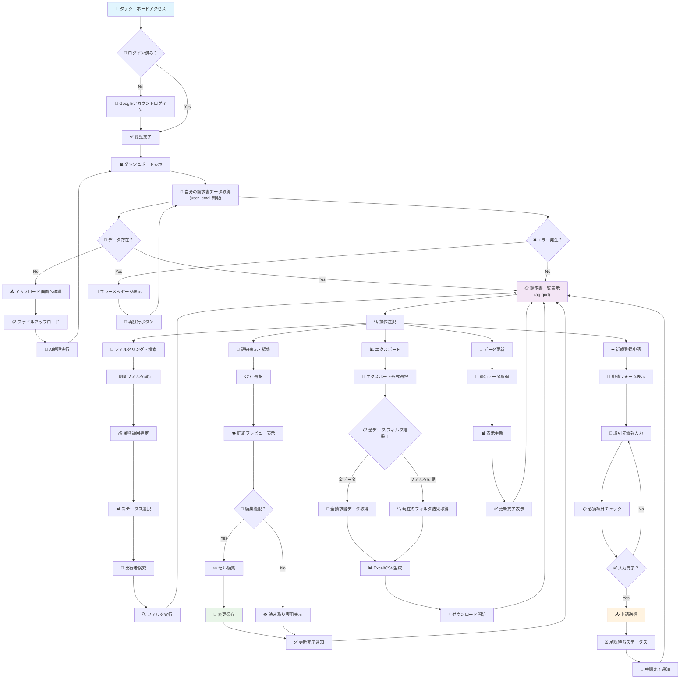
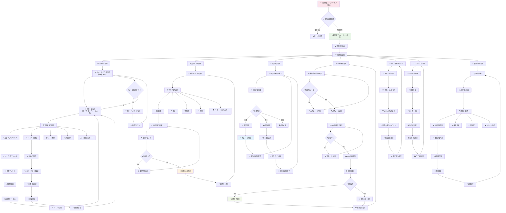
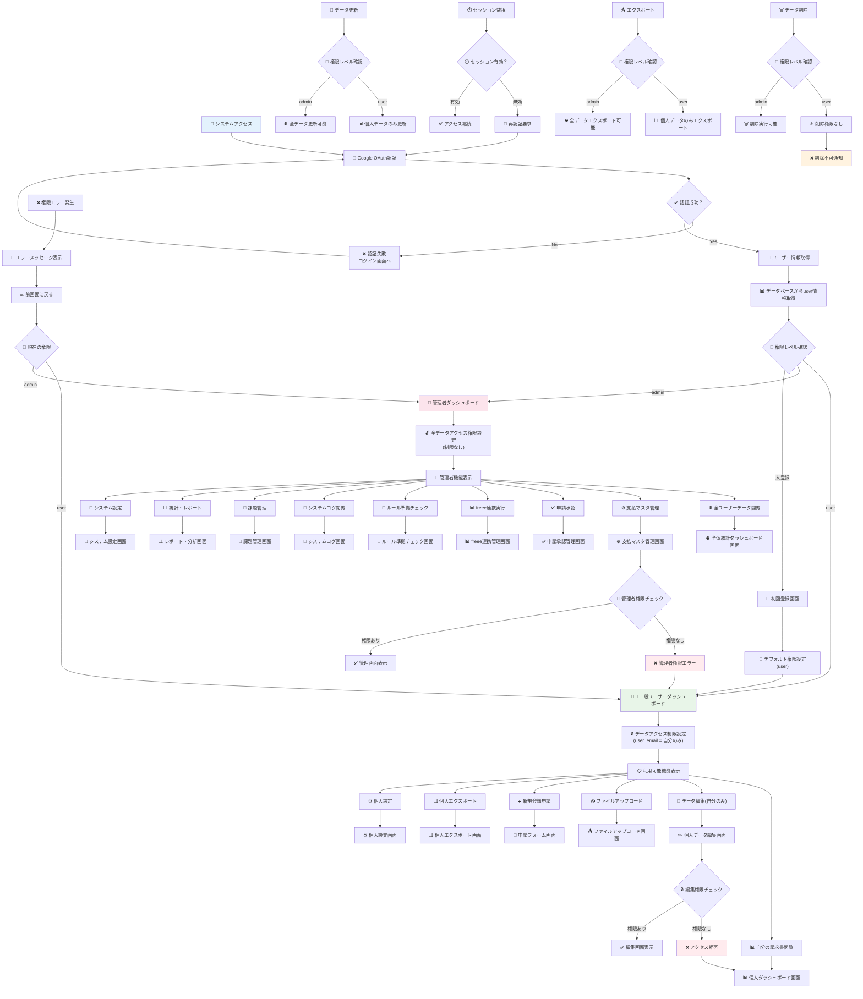

# 📊 取込データダッシュボード　アクティビティ図

**作成日**: 2025年8月1日  
**バージョン**: 1.0  
**対象システム**: 請求書処理自動化システム  
**対象機能**: 取込データダッシュボード

## 📋 概要

本ドキュメントは取込データダッシュボード機能のアクティビティ図を定義します。  
**一般ユーザー**と**管理者**の2つの権限レベルに対応したダッシュボード操作フローと、システム全体の権限制御フローを詳細に記載しています。

### 🎯 アクティビティ図一覧

| **図番号** | **対象** | **機能概要** | **主要操作** |
|-----------|---------|-------------|-------------|
| **図1** | **一般ユーザー** | 個人データ管理・表示・編集 | フィルタリング・詳細表示・編集・エクスポート・申請 |
| **図2** | **管理者** | 全データ管理・承認・連携 | 全データ管理・承認・freee連携・ルールチェック |
| **図3** | **権限制御** | アクセス制御・画面遷移 | 認証・権限判定・セキュリティ制御 |

---

## 📊 図1: 一般ユーザー向けダッシュボード　アクティビティ図

### 対象ユーザー
- **一般ユーザー**: 各部門の担当者
- **権限**: 自分がアップロードした請求書データのみアクセス可能
- **制限**: `user_email`による自分のデータのみ表示・編集

### 主要機能フロー

### 🔧 技術実装ポイント
- **データ制限**: `WHERE user_email = current_user.email`によるデータアクセス制限
- **UI表示**: ag-gridによるインタラクティブな表示・編集
- **フィルタリング**: SQLクエリとクライアントサイドフィルタの組み合わせ
- **エクスポート**: pandas DataFrame → Excel/CSV変換

---

## 👑 図2: 管理者向けダッシュボード　アクティビティ図

### 対象ユーザー
- **管理者**: 経理担当者
- **権限**: 全ユーザーのデータアクセス可能・システム管理機能利用可能
- **制限**: なし（全データアクセス）

### 主要機能フロー

### 🔧 技術実装ポイント
- **権限チェック**: `user.role == 'admin'`による管理者権限確認
- **全データアクセス**: 権限制限なしのSQLクエリ実行
- **承認ワークフロー**: ステータス更新 + 通知機能
- **一括操作**: トランザクション処理による安全な一括更新

---

## 🛡️ 図3: 権限制御・画面遷移フロー　アクティビティ図

### システム全体のセキュリティ制御
- **認証**: Google OAuth認証
- **権限管理**: user/admin の2段階権限
- **アクセス制御**: 機能別・データ別のきめ細かいアクセス制御

### 権限制御フロー

### 🔧 技術実装ポイント
- **OAuth認証**: Google OAuth 2.0による認証
- **セッション管理**: Streamlit session stateによる状態管理
- **権限チェック**: デコレータパターンによる機能別権限制御
- **エラーハンドリング**: ユーザーフレンドリーなエラー表示

---

## 🚀 実装ガイドライン

### 📋 開発優先順位

#### **Phase 1: 基本フロー実装（1週間）**
1. **権限制御基盤** - 図3の認証・権限判定部分
2. **一般ユーザー基本フロー** - 図1のデータ表示・基本操作
3. **管理者基本フロー** - 図2の全データ表示・基本管理

#### **Phase 2: 高度機能実装（2週間）**
1. **フィルタリング・検索** - 図1, 2の詳細検索機能
2. **編集・承認機能** - 図1の編集、図2の承認ワークフロー
3. **エクスポート機能** - 図1, 2のデータエクスポート

#### **Phase 3: 管理者専用機能（3週間）**
1. **支払マスタ管理** - 図2のマスタCRUD操作
2. **freee連携管理** - 図2のfreee連携実行・監視
3. **システム管理** - 図2のログ閲覧・課題管理

### 🔧 技術実装マップ

| **機能** | **実装方法** | **主要コンポーネント** |
|---------|-------------|---------------------|
| **権限制御** | `get_current_user()`による動的権限判定 | `oauth_handler.py` |
| **データフィルタリング** | SQLクエリ + ag-gridフィルタ | `DatabaseManager` + `AgGridManager` |
| **画面遷移** | Streamlit `st.session_state`による状態管理 | `st.rerun()` |
| **エラーハンドリング** | try-catch + ユーザーフレンドリーエラー表示 | `st.error()`, `st.warning()` |
| **一括操作** | トランザクション処理による安全な一括更新 | PostgreSQL Transaction |
| **リアルタイム更新** | 定期的データ取得 + 差分更新 | `st.rerun()` + caching |

### 📝 テストシナリオ

#### **一般ユーザーテスト**
1. ログイン → 自分のデータのみ表示確認
2. フィルタリング機能の動作確認
3. 詳細表示・編集機能の確認
4. エクスポート機能の確認
5. 新規登録申請機能の確認

#### **管理者テスト**
1. 管理者権限での全データアクセス確認
2. 支払マスタ管理機能の確認
3. 申請承認ワークフローの確認
4. freee連携機能の確認
5. システムログ機能の確認

#### **権限制御テスト**
1. 未認証アクセスの拒否確認
2. 権限レベル別機能制限の確認
3. 不正アクセス試行時のエラーハンドリング確認
4. セッション管理の確認

---

**最終更新**: 2025年8月1日  
**承認者**: システム設計者・開発チーム  
**レビュー予定**: 2025年9月1日

**関連ドキュメント**:
- [01_要件定義書.md](01_要件定義書.md) - システム要件・ユーザー役割定義
- [21_クラス図.md](21_クラス図.md) - システムアーキテクチャ・クラス設計
- [20_シーケンス図集.md](20_シーケンス図集.md) - 処理フロー・データ連携