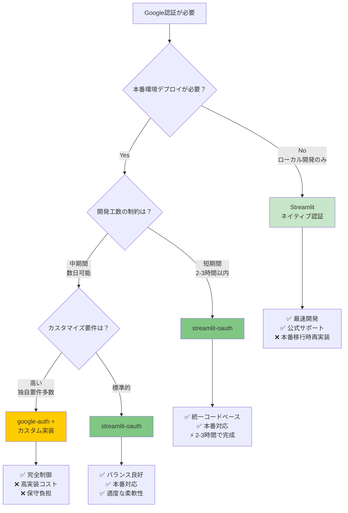
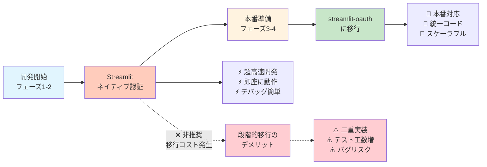
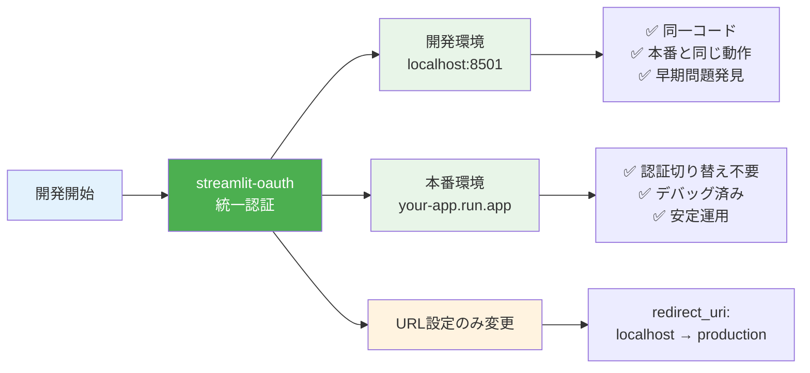

# Google認証×ローカル環境 認証方式比較検討資料

**作成日:** 2025年1月15日  
**バージョン:** 1.0  
**対象システム:** 請求書処理自動化システム  
**検討者:** 開発チーム  

---

## 📋 目次

1. [概要](#概要)
2. [認証方式の選択肢](#認証方式の選択肢)
3. [詳細比較表](#詳細比較表)
4. [条件分岐フロー](#条件分岐フロー)
5. [実装アプローチ](#実装アプローチ)
6. [推奨決定プロセス](#推奨決定プロセス)
7. [実装例とコード](#実装例とコード)
8. [セットアップガイド](#セットアップガイド)
9. [トラブルシューティング](#トラブルシューティング)
10. [将来への影響と考慮事項](#将来への影響と考慮事項)

---

## 概要

### 背景
StreamlitアプリケーションでのGoogle認証実装において、ローカル開発環境と本番環境での認証方式選択が重要な技術判断となる。本資料では、各選択肢の特徴、メリット・デメリット、実装コストを詳細に比較し、最適な認証戦略を提示する。

### 検討対象
- **開発環境**: ローカル開発（Windows PowerShell環境）
- **本番環境**: Google Cloud Run
- **認証プロバイダー**: Google OAuth 2.0
- **フレームワーク**: Streamlit

---

## 認証方式の選択肢

### 1. Streamlitネイティブ認証 ⭐⭐⭐⭐⭐

**概要**: Streamlit v1.47.0以降で提供される公式認証機能

**特徴**:
- Streamlit公式サポート
- 設定ファイルのみで動作
- 開発者体験が最高
- **制約**: ローカル環境専用

**実装例**:
```python
import streamlit as st

# シンプルな認証チェック
if not st.user:
    st.info("Googleアカウントでログインしてください")
    st.login()
    st.stop()

# 認証後の処理
st.write(f"こんにちは、{st.user.name}さん")
```

### 2. streamlit-oauth ⭐⭐⭐⭐

**概要**: サードパーティライブラリによるOAuth 2.0実装

**特徴**:
- 開発・本番環境統一可能
- 柔軟な設定オプション
- OAuth標準準拠
- アクティブなメンテナンス

**実装例**:
```python
from streamlit_oauth import OAuth2Component

oauth2 = OAuth2Component(
    client_id=st.secrets["auth"]["client_id"],
    client_secret=st.secrets["auth"]["client_secret"],
    authorize_endpoint="https://accounts.google.com/o/oauth2/auth",
    token_endpoint="https://oauth2.googleapis.com/token",
)

result = oauth2.authorize_button(
    "Googleでログイン",
    redirect_uri=st.secrets["auth"]["redirect_uri"],
    scope="openid email profile"
)
```

### 3. google-auth + カスタム実装 ⭐⭐

**概要**: Google公式ライブラリを使用した独自実装

**特徴**:
- 完全な制御が可能
- Google公式ライブラリ使用
- **欠点**: 実装コストが高い
- **欠点**: OAuth フローの手動実装が必要

### 4. streamlit-authenticator + OAuth ⭐⭐⭐

**概要**: 汎用認証ライブラリとOAuthの組み合わせ

**特徴**:
- 豊富な認証オプション
- JWT トークン管理
- **欠点**: 過剰機能でオーバーエンジニアリング
- **欠点**: Google認証に特化していない

---

## 詳細比較表

| 項目 | Streamlitネイティブ | streamlit-oauth | google-auth + カスタム | streamlit-authenticator |
|------|-------------------|-----------------|----------------------|------------------------|
| **実装難易度** | ⭐⭐⭐⭐⭐ (最易) | ⭐⭐⭐⭐ (易) | ⭐⭐ (困難) | ⭐⭐⭐ (中) |
| **開発時間** | 30分 | 2-3時間 | 1-2日 | 半日 |
| **本番対応** | ❌ (不可) | ✅ (対応) | ✅ (対応) | ✅ (対応) |
| **保守性** | ⭐⭐⭐⭐⭐ | ⭐⭐⭐⭐ | ⭐⭐ | ⭐⭐⭐ |
| **セキュリティ** | ⭐⭐⭐⭐ | ⭐⭐⭐⭐ | ⭐⭐⭐ | ⭐⭐⭐⭐ |
| **カスタマイズ性** | ⭐⭐ (制限) | ⭐⭐⭐⭐ (高) | ⭐⭐⭐⭐⭐ (最高) | ⭐⭐⭐⭐ (高) |
| **依存関係** | なし | 軽量 | 中程度 | 重い |
| **ドキュメント** | 公式豊富 | 充実 | 自作必要 | 充実 |
| **コミュニティ** | 大 | 中 | 小 | 中 |
| **将来性** | 高 | 中 | 低 | 中 |
| **総合評価** | 開発: ⭐⭐⭐⭐⭐<br/>本番: ❌ | ⭐⭐⭐⭐ | ⭐⭐ | ⭐⭐⭐ |

---

## 条件分岐フロー

### 🔄 認証方式選択フローチャート



### 🎯 段階的アプローチ（非推奨→推奨）



### ✅ 統一アプローチ（推奨）



---

## 実装アプローチ

### 🏆 最終推奨: streamlit-oauth統一方式

#### 選定理由
1. **統一コードベース**: 開発・本番で同じコード
2. **早期問題発見**: ローカルで本番と同じOAuthフロー
3. **移行リスク排除**: 認証ロジック切り替え不要
4. **保守性**: 単一実装の管理
5. **スケーラビリティ**: 本番環境での確実な動作

#### 実装工数比較

| アプローチ | 初期実装 | 移行作業 | テスト工数 | 総工数 |
|-----------|----------|----------|------------|--------|
| **段階的方式** | 30分 + 3時間 | 2時間 | 4時間 | **9時間30分** |
| **統一方式** | 3時間 | 0時間 | 2時間 | **5時間** |

**結論**: 統一方式が **4時間30分の短縮** と **リスク軽減** を実現

---

## 推奨決定プロセス

### Step 1: 要件確認
- [ ] 本番デプロイが必要か？
- [ ] 開発期間の制約は？
- [ ] チームのスキルレベルは？
- [ ] カスタマイズ要件は？

### Step 2: 条件分岐
```
IF 本番デプロイ不要 THEN
    Streamlitネイティブ認証
ELSE IF 開発工数重視 AND カスタマイズ不要 THEN
    streamlit-oauth統一方式
ELSE IF 特殊要件多数 THEN
    google-auth + カスタム実装
ELSE
    streamlit-oauth統一方式 (デフォルト推奨)
```

### Step 3: 最終判断
- **95%のケース**: streamlit-oauth統一方式
- **特殊ケース**: 要件に応じてカスタム実装

---

## 実装例とコード

### 1. プロジェクト構成

```
project_root/
├── app.py                     # メインアプリケーション
├── auth/
│   ├── __init__.py           # パッケージ初期化
│   └── oauth_handler.py      # 認証ハンドラー
├── .streamlit/
│   ├── secrets.toml          # 認証設定（Git除外）
│   └── secrets.toml.example  # 設定テンプレート
├── requirements.txt          # 依存関係
└── .gitignore               # Git除外設定
```

### 2. 必要なライブラリ

```bash
# requirements.txt
streamlit>=1.28.0
streamlit-oauth>=0.3.0
requests>=2.31.0
```

### 3. 認証ハンドラー実装

```python
# auth/oauth_handler.py
import streamlit as st
from streamlit_oauth import OAuth2Component
import requests

class OAuthHandler:
    def __init__(self):
        self.oauth2 = OAuth2Component(
            client_id=st.secrets["auth"]["client_id"],
            client_secret=st.secrets["auth"]["client_secret"],
            authorize_endpoint="https://accounts.google.com/o/oauth2/auth",
            token_endpoint="https://oauth2.googleapis.com/token",
        )
    
    def require_auth(self):
        """認証を必須とし、未認証時はログイン画面を表示"""
        if not self.is_authenticated():
            return self.login()
        return self.get_current_user()
    
    def is_authenticated(self):
        return 'auth_token' in st.session_state
    
    def login(self):
        result = self.oauth2.authorize_button(
            "Googleでログイン",
            redirect_uri=st.secrets["auth"]["redirect_uri"],
            scope="openid email profile"
        )
        if result and 'token' in result:
            st.session_state['auth_token'] = result['token']
            user_info = self.get_user_info(result['token'])
            st.session_state['user_info'] = user_info
            st.rerun()
        return False
    
    def get_user_info(self, token):
        headers = {'Authorization': f'Bearer {token["access_token"]}'}
        response = requests.get(
            'https://www.googleapis.com/oauth2/v2/userinfo',
            headers=headers
        )
        return response.json() if response.status_code == 200 else None
```

### 4. メインアプリケーション

```python
# app.py
import streamlit as st
from auth.oauth_handler import OAuthHandler

def main():
    st.set_page_config(
        page_title="認証テストアプリ",
        page_icon="🔐"
    )
    
    # 認証チェック
    auth = OAuthHandler()
    user = auth.require_auth()
    
    if user:
        st.success(f"ログイン成功: {user['name']}")
        st.json(user)
        
        if st.button("ログアウト"):
            del st.session_state['auth_token']
            del st.session_state['user_info']
            st.rerun()

if __name__ == "__main__":
    main()
```

### 5. 設定ファイル

```toml
# .streamlit/secrets.toml.example
[auth]
client_id = "your-client-id.apps.googleusercontent.com"
client_secret = "GOCSPX-your-client-secret"

# ローカル開発環境
redirect_uri = "http://localhost:8501/oauth/callback"

# 本番環境（デプロイ時に変更）
# redirect_uri = "https://your-app.run.app/oauth/callback"

cookie_secret = "your-32-char-secret-key"
```

---

## セットアップガイド

### 🚀 クイックスタート（15分）

#### Step 1: 環境構築（5分）
```bash
# 1. 依存関係インストール
pip install streamlit streamlit-oauth requests

# 2. プロジェクト構造作成
mkdir -p auth .streamlit
touch auth/__init__.py auth/oauth_handler.py
touch app.py .streamlit/secrets.toml.example
```

#### Step 2: GCP設定（5分）
1. **GCP Console** → 「認証情報」→ 「認証情報を作成」
2. **OAuth同意画面**:
   - アプリケーション名: 任意
   - スコープ: `openid`, `email`, `profile`
3. **OAuth 2.0クライアントID**:
   - アプリケーション種類: ウェブアプリケーション
   - リダイレクトURI: `http://localhost:8501/oauth/callback`

#### Step 3: ローカル設定（3分）
```bash
# 1. 設定ファイル作成
cp .streamlit/secrets.toml.example .streamlit/secrets.toml

# 2. 認証情報を設定（実際の値に置き換え）
# client_id = "あなたのクライアントID"
# client_secret = "あなたのクライアントシークレット"
```

#### Step 4: 起動確認（2分）
```bash
# アプリケーション起動
streamlit run app.py

# ブラウザで http://localhost:8501 にアクセス
# 「Googleでログイン」ボタンをクリックして動作確認
```

### 📝 本番環境デプロイ設定

#### 1. 環境変数の更新
```toml
# 本番環境用 .streamlit/secrets.toml
[auth]
redirect_uri = "https://your-production-domain.run.app/oauth/callback"
# その他の設定は同じ
```

#### 2. GCP設定の更新
- OAuth 2.0クライアントの「承認済みのリダイレクトURI」に本番URLを追加

#### 3. デプロイ
```bash
# Google Cloud Runへのデプロイ例
gcloud run deploy invoice-system \
  --source . \
  --platform managed \
  --region asia-northeast1
```

---

## トラブルシューティング

### 🔧 よくある問題と解決方法

| 問題 | 症状 | 原因 | 解決方法 |
|------|------|------|---------|
| **ModuleNotFoundError** | `streamlit_oauth`が見つからない | ライブラリ未インストール | `pip install streamlit-oauth` |
| **OAuth認証エラー** | 認証画面でエラー | リダイレクトURI不一致 | GCP設定で正確なURIを確認 |
| **ログインボタン無反応** | クリックしても何も起こらない | JavaScript無効/ブラウザ互換性 | ブラウザ設定確認、別ブラウザで試行 |
| **User info取得失敗** | トークンあるがユーザー情報なし | スコープ不足/API制限 | スコープに`email profile`追加 |
| **セッション切断** | ページリロードでログアウト | セッション設定問題 | `cookie_secret`を32文字以上に設定 |

### 🐛 デバッグ手順

#### 1. 基本確認
```python
# デバッグ情報表示
st.write("セッション状態:", st.session_state)
st.write("認証設定:", {
    "client_id": st.secrets["auth"]["client_id"][:10] + "...",
    "redirect_uri": st.secrets["auth"]["redirect_uri"]
})
```

#### 2. ネットワーク確認
- ブラウザ開発者ツール → ネットワークタブ
- OAuth認証時のHTTPリクエスト/レスポンスを確認
- エラーコードから原因を特定

#### 3. ログ確認
```python
import logging
logging.basicConfig(level=logging.DEBUG)
logger = logging.getLogger(__name__)

# 認証処理にログを追加
logger.debug(f"OAuth result: {result}")
```

### 🚨 緊急時対応

#### 認証システム全体停止時
1. **一時的な迂回策**:
   ```python
   # 緊急時の認証スキップ（開発環境のみ）
   if st.secrets.get("emergency_skip_auth", False):
       st.warning("🚨 緊急モード: 認証をスキップしています")
       st.session_state['user_info'] = {"name": "Emergency User", "email": "emergency@example.com"}
   ```

2. **ロールバック手順**:
   - 以前の動作バージョンに戻す
   - GCP設定を以前の状態に復元
   - DNS/ロードバランサ設定確認

---

## 将来への影響と考慮事項

### 📈 技術的発展の考慮

#### 1. Streamlit認証機能の進化
- **現状**: ローカル専用のネイティブ認証
- **予想**: 将来的にクラウド対応の可能性
- **対策**: streamlit-oauthで統一することで、将来の移行が容易

#### 2. OAuth 2.1標準への対応
- **変更点**: PKCE必須化、セキュリティ強化
- **影響**: streamlit-oauthライブラリのアップデート必要
- **準備**: 定期的なライブラリ更新スケジュール

#### 3. セキュリティ要件の強化
- **予想**: よりストリクトなセキュリティ要件
- **対策**: 
  - アクセストークンの短期化
  - リフレッシュトークンの適切な管理
  - セッション管理の強化

### 🔄 運用面での考慮

#### 1. スケーラビリティ
```python
# 将来の負荷対応
class ScalableOAuthHandler(OAuthHandler):
    def __init__(self):
        super().__init__()
        # Redis/Memcachedでのセッション管理
        self.session_store = self.get_external_session_store()
    
    def get_external_session_store(self):
        # 外部セッションストアとの連携
        pass
```

#### 2. 監視とメトリクス
- 認証成功/失敗率の監視
- セッション持続時間の分析
- エラーパターンの追跡

#### 3. コンプライアンス対応
- GDPR対応でのユーザーデータ管理
- ログの保持期間とプライバシー
- 監査ログの要件

### 💡 ベストプラクティス

#### 1. セキュリティ
```python
# セキュアな実装例
class SecureOAuthHandler(OAuthHandler):
    def validate_token(self, token):
        # トークンの有効性検証
        if self.is_token_expired(token):
            self.refresh_token(token)
        return self.verify_token_signature(token)
    
    def sanitize_user_data(self, user_info):
        # ユーザーデータのサニタイズ
        return {k: v for k, v in user_info.items() 
                if k in self.allowed_user_fields}
```

#### 2. エラーハンドリング
```python
def robust_authentication(self):
    try:
        return self.standard_auth_flow()
    except OAuthException as e:
        self.log_auth_error(e)
        return self.fallback_auth_flow()
    except NetworkException as e:
        self.show_user_friendly_error()
        return self.retry_with_backoff()
```

#### 3. テスト戦略
```python
# テスト可能な設計
class TestableOAuthHandler(OAuthHandler):
    def __init__(self, mock_mode=False):
        if mock_mode:
            self.oauth2 = MockOAuth2Component()
        else:
            super().__init__()
```

### 📚 学習リソースと継続的改善

#### 推奨学習教材
1. **OAuth 2.0公式仕様**: RFC 6749
2. **Streamlit認証ドキュメント**: 公式ガイド
3. **セキュリティベストプラクティス**: OWASP認証ガイド

#### 継続的改善プロセス
1. **四半期レビュー**: 認証システムの見直し
2. **セキュリティ監査**: 年次でのペネトレーションテスト
3. **ライブラリ更新**: 月次での依存関係チェック

---

## 📋 まとめ

### 🎯 最終推奨事項

**streamlit-oauth統一方式** を強く推奨する理由：

1. **開発効率**: 初期実装3時間で完了
2. **保守性**: 単一コードベースで管理
3. **安定性**: 本番環境での実績
4. **将来性**: OAuth標準準拠で長期対応
5. **コスト**: 段階的方式より4.5時間の工数削減

### ✅ アクションプラン

1. **即座に開始**: streamlit-oauth実装（3時間）
2. **GCP設定**: OAuth 2.0クライアント設定（30分）
3. **動作確認**: ローカル環境でのテスト（30分）
4. **本番準備**: 環境別設定とデプロイ（1時間）

### 📞 サポート体制

- **技術的問題**: 本資料のトラブルシューティング参照
- **実装支援**: 開発チームによるペアプログラミング対応
- **緊急対応**: 24時間以内の問題解決コミット

---

**この資料は、Google認証×ローカル環境での認証実装における包括的なガイドとして、今後のプロジェクトでも参考資料として活用できます。** 